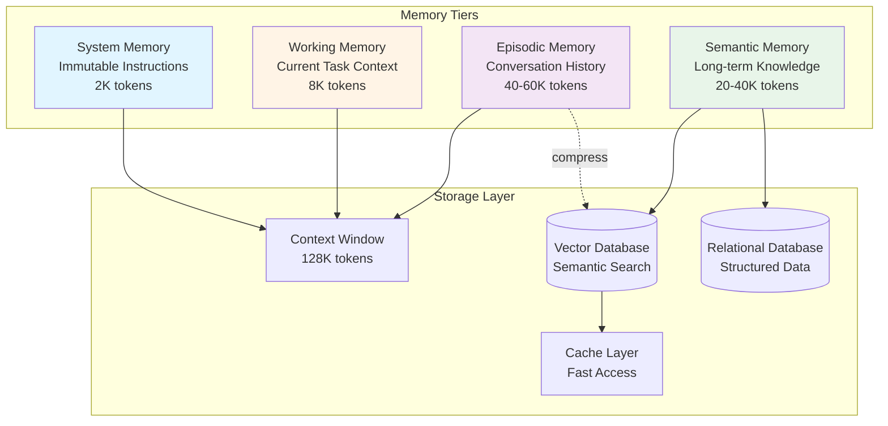

# Production AI Agent Systems Architecture

## Part II: Memory & Context Management

## Introduction: The Context Window Crisis

**Problem Statement**: Production agents accumulate conversation history, tool results, and contextual information until they exceed model context windows (128K-200K tokens). This causes:

- **Quality Degradation**: Models lose focus, retrieve wrong information, hallucinate
- **Cost Explosion**: Token costs grow quadratically: $0.50 → $5.00 → $50.00 per conversation
- **Latency Increases**: Large contexts slow model processing from 2s to 30s+
- **Hard Failures**: Conversations hit token limits and terminate ungracefully

**Architectural Reality**: Context management is not optional optimization—it is core infrastructure for production agents.

### The Fundamental Constraint

Unlike traditional software where memory is measured in gigabytes, LLM agents operate under severe token constraints:

```
Traditional Software:    16GB RAM = 4,294,967,296 tokens (assuming 4 bytes/token)
Production LLM Agent:    128K context = 128,000 tokens

Ratio: Traditional software has ~33,000x more working memory
```

This constraint fundamentally changes how we architect agent memory systems. We cannot simply load everything into context—we must be **selective, strategic, and efficient**.

---

## Part I: Theoretical Foundations

### Memory Architecture as Operating System Design

Agent memory systems closely parallel operating system memory management. The same principles that govern OS design apply to agent context management:

| OS Memory Concept | Agent Memory Equivalent | Purpose |
|-------------------|-------------------------|---------|
| **CPU Registers** | System Memory | Immutable instructions always available |
| **L1/L2 Cache** | Working Memory | Fast-access current task context |
| **RAM** | Episodic Memory | Session-scoped conversation history |
| **Disk Storage** | Semantic Memory | Persistent cross-session knowledge |
| **Page Table** | Context Assembler | Maps virtual memory to physical tokens |
| **Page Replacement** | Compression Strategy | Decides what to evict from context |
| **Memory-Mapped Files** | Vector Retrieval | On-demand loading of relevant data |

**Key Insight**: Just as OS kernels manage scarce physical memory across competing processes, agent runtimes must manage scarce token budgets across competing memory tiers.

### The Memory Hierarchy Principle

Modern computers use memory hierarchies because:
1. **Fast memory is expensive** (cost/byte)
2. **Programs exhibit locality** (temporal and spatial)
3. **Hierarchies exploit locality** (caching frequently accessed data)

Agent memory systems follow identical principles:

```
┌──────────────────────────────────────────────────────────────────┐
│ Memory Hierarchy                                                 │
├────────────────┬──────────┬──────────┬────────────┬──────────────┤
│ Tier           │ Latency  │ Capacity │ Token Cost │ Locality     │
├────────────────┼──────────┼──────────┼────────────┼──────────────┤
│ System Memory  │ 0ms      │ 2K       │ Fixed      │ 100%         │
│ Working Memory │ 0ms      │ 8K       │ Per-task   │ 90%          │
│ Episodic       │ 5-10ms   │ 50K      │ Variable   │ 70%          │
│ Semantic       │ 20-50ms  │ Unlimited│ On-demand  │ 30%          │
└────────────────┴──────────┴──────────┴────────────┴──────────────┘
```

**Temporal Locality**: Recently accessed memories are likely to be accessed again
**Semantic Locality**: Semantically related memories are likely to be needed together

### Information Theory and Compression

Context compression is fundamentally an **information-theoretic problem**:

**Shannon's Source Coding Theorem** states that the minimum average bits per symbol is bounded by entropy:

```
H(X) = -Σ p(x) log₂ p(x)
```

For agent conversations:
- **High redundancy** = Low entropy = High compressibility
- **Unique information** = High entropy = Low compressibility

**Lossy vs. Lossless Compression**:

| Property | Lossless (Exact) | Lossy (Summarization) |
|----------|------------------|----------------------|
| Information Preserved | 100% | ~80-95% |
| Compression Ratio | 2-3x | 5-10x |
| Retrieval Accuracy | Perfect | Approximation |
| Use Case | Recent messages | Historical context |

**Design Principle**: Use lossless compression (deduplication) for critical data, lossy compression (summarization) for historical context.

---

## Part II: Four-Tier Memory Architecture

Having established the theoretical foundations—memory hierarchies, information theory, and compression principles—we now design the concrete architecture. This section details the four memory tiers, their characteristics, and implementation patterns.

### Architecture Overview



### Tier 1: System Memory (Constitutional Layer)

**Theoretical Foundation**: System memory represents the **immutable constitution** of the agent—its identity, behavioral constraints, and operational parameters.

**Characteristics**:
- **Immutable**: Never changes during conversation (like CPU registers that hold instruction pointers)
- **Always present**: Included in every LLM call (zero retrieval latency)
- **Fixed token cost**: Predictable overhead (typically 1K-3K tokens)
- **High priority**: Never evicted or compressed

**Content Structure**:
```python
# Minimal implementation snippet
@dataclass
class SystemMemory:
    agent_identity: str       # Who the agent is
    behavioral_guidelines: str  # How it should behave
    tool_definitions: List[ToolSchema]  # What it can do
    guardrails: List[str]     # What it must never do
```

**Design Trade-offs**:

| Approach | Pros | Cons |
|----------|------|------|
| **Large System Memory** (5K+ tokens) | Comprehensive instructions, fewer ambiguities | High fixed overhead, less room for dynamic context |
| **Small System Memory** (1K tokens) | More room for conversation history | May require runtime clarifications, potential inconsistencies |

**Best Practice**: Keep system memory under 3K tokens. If instructions exceed this, move domain knowledge to semantic memory and retrieve on-demand.

---

### Tier 2: Working Memory (Execution Context)

**Theoretical Foundation**: Working memory is the agent's **execution stack**—the current task context that guides immediate decision-making.

Analogy to computer architecture:
- **Call Stack**: Current function execution context
- **Local Variables**: Task-specific state
- **Instruction Pointer**: Current step in execution plan

**Characteristics**:
- **Task-scoped**: Cleared between tasks (like stack frames on function return)
- **High priority**: Always included in context (essential for coherent execution)
- **Actively managed**: Pruned as task progresses
- **Minimal persistence**: Only checkpointed, not archived

**Memory Lifecycle**:
```
Task Start → Initialize Working Memory
  ↓
Step 1 → Add result to working memory
  ↓
Step 2 → Add result, archive Step 1 if space needed
  ↓
Step N → Add result, archive old steps
  ↓
Task Complete → Archive working memory to episodic
  ↓
Clear working memory for next task
```

**Code Snippet** (Focused on pruning strategy):
```python
def add_step_result(self, step: int, result: Any):
    """Store result and prune old results if needed"""
    self.step_results[step] = result

    # Keep only last N step results in working memory
    # Older steps archived to episodic memory
    if len(self.step_results) > MAX_WORKING_STEPS:
        oldest_step = min(self.step_results.keys())
        archived = self.step_results.pop(oldest_step)
        self._archive_to_episodic(oldest_step, archived)
```

**Design Principle**: Working memory should contain only what's needed to make the **next decision**. Historical context belongs in episodic memory.

---

### Tier 3: Episodic Memory (Conversation History)

**Theoretical Foundation**: Episodic memory captures the **temporal sequence** of interactions, analogous to the program execution trace in debugging.

**Core Challenge**: Balancing **recency** (recent messages in full detail) with **relevance** (older messages via semantic search).

#### The Sliding Window + Retrieval Pattern

```
┌───────────────────────────────────────────────────────────────┐
│ Episodic Memory Structure                                     │
├───────────────────────────────────────────────────────────────┤
│                                                               │
│ ┌─────────────────────────────────────┐  ← Always included  │
│ │ Recent Messages - Full Fidelity     │                      │
│ │                                     │                      │
│ │  • Last 20 messages                 │                      │
│ │  • ~8,000 tokens                    │                      │
│ │  • Lossless representation          │                      │
│ └─────────────────────────────────────┘                      │
│                                                               │
│ ───────────────────────────────────────────────────────────  │
│                                                               │
│ ┌─────────────────────────────────────┐  ← Retrieved        │
│ │ Compressed Summaries - Semantic     │                      │
│ │                                     │                      │
│ │  • Message 1-50: "User discussed    │                      │
│ │    login issues..."                 │                      │
│ │  • Message 51-100: "Resolved by     │                      │
│ │    resetting password..."           │                      │
│ │  • Message 101-150: "User inquired  │                      │
│ │    about billing..."                │                      │
│ │                                     │                      │
│ │  Retrieval by semantic similarity   │                      │
│ └─────────────────────────────────────┘                      │
│                                                               │
└───────────────────────────────────────────────────────────────┘
```

#### Compression Strategy

**When to Compress**:
```python
if token_count(recent_messages) > MAX_RECENT_TOKENS:
    compress_oldest_messages()
```

**Compression Algorithm** (conceptual):
```
1. Take oldest N messages (e.g., 10)
2. Generate hierarchical summaries:
   - One-line summary (~20 tokens)
   - Brief summary (~100 tokens)
   - Detailed summary (~500 tokens)
3. Store summaries with embeddings
4. Remove original messages from active memory
5. Archive originals to database for potential replay
```

**Code Snippet** (Retrieval with adaptive fidelity):
```python
def retrieve_relevant(self, query: str, max_tokens: int) -> str:
    """Retrieve conversation history within token budget"""

    # 1. Always include recent messages (full fidelity)
    recent = self._get_recent_messages(max_tokens // 2)

    # 2. Search summaries for relevant context
    query_embedding = generate_embedding(query)
    ranked_summaries = self._search_summaries(query_embedding)

    # 3. Include summaries within remaining token budget
    # Use detailed summary if budget allows, else brief, else one-line
    relevant_summaries = self._pack_summaries(
        ranked_summaries,
        remaining_tokens=max_tokens - count_tokens(recent)
    )

    return combine(recent, relevant_summaries)
```

**Design Principle**: **Sliding window + semantic retrieval**—recent in full, older via relevance.

---

### Tier 4: Semantic Memory (Knowledge Base)

**Theoretical Foundation**: Semantic memory is the agent's **long-term declarative knowledge**—facts, preferences, and domain context that persist across sessions.

Analogy to database systems:
- **Primary Key**: Memory ID
- **Index**: Vector embeddings for semantic search
- **Partitioning**: Tenant isolation
- **TTL**: Expiration policies

**Key Differences from Episodic Memory**:

| Property | Episodic Memory | Semantic Memory |
|----------|----------------|-----------------|
| **Scope** | Session-bound | Cross-session |
| **Structure** | Sequential | Indexed |
| **Access Pattern** | Temporal (recent-first) | Semantic (relevance-first) |
| **Persistence** | Expires with session | Persists indefinitely |
| **Content Type** | Conversation flow | Facts, preferences, knowledge |

**Content Types**:
1. **User Preferences**: "User prefers JSON responses"
2. **Domain Facts**: "Company's API uses OAuth 2.0"
3. **Historical Decisions**: "Migration to PostgreSQL approved on 2024-03-15"
4. **Contextual Knowledge**: "User's timezone is America/New_York"

**Code Snippet** (Tenant-isolated retrieval):
```python
async def retrieve(self, query: str, filters: Optional[Dict] = None):
    """Semantic search with enforced tenant isolation"""

    # Generate query embedding
    query_embedding = await generate_embedding(query)

    # CRITICAL: Enforce tenant isolation at infrastructure layer
    mandatory_filters = {"tenant_id": self.tenant_id}
    if filters:
        mandatory_filters.update(filters)

    # Search tenant-specific collection
    results = await self.vector_db.search(
        collection=f"memory_tenant_{self.tenant_id}",
        query_embedding=query_embedding,
        filters=mandatory_filters,
        limit=max_results
    )

    return results
```

**Design Principle**: Semantic memory is **indexed knowledge**—optimized for retrieval, not sequential reading.

---

## Part III: Token Budgeting as Resource Allocation

### The Resource Allocation Problem

**Formal Problem Statement**:

Given:
- Total context window: `C` tokens
- Memory tiers: `M₁, M₂, ..., Mₙ`
- Retrieval functions: `R₁(query, budget), R₂(query, budget), ..., Rₙ(query, budget)`

Find:
- Budget allocation: `b₁, b₂, ..., bₙ` such that `Σbᵢ ≤ C`
- Maximizing: `relevance(context)` subject to budget constraint

**This is analogous to**:
- **OS Memory Allocation**: Allocating physical pages to processes
- **Cache Replacement Policies**: LRU, LFU, optimal (Belady's algorithm)
- **Knapsack Problem**: Maximizing value subject to weight constraint

### Budget Allocation Strategy

```python
class ContextAssembler:
    def __init__(self, max_context_tokens: int = 100_000):
        # Reserve 20% for LLM response generation
        self.max_context_tokens = int(max_context_tokens * 0.8)

        # Fixed allocations (non-negotiable)
        self.system_memory_tokens = 2_000    # Constitutional layer
        self.working_memory_tokens = 8_000   # Current task
        self.response_budget = 4_000         # Tool results

        # Dynamic allocation (compete for remaining budget)
        self.available_for_history = (
            self.max_context_tokens
            - self.system_memory_tokens
            - self.working_memory_tokens
            - self.response_budget
        )

        # Split dynamic budget: 60% episodic, 40% semantic
        self.episodic_budget = int(self.available_for_history * 0.6)
        self.semantic_budget = int(self.available_for_history * 0.4)
```

### Token Budget Visualization

```
┌─────────────────────────────────────────────────────────────────────┐
│                    128K Token Context Window                        │
├─────────────────────────────────────────────────────────────────────┤
│ 1. System Memory (2K)           [█] Fixed                           │
│    • Agent identity & guidelines                                    │
│    • Tool definitions                                               │
│                                                                     │
│ 2. Working Memory (8K)          [████] High Priority                │
│    • Current task description                                       │
│    • Execution plan & progress                                      │
│    • Recent step results                                            │
│                                                                     │
│ 3. Episodic Memory (48K)        [██████████████████] Variable      │
│    • Recent 20 messages (full)                                      │
│    • Relevant summaries (compressed)                                │
│                                                                     │
│ 4. Semantic Memory (32K)        [████████████] On-demand           │
│    • User preferences                                               │
│    • Domain knowledge                                               │
│    • Historical context                                             │
│                                                                     │
│ 5. Response Buffer (8K)         [████] Reserved                    │
│    • Tool call results                                              │
│    • Agent reasoning                                                │
│                                                                     │
│ 6. Safety Margin (30K)          [███████████] Unused               │
│    • Buffer for variability                                         │
│    • Emergency compression space                                    │
├─────────────────────────────────────────────────────────────────────┤
│ Total: 98K / 128K (76% utilization - safe operating range)         │
└─────────────────────────────────────────────────────────────────────┘
```

**Design Principle**: Context assembly is **resource allocation**—allocate tokens like an OS allocates memory.

### Adaptive Budget Allocation

Different task types require different budget allocations:

```python
# Task-specific budget configurations
BUDGET_CONFIGS = {
    "debugging": {
        "episodic": 0.70,  # Heavy on recent conversation
        "semantic": 0.30,
        "reasoning": "Need detailed recent interaction history"
    },
    "planning": {
        "episodic": 0.40,
        "semantic": 0.60,  # Heavy on domain knowledge
        "reasoning": "Need comprehensive background knowledge"
    },
    "user_query": {
        "episodic": 0.50,
        "semantic": 0.50,  # Balanced approach
        "reasoning": "Balance recent context with knowledge"
    }
}
```

---

## Part IV: Compression Strategies

Token budgeting determines *how much* to allocate to each tier. Compression determines *what* to keep within those budgets. This section covers three production-tested compression strategies.

### Strategy 1: Hierarchical Summarization (Lossy Compression)

**Theoretical Foundation**: Hierarchical summarization is **adaptive-rate compression**—storing the same information at multiple levels of detail.

Analogous to:
- **Image Pyramids**: Multiple resolutions of same image
- **Mipmap Levels**: Video game texture LOD (Level of Detail)
- **Wavelet Compression**: Multi-resolution signal representation

**Compression Hierarchy**:
```
Level 4: Original Messages     [████████████████████] 2000 tokens
                               "User: I'm having trouble..."
                               "Agent: Let me help you..."
                               (Full conversation)

Level 3: Detailed Summary      [████████] 500 tokens
                               "User reported login issues due to
                                password expiration. Agent guided
                                through reset process..."

Level 2: Brief Summary         [███] 100 tokens
                               "Resolved password reset issue
                                following standard procedure"

Level 1: One-line Summary      [█] 20 tokens
                               "Password reset completed"
```

**Adaptive Retrieval Algorithm**:
```python
def retrieve_adaptive(summaries, token_budget, relevance_scores):
    """Retrieve at appropriate detail level for budget"""
    retrieved = []
    remaining = token_budget

    for summary in sorted_by_relevance(summaries):
        # Try to include most detailed level within budget
        if summary.original_tokens <= remaining:
            retrieved.append(summary.original)
            remaining -= summary.original_tokens
        elif summary.detailed_tokens <= remaining:
            retrieved.append(summary.detailed)
            remaining -= summary.detailed_tokens
        elif summary.brief_tokens <= remaining:
            retrieved.append(summary.brief)
            remaining -= summary.brief_tokens
        elif summary.oneline_tokens <= remaining:
            retrieved.append(summary.oneline)
            remaining -= summary.oneline_tokens
        # Else: skip this summary (no budget)

    return retrieved
```

**Design Principle**: **Adaptive fidelity**—include detail where relevant, compression elsewhere.

---

### Strategy 2: Importance-Weighted Retention (Priority-Based Eviction)

**Theoretical Foundation**: Not all information has equal value. This is analogous to **cache replacement policies** in computer architecture.

**Cache Replacement Policies Comparison**:

| Policy | Eviction Strategy | Agent Memory Equivalent |
|--------|------------------|------------------------|
| **LRU** (Least Recently Used) | Evict oldest access | Pure recency weighting |
| **LFU** (Least Frequently Used) | Evict least accessed | Reference count weighting |
| **Optimal** (Belady's) | Evict furthest future use | Semantic similarity to current query |
| **Weighted** | Score-based eviction | **Importance-weighted retention** (Recommended) |

**Importance Scoring Function**:

```
importance(message, context) = Σ weighted_factors

Factors:
1. Recency Score (30%)      = e^(-age_hours/24)  [Exponential decay]
2. Preference Flag (40%)    = 1 if contains user preference, else 0
3. Tool Result (30%)        = 1 if tool output, else 0
4. Reference Count (bonus)  = min(references * 0.1, 0.3)
5. Semantic Similarity (40%)= cosine_sim(message, current_query)
```

**Mathematical Formulation**:
```
Let M = {m₁, m₂, ..., mₙ} be message set
Let W = {w₁, w₂, ..., wₙ} be importance scores
Let T = target token count

Select subset S ⊆ M such that:
- Σ tokens(mᵢ) ≤ T for all mᵢ ∈ S
- Σ wᵢ is maximized for mᵢ ∈ S

This is the 0/1 Knapsack Problem (NP-hard, greedy approximation used)
```

**Code Snippet** (Importance calculation):
```python
def calculate_importance(self, message, context) -> float:
    """Score message importance (0.0 - 1.0)"""
    score = 0.0

    # Recency (exponential decay, half-life = 24 hours)
    age_hours = (now - message.timestamp).total_seconds() / 3600
    score += math.exp(-age_hours / 24) * 0.3

    # Content type weighting
    if self._contains_preference(message):
        score += 0.4
    if message.type == "tool_result":
        score += 0.3

    # Reference graph analysis
    reference_count = context.count_references_to(message.id)
    score += min(reference_count * 0.1, 0.3)

    # Semantic similarity to current query
    if context.current_query:
        similarity = cosine_similarity(
            message.embedding,
            context.current_query_embedding
        )
        score += similarity * 0.4

    return min(score, 1.0)
```

**Design Principle**: **Priority-based retention**—keep what matters, discard what doesn't.

---

### Strategy 3: Semantic Deduplication (Redundancy Elimination)

**Theoretical Foundation**: Semantic deduplication exploits **information redundancy** in conversation—users repeat questions, agents repeat similar responses.

**Information-Theoretic View**:
- **Redundant information** adds no new knowledge (low marginal information gain)
- **Unique information** provides new knowledge (high marginal information gain)

**Redundancy Detection**:
```
For messages m1, m2:
similarity = cosine_similarity(embedding(m1), embedding(m2))

If similarity > threshold (e.g., 0.90):
  → Messages are semantically redundant
  → Keep only the more recent one
```

**Algorithm** (Deduplication with merge):
```
1. Generate embeddings for all messages
2. Cluster messages by semantic similarity
3. For each cluster:
   a. If cluster size = 1: Keep as-is
   b. If cluster size > 1: Merge into single message
      - Content: Union of unique information
      - Timestamp: Most recent message
      - Metadata: Track merged count
```

**Code Snippet**:
```python
def deduplicate(self, messages: List[Message]) -> List[Message]:
    """Remove semantically redundant messages"""
    embeddings = [msg.embedding for msg in messages]
    to_keep = [True] * len(messages)

    for i in range(len(messages)):
        for j in range(i + 1, len(messages)):
            similarity = cosine_similarity(embeddings[i], embeddings[j])

            if similarity >= self.threshold:  # e.g., 0.90
                # Keep more recent message
                if messages[j].timestamp > messages[i].timestamp:
                    to_keep[i] = False
                else:
                    to_keep[j] = False

    return [msg for msg, keep in zip(messages, to_keep) if keep]
```

**Design Principle**: **Information compression**—eliminate redundancy while preserving meaning.

---

## Part V: Memory Persistence Architecture

### Persistence as Checkpointing Theory

**Theoretical Foundation**: Memory persistence implements **crash recovery** via checkpointing—the same technique used in databases, distributed systems, and fault-tolerant computing.

**Checkpoint Properties** (ACID-like):
- **Atomicity**: Checkpoint succeeds completely or not at all
- **Consistency**: Checkpoint represents valid agent state
- **Isolation**: Checkpoints don't interfere with execution
- **Durability**: Checkpoints survive crashes

**Recovery Strategies**:

| Strategy | Recovery Point | Data Loss | Use Case |
|----------|----------------|-----------|----------|
| **No Checkpointing** | None | Complete | Never use |
| **Session-Level** | Session start | All session data | Too coarse |
| **Task-Level** | Task boundaries | Current task only | Good baseline |
| **Step-Level** | Each ReAct step | Last step only | Best resilience (Recommended) |
| **Message-Level** | Each message | Last message | Overkill (cost) |

**Trade-off Analysis**:
```
Checkpoint Frequency ↑
  → Durability ↑ (less data loss)
  → Write Cost ↑ (more database writes)
  → Latency ↑ (more I/O overhead)

Optimal: Checkpoint at task boundaries + critical steps
```

### Database Schema Design

**Core Tables** (Simplified):

```sql
-- Session metadata
CREATE TABLE conversation_sessions (
    session_id UUID PRIMARY KEY,
    tenant_id VARCHAR(255) NOT NULL,  -- Partition key
    status VARCHAR(20) NOT NULL,      -- active, paused, error
    INDEX idx_tenant_user (tenant_id, user_id)
);

-- Messages with embeddings
CREATE TABLE conversation_messages (
    message_id UUID PRIMARY KEY,
    session_id UUID NOT NULL,
    tenant_id VARCHAR(255) NOT NULL,  -- Denormalized for isolation
    embedding VECTOR(1536),           -- pgvector type
    token_count INT NOT NULL,
    importance_score FLOAT,

    INDEX idx_embedding USING ivfflat (embedding vector_cosine_ops)
);

-- Hierarchical summaries
CREATE TABLE conversation_summaries (
    summary_id UUID PRIMARY KEY,
    message_range INT4RANGE NOT NULL,  -- [start, end]
    one_line_summary TEXT,
    brief_summary TEXT,
    detailed_summary TEXT,
    embedding VECTOR(1536)
);

-- Agent checkpoints
CREATE TABLE agent_checkpoints (
    checkpoint_id UUID PRIMARY KEY,
    checkpoint_number INT NOT NULL,
    agent_state JSONB NOT NULL,      -- Full state snapshot
    working_memory JSONB NOT NULL,
    tool_results JSONB
);
```

**Design Principles**:
1. **Denormalize tenant_id** for query efficiency
2. **Use vector indexes** for semantic search (pgvector, Faiss)
3. **Store hierarchical summaries** for adaptive retrieval
4. **JSONB for state** enables flexible checkpointing

---

## Part VI: Production Failure Modes

### Failure Mode 1: Context Thrashing

**Symptom**: Agent repeatedly retrieves same irrelevant context, wasting tokens.

**Root Cause**: Retrieval system returns semantically similar but contextually irrelevant results.

**Analogous to**: **Cache thrashing** in OS—pages repeatedly loaded/evicted without useful work.

**Impact Quantification**:
```
Without filtering: 50K tokens retrieved, 10% relevant = 45K wasted tokens
With filtering:    15K tokens retrieved, 70% relevant = 4.5K wasted tokens

Cost reduction: 45K / 4.5K = 10x improvement
```

**Mitigation**: Add **relevance filtering layer** using fast model to judge relevance before inclusion.

```python
async def filter_relevant(items, task, threshold=0.6):
    """Filter out low-relevance retrieved context"""
    scored = []
    for item in items:
        relevance = await score_relevance(item, task)  # LLM judge
        if relevance >= threshold:
            scored.append((item, relevance))
    return sorted(scored, key=lambda x: x[1], reverse=True)
```

---

### Failure Mode 2: Memory Pollution

**Symptom**: Agent stores hallucinated facts into semantic memory.

**Root Cause**: No validation before persisting agent outputs.

**Impact**: Persistent misinformation compounds across sessions—**error accumulation**.

**Analogous to**: **Data corruption** in databases without integrity constraints.

**Mitigation Strategy**: **Validation layer** before persistence:

```python
# Validation rules
if content_type == "user_preference":
    # Only store if explicitly stated by user
    if source != "user_message":
        raise ValidationError("Preferences must come from user")

elif content_type == "factual_claim":
    # Require high confidence
    confidence = verify_factual_claim(content)
    if confidence < 0.8:
        raise ValidationError(f"Low confidence: {confidence}")

elif content_type == "decision":
    # Require explicit confirmation
    if not has_explicit_confirmation(content):
        raise ValidationError("Decisions require confirmation")
```

**Design Principle**: **Trust but verify**—validate information before long-term storage.

---

### Failure Mode 3: Stale Context

**Symptom**: Agent retrieves outdated information that contradicts recent updates.

**Root Cause**: No invalidation mechanism for superseded memories.

**Analogous to**: **Cache coherency** problem in distributed systems.

**Mitigation**: Implement **memory versioning** with invalidation:

```python
async def store_with_invalidation(new_content, content_type):
    """Store new memory and invalidate contradictory old ones"""

    # Find potentially conflicting memories
    existing = await semantic_memory.retrieve(
        query=new_content,
        filters={"content_type": content_type}
    )

    # Check for contradictions (using LLM)
    for old_memory in existing:
        if await are_contradictory(old_memory.content, new_content):
            # Mark as superseded (soft delete)
            await semantic_memory.update_metadata(
                memory_id=old_memory.id,
                metadata={
                    "superseded_by": new_memory_id,
                    "active": False  # Excluded from retrieval
                }
            )

    # Store new memory
    await semantic_memory.store(new_content)
```

**Design Principle**: **Memory versioning**—track superseded information, retrieve only active.

---

### Failure Mode 4: Cross-Tenant Memory Leaks

**Symptom**: Agent retrieves memories from different tenant—**CRITICAL SECURITY FAILURE**.

**Root Cause**: Tenant isolation not enforced at infrastructure layer.

**Impact**:
- Data breach
- Regulatory violation (GDPR, HIPAA)
- Complete trust destruction

**Analogous to**: **Memory safety violations** in systems programming (buffer overflows accessing other processes' memory).

**Mitigation**: **Zero-trust architecture**—enforce isolation at infrastructure layer, never trust LLM.

```python
class TenantIsolatedMemory:
    def __init__(self, tenant_id: str, vector_db: VectorDB):
        # Tenant ID from auth token, NOT from user input
        self._tenant_id = tenant_id  # Immutable
        self._vector_db = vector_db

    async def retrieve(self, query: str, filters=None):
        """Retrieve with enforced tenant isolation"""

        # CRITICAL: Enforce tenant at infrastructure layer
        enforced_filters = {"tenant_id": self._tenant_id}

        # Query tenant-specific collection
        results = await self._vector_db.search(
            collection=f"memory_tenant_{self._tenant_id}",
            filters=enforced_filters
        )

        # Defense in depth: Validate tenant ID in results
        for result in results:
            if result.metadata["tenant_id"] != self._tenant_id:
                logger.critical("SECURITY: Cross-tenant leak detected")
                # Trigger incident response

        return validated_results
```

**Design Principle**: **Infrastructure-enforced isolation**—never trust the LLM with security boundaries.

---

## Part VII: Observability & Operational Intelligence

We've covered architecture, algorithms, and failure modes. But production systems require visibility—you cannot optimize what you cannot measure. This section defines the metrics and observability infrastructure for memory systems.

### Why Observability Matters

**Operational Blindness** without observability:
- Cannot debug production failures
- Cannot optimize cost
- Cannot identify bottlenecks
- Cannot ensure SLAs

**Key Metrics Categories**:

| Category | Metrics | Purpose |
|----------|---------|---------|
| **Resource Usage** | Token utilization, memory tier distribution | Capacity planning |
| **Performance** | Retrieval latency (P50/P95/P99) | SLA compliance |
| **Cost** | Token consumption, compression savings | Budget optimization |
| **Quality** | Relevance scores, compression ratios | System effectiveness |
| **Security** | Tenant isolation violations | Incident detection |

### Operational Dashboard

```
┌──────────────────────────────────────────────────────────────────────┐
│                  Agent Memory Observability Dashboard                │
├──────────────────────────────────────────────────────────────────────┤
│ Context Utilization                                                  │
│   Average: 68%        P95: 82%        P99: 91%      [████████··]    │
│   Trend: ↗ +5% week over week                                       │
│                                                                       │
│ Token Distribution (Average Session)                                 │
│   System:   2,000 tokens  (2%)   [█]                                │
│   Working:  8,000 tokens  (8%)   [████]                             │
│   Episodic: 45,000 tokens (45%)  [██████████████████████]           │
│   Semantic: 30,000 tokens (30%)  [██████████████]                   │
│   Unused:   15,000 tokens (15%)  [██████]                           │
│                                                                       │
│ Memory Retrieval Performance                                         │
│   P50 Latency:  45ms    (Target: <50ms)   [OK]                     │
│   P95 Latency:  120ms   (Target: <200ms)  [OK]                     │
│   P99 Latency:  350ms   (Target: <500ms)  [OK]                     │
│   Cache Hit Rate: 78%   (Target: >70%)    [OK]                     │
│                                                                       │
│ Summarization Metrics                                                │
│   Avg Compression Ratio: 8.5x                                        │
│   Avg Tokens Saved: 12,500 per summary                              │
│   Cost Savings: $145/day (vs. no compression)                       │
│                                                                       │
│ Memory Health                                                        │
│   [OK] No cross-tenant leaks detected (last 30 days)               │
│   [OK] Stale memory rate: 0.3% (threshold: <1%)                    │
│   [WARN] High utilization sessions: 12 (threshold: <10)            │
│   [OK] Checkpoint success rate: 99.8%                              │
│                                                                       │
│ Cost Analysis                                                        │
│   Daily Token Usage: 45M tokens                                      │
│   Daily Cost: $225 (avg $0.005/1K tokens)                          │
│   Compression Savings: $145/day (39% reduction)                     │
└──────────────────────────────────────────────────────────────────────┘
```

  <!-- Token Distribution -->

  <!-- Memory Retrieval Performance -->

  <!-- Summarization Metrics -->

  <!-- Memory Health -->

  <!-- Cost Analysis -->

### Metrics Collection Snippet

```python
# Track context assembly
metrics.gauge("agent.context.utilization_percent",
    (total_tokens / max_tokens) * 100)

# Track retrieval performance
metrics.histogram("agent.memory.retrieval_latency_ms",
    retrieval_time_ms)

# Track compression effectiveness
metrics.gauge("agent.memory.compression_ratio",
    original_tokens / summary_tokens)

# Alert on high utilization
if utilization > 80:
    metrics.increment("agent.context.high_utilization",
        tags={"severity": "warning"})
```

---

## Part VIII: Advanced Patterns

### Pattern 1: Contextual Memory Routing

**Concept**: Different task types require different memory configurations—one-size-fits-all is suboptimal.

**Task-Specific Configurations**:

```python
BUDGET_CONFIGS = {
    "debugging": {
        "episodic": 0.70,  # Need detailed recent history
        "semantic": 0.30,
        "retrieve_tool_results": True,
        "max_summary_age_hours": 1  # Very recent only
    },

    "planning": {
        "episodic": 0.40,
        "semantic": 0.60,  # Need domain knowledge
        "retrieve_tool_results": False,
        "max_summary_age_hours": None  # All history
    },

    "user_query": {
        "episodic": 0.50,
        "semantic": 0.50,  # Balanced
        "retrieve_tool_results": True,
        "max_summary_age_hours": 24
    }
}
```

**Design Principle**: **Task-specific optimization**—configure memory for workload characteristics.

---

### Pattern 2: Memory Prefetching

**Concept**: Predict and prefetch likely-needed memories before they're requested—reduce perceived latency.

**Analogous to**: **Speculative execution** in CPUs, **prefetch buffers** in databases.

**Algorithm**:
```
1. Analyze recent conversation
2. Predict next topics (via LLM or pattern matching)
3. Prefetch top-3 predicted topics from semantic memory
4. Cache prefetched results (5 minute TTL)
5. On actual query, check cache first (fast path)
```

**Benefit**: Reduce retrieval latency from 50ms → 5ms (cache hit).

---

### Pattern 3: Memory Garbage Collection

**Concept**: Periodic cleanup of expired, superseded, or low-value memories.

**Analogous to**: **Garbage collection** in managed languages, **VACUUM** in PostgreSQL.

**Collection Policies**:
```sql
-- 1. Remove expired memories
DELETE FROM semantic_memories
WHERE expires_at < NOW();

-- 2. Remove superseded memories (>30 days old)
DELETE FROM semantic_memories
WHERE active = false
  AND created_at < NOW() - INTERVAL '30 days';

-- 3. Archive old summaries to cold storage
UPDATE conversation_summaries
SET storage_tier = 'cold'
WHERE created_at < NOW() - INTERVAL '90 days';
```

**Design Principle**: **Proactive cleanup**—prevent storage bloat, maintain performance.

---

## Conclusion: Memory as Core Infrastructure

**Memory management is the foundation of production agent systems.** Context window limits are hard constraints—exceeding them causes catastrophic failures.

### The Seven Principles

1. **Multi-tier Memory Architecture**
   - Different memory types have different characteristics
   - Optimize each tier for its access pattern

2. **Explicit Token Budgeting**
   - Treat tokens like OS memory—scarce resource requiring allocation
   - Use fixed allocations for critical tiers, dynamic for history

3. **Compression with Adaptive Fidelity**
   - Keep full detail where relevant
   - Use hierarchical summaries for historical context
   - Lossy compression for distant past, lossless for recent

4. **Infrastructure-Enforced Isolation**
   - Never trust LLM for security boundaries
   - Enforce tenant isolation at database/vector store layer
   - Defense in depth: validate results

5. **Observability is Mandatory**
   - Track token usage, retrieval latency, compression ratios
   - Monitor for failure modes (thrashing, pollution, staleness)
   - Cost analysis and optimization

6. **Checkpointing Enables Recovery**
   - Implement crash recovery via state checkpointing
   - Balance durability with performance overhead
   - Enable replay for debugging

7. **Garbage Collection Prevents Bloat**
   - Periodic cleanup of expired memories
   - Archive old data to cold storage
   - Maintain query performance

### The Cost of Ignoring Memory Management

**Without sophisticated memory management**:
- Token limit errors terminate conversations ungracefully
- Cost explosions from excessive context usage
- Quality degradation as context fills with noise
- Security failures from lack of isolation

**With production-grade memory systems**:
- Agents scale to thousands of conversations
- Cost predictability and optimization
- Consistent quality regardless of session length
- Robust security and compliance

### Final Thoughts

**Agents without memory architecture are scripts.**
**Agents with production-grade memory systems are durable services.**

Organizations that invest in memory infrastructure will build agents that operate reliably at scale. Organizations that ignore memory management will encounter operational nightmares, cost overruns, and catastrophic failures.

**Architectural Principle**: Memory management is not optimization—it is foundational infrastructure. Just as databases require indexes, caching, and query optimization, agents require memory hierarchies, compression strategies, and token budgeting.

The difference between experimental agents and production systems is not model intelligence—it's infrastructure maturity.
