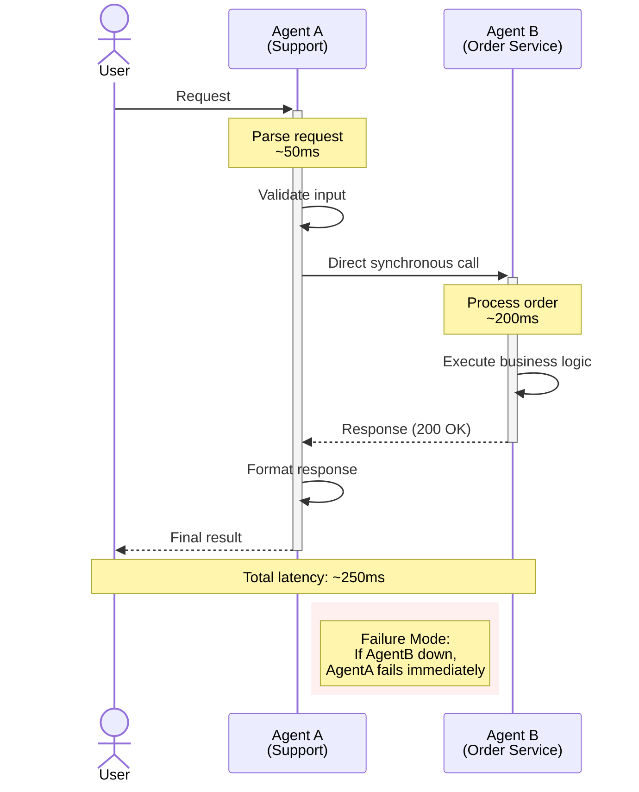
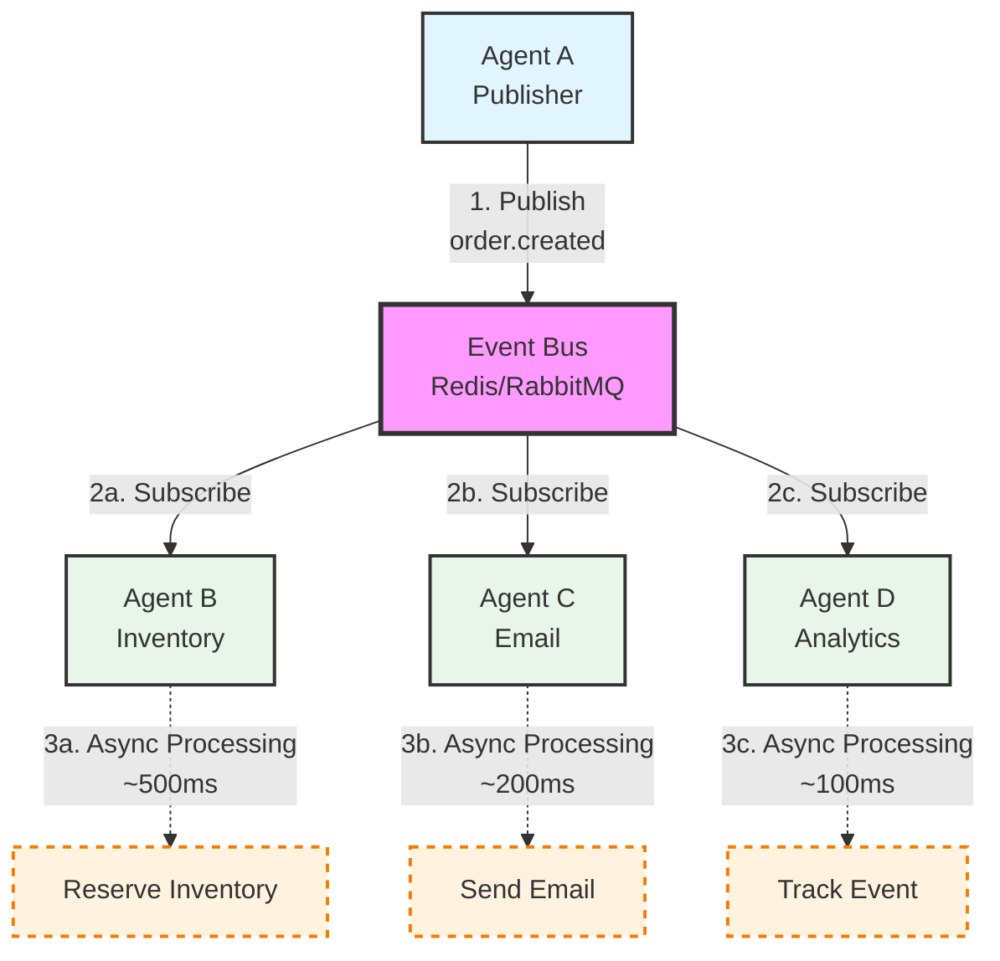
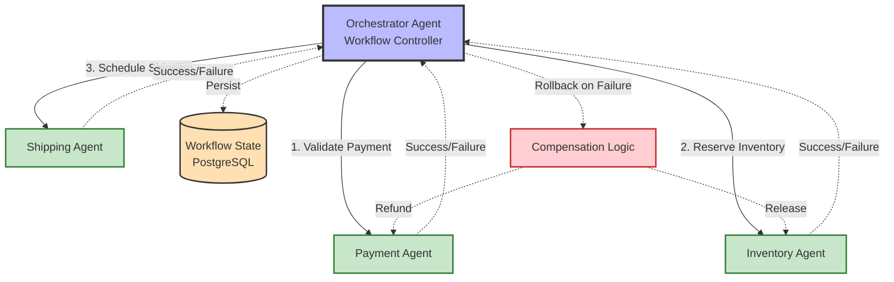
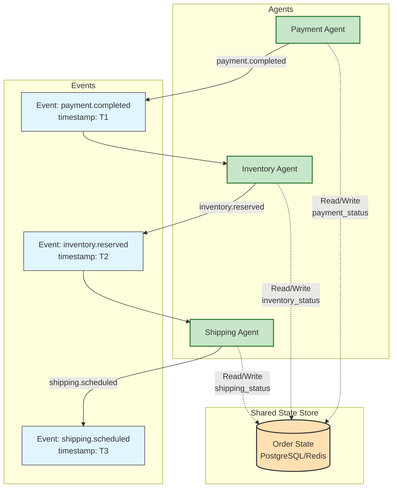
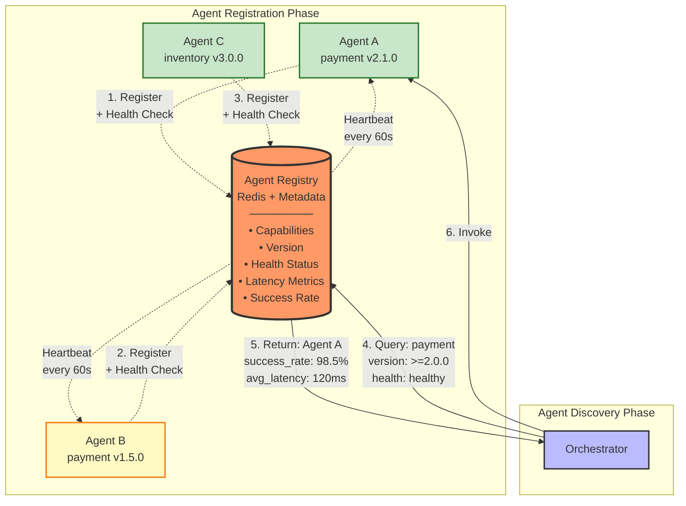
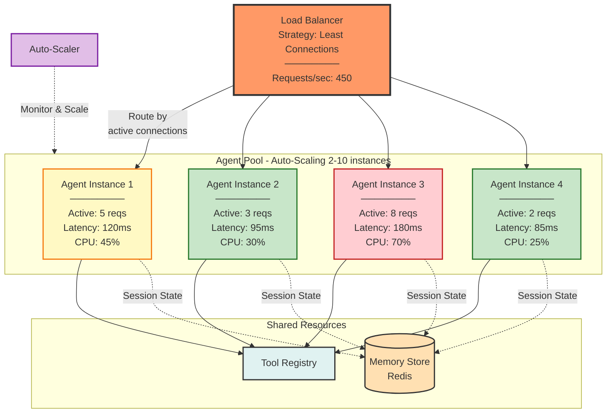
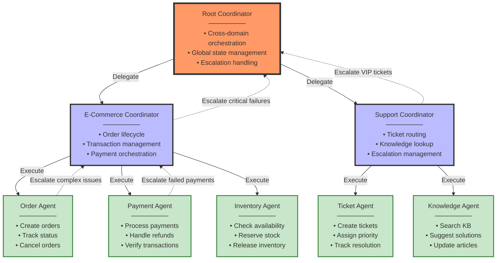

# Production AI Agent Systems Architecture

## Part III: Multi-Agent Systems

## Introduction: The Single Agent Ceiling

**Problem Statement**: As agent complexity grows, single-agent architectures encounter fundamental scaling limits. A monolithic agent handling customer support, order processing, inventory management, and fraud detection becomes:

- **Cognitively overloaded**: Too many tools, too much context, degraded decision quality
- **Operationally fragile**: Single point of failure affects all capabilities
- **Difficult to iterate**: Changes to fraud detection risk breaking support workflows
- **Resource inefficient**: Cannot scale components independently based on demand

**Naive Solution**: Add more tools, increase context window, use more powerful models.

**Architectural Reality**: Beyond a certain complexity threshold, decomposition into specialized agents becomes structurally necessary—not for performance optimization, but for **system maintainability, fault isolation, and operational flexibility**.

### The Monolithic Agent Problem

```
┌─────────────────────────────────────────────────────────────┐
│                    Monolithic Agent                         │
│                                                             │
│  • 47 tools registered                                      │
│  • 12 different domains                                     │
│  • 85K token system prompt                                  │
│  • 200K token context window (constantly full)              │
│  • 15 second average response time                          │
│  • Single failure mode affects all capabilities             │
│                                                             │
│  Result: High latency, frequent failures, difficult to      │
│          debug, impossible to scale independently           │
└─────────────────────────────────────────────────────────────┘
```

vs.

```
┌─────────────────────────────────────────────────────────────┐
│                   Multi-Agent Architecture                  │
│                                                             │
│  ┌────────────┐  ┌────────────┐  ┌────────────┐            │
│  │  Support   │  │  Orders    │  │   Fraud    │            │
│  │   Agent    │  │   Agent    │  │  Detection │            │
│  │            │  │            │  │   Agent    │            │
│  │  8 tools   │  │  6 tools   │  │  5 tools   │            │
│  │  3K tokens │  │  4K tokens │  │  6K tokens │            │
│  │  2s resp   │  │  1.5s resp │  │  3s resp   │            │
│  └────────────┘  └────────────┘  └────────────┘            │
│                                                             │
│  Result: Fast responses, isolated failures, independent     │
│          scaling, clear ownership boundaries                │
└─────────────────────────────────────────────────────────────┘
```

**Architectural Insight**: Multi-agent systems address complexity through decomposition—the same principle that drove the evolution from monolithic to microservices architectures in distributed systems.

---

## Part I: Theoretical Foundations

### Multi-Agent Systems as Microservices Architecture

**Theoretical Foundation**: Multi-agent architectures exhibit structural isomorphism with microservices patterns documented in distributed systems literature (Newman, 2015; Richardson, 2018). The same decomposition principles, communication patterns, and failure modes apply.

Multi-agent systems directly parallel microservices architecture in distributed systems:

| Microservices Concept | Multi-Agent Equivalent | Purpose |
|----------------------|------------------------|---------|
| **Service Boundary** | Agent Specialization | Clear responsibility separation |
| **API Gateway** | Orchestration Layer | Unified entry point, routing |
| **Service Discovery** | Agent Registry | Dynamic capability lookup |
| **Message Bus** | Event System | Asynchronous communication |
| **Circuit Breaker** | Agent Timeout/Fallback | Failure isolation |
| **Load Balancer** | Agent Pool | Distribute work across instances |
| **Service Mesh** | Agent Communication Layer | Observability, security, reliability |

**Design Principle**: Multi-agent architectures are distributed systems—apply proven distributed systems patterns rather than inventing agent-specific solutions.

### Conway's Law for Agent Systems

**Conway's Law**: "Organizations design systems that mirror their communication structure."

**Agent System Corollary**: **Agent architectures should mirror domain boundaries, not technical capabilities.**

**Anti-Pattern**: Agents divided by technical function
```
- "Tool Calling Agent" (uses all tools)
- "Planning Agent" (makes all plans)
- "Execution Agent" (executes everything)
```
Problem: Every task requires all three agents, creating tight coupling.

**Pattern**: Agents divided by domain responsibility
```
- "Customer Support Agent" (owns support domain)
- "Order Management Agent" (owns order lifecycle)
- "Inventory Agent" (owns stock management)
```
Benefit: Agents can complete tasks within their domain autonomously.

**Design Principle**: **Domain-driven agent boundaries**—decompose by business capability, not technical layer.

### The CAP Theorem for Agent Coordination

**Theoretical Foundation**: Brewer's CAP theorem (2000), formalized by Gilbert and Lynch (2002), states that distributed systems cannot simultaneously guarantee Consistency, Availability, and Partition Tolerance. Multi-agent systems, as distributed systems, inherit these constraints.

The CAP theorem applies directly to multi-agent coordination:

**Scenario**: Two agents attempting to book the same hotel room.

| Approach | Consistency | Availability | Partition Tolerance | Trade-off |
|----------|-------------|--------------|---------------------|-----------|
| **Distributed Lock** | ✓ | ✗ | ✗ | Lock service is SPOF |
| **Event Sourcing** | Eventual | ✓ | ✓ | Delayed consistency |
| **Coordinator Agent** | ✓ | ✗ | ✗ | Coordinator is SPOF |
| **Optimistic Concurrency** | Eventual | ✓ | ✓ | Requires conflict resolution |

**Architectural Principle**: Choose consistency model based on domain requirements:
- **Financial transactions**: Strong consistency (accept lower availability)
- **Content generation**: Eventual consistency (prioritize availability)
- **Inventory management**: Optimistic concurrency with reconciliation

---

## Part II: When to Use Multi-Agent Systems

### Decision Framework

Multi-agent architectures introduce operational complexity. Use them when benefits exceed costs.

**Use Multi-Agent When**:

1. **Domain Complexity**: System spans multiple distinct domains with different tool sets
2. **Independent Scaling**: Different capabilities have different load patterns
3. **Failure Isolation**: Failures in one domain should not cascade to others
4. **Team Boundaries**: Multiple teams own different agent capabilities
5. **Specialized Models**: Different domains benefit from different model sizes/types

**Use Single Agent When**:

1. **Simple Workflow**: Task spans 2-3 tools in single domain
2. **Tight Coupling**: Subtasks require shared context throughout execution
3. **Low Volume**: Request volume doesn't justify infrastructure complexity
4. **Rapid Iteration**: Early product stage requiring frequent architecture changes

### Complexity Threshold Analysis

**Theoretical Foundation**: Decomposition decisions follow from information theory and coupling analysis. High tool count (T), domain diversity (D), and context requirements (C) indicate low cohesion. High interdependency (R) indicates tight coupling. The optimal architecture minimizes coupling while maximizing cohesion—the fundamental principle of modular design (Parnas, 1972).

**Complexity Metric**:

```
Agent Complexity Score = (T × D × C) / R

Where:
T = Tool count (>20 suggests decomposition)
D = Domain count (>3 suggests decomposition)
C = Context size in tokens (>50K suggests decomposition)
R = Request interdependency ratio (>0.7 suggests single agent)

Decision boundaries:
Score > 400:  Strong multi-agent candidate
Score < 100:  Remain single agent
Score 100-400: Consider hybrid architecture
```

**Example Calculations**:

```python
# E-commerce Support Agent
T = 25 tools
D = 5 domains (support, orders, inventory, shipping, refunds)
C = 60K tokens
R = 0.4 (requests mostly independent)

Score = (25 × 5 × 60) / 0.4 = 18,750
→ Strong multi-agent candidate

# Code Documentation Agent
T = 8 tools
D = 2 domains (code analysis, documentation)
C = 30K tokens
R = 0.9 (tightly coupled workflow)

Score = (8 × 2 × 30) / 0.9 = 533
→ Borderline, likely remain single agent
```

---

## Part III: Communication Patterns

### Pattern 1: Direct Invocation (Synchronous)

**Architecture**: Agent A directly calls Agent B's API.



**Characteristics**:
- **Latency**: Low (direct call)
- **Coupling**: High (A must know B's interface)
- **Failure Handling**: A must handle B's failures
- **Tracing**: Simple (linear call chain)

**Use Cases**:
- Real-time requirements (chatbots)
- Simple request-response patterns
- Low agent count (2-3 agents)

**Code Snippet**:
```python
class SupportAgent:
    def __init__(self, order_agent: OrderAgent):
        self.order_agent = order_agent  # Direct dependency

    async def handle_request(self, user_input: str) -> str:
        if "order status" in user_input.lower():
            # Direct synchronous call
            order_status = await self.order_agent.get_order_status(
                order_id=extract_order_id(user_input)
            )
            return f"Your order status: {order_status}"
```

**Failure Mode**: If `order_agent` is down, `support_agent` fails immediately.

**Mitigation**: Circuit breaker pattern with fallback.

---

### Pattern 2: Event-Driven (Asynchronous)

**Architecture**: Agents publish events to message bus; subscribers react independently.



**Characteristics**:
- **Latency**: Higher (async processing)
- **Coupling**: Low (pub/sub decoupling)
- **Failure Handling**: Subscribers fail independently
- **Tracing**: Complex (requires correlation IDs)

**Use Cases**:
- Background processing
- Fan-out workflows (one event, multiple handlers)
- High agent count (5+ agents)
- Long-running tasks

**Code Snippet**:
```python
class OrderAgent:
    def __init__(self, event_bus: EventBus):
        self.event_bus = event_bus

    async def create_order(self, order_data: dict):
        # Process order
        order = await self._create_order_internal(order_data)

        # Publish event asynchronously (non-blocking)
        await self.event_bus.publish(
            event_type="order.created",
            data={
                "order_id": order.id,
                "user_id": order.user_id,
                "total": order.total
            },
            correlation_id=order.correlation_id
        )

        return order

class InventoryAgent:
    def __init__(self, event_bus: EventBus):
        # Subscribe to relevant events
        event_bus.subscribe("order.created", self.handle_order_created)

    async def handle_order_created(self, event: Event):
        """React to order creation independently"""
        await self.reserve_inventory(event.data["order_id"])

class EmailAgent:
    def __init__(self, event_bus: EventBus):
        event_bus.subscribe("order.created", self.send_confirmation)

    async def send_confirmation(self, event: Event):
        """Send confirmation email (independent of inventory)"""
        await self.send_email(
            user_id=event.data["user_id"],
            template="order_confirmation"
        )
```

**Architectural Insight**: Event-driven patterns provide natural failure isolation—inventory reservation failures do not cascade to email delivery. Subscribers can be added without publisher modification, exhibiting the Open/Closed Principle from software architecture.

**Design Principle**: **Event-driven for fan-out, direct invocation for request-response**.

---

### Pattern 3: Orchestration (Centralized Control)

**Architecture**: Orchestrator agent coordinates other agents, maintains workflow state.



**Characteristics**:
- **Control Flow**: Centralized
- **State Management**: Orchestrator maintains workflow state
- **Debugging**: Simpler (single point of visibility)
- **Failure Point**: Orchestrator is critical

**Use Cases**:
- Complex multi-step workflows with conditional logic
- Cross-domain transactions requiring coordination
- Workflows requiring human-in-the-loop at specific steps

**Code Snippet**:
```python
class OrderFulfillmentOrchestrator:
    """Orchestrates multi-agent order fulfillment workflow"""

    def __init__(
        self,
        payment_agent: PaymentAgent,
        inventory_agent: InventoryAgent,
        shipping_agent: ShippingAgent
    ):
        self.payment = payment_agent
        self.inventory = inventory_agent
        self.shipping = shipping_agent

    async def fulfill_order(self, order_id: str):
        """Orchestrate complete fulfillment workflow"""

        # Step 1: Validate payment
        payment_result = await self.payment.validate(order_id)
        if not payment_result.success:
            return WorkflowResult(
                status="failed",
                step="payment",
                reason=payment_result.error
            )

        # Step 2: Reserve inventory
        inventory_result = await self.inventory.reserve(order_id)
        if not inventory_result.success:
            # Rollback: refund payment
            await self.payment.refund(order_id)
            return WorkflowResult(
                status="failed",
                step="inventory",
                reason=inventory_result.error
            )

        # Step 3: Schedule shipping
        shipping_result = await self.shipping.schedule(order_id)
        if not shipping_result.success:
            # Rollback: release inventory and refund
            await self.inventory.release(order_id)
            await self.payment.refund(order_id)
            return WorkflowResult(
                status="failed",
                step="shipping",
                reason=shipping_result.error
            )

        return WorkflowResult(status="success")
```

**Architectural Analysis**:

*Strengths*:
- Centralized control flow provides deterministic execution and simplified debugging
- Transactional semantics through coordinated rollback (ACID properties)
- Explicit workflow state enables checkpoint-based recovery

*Constraints*:
- Orchestrator represents single point of failure and throughput bottleneck
- Tight coupling limits independent evolution of domain agents
- Scaling requires vertical scaling of orchestrator before horizontal scaling becomes effective

---

### Pattern 4: Choreography (Decentralized Coordination)

**Architecture**: Agents coordinate through shared state or events, no central controller.



**Characteristics**:
- **Control Flow**: Distributed
- **State Management**: Shared state store (database, cache)
- **Debugging**: Complex (distributed tracing required)
- **Failure Point**: No single point of failure

**Use Cases**:
- High-scale systems requiring independent agent scaling
- Workflows where agents can work autonomously
- Systems requiring high availability

**Code Snippet**:
```python
class PaymentAgent:
    """Autonomous agent using choreography"""

    async def process_payment(self, order_id: str):
        # Process payment
        result = await self._charge_card(order_id)

        # Update shared state
        await self.state_store.update(
            order_id=order_id,
            payment_status="completed" if result.success else "failed"
        )

        # Publish event for other agents
        await self.event_bus.publish(
            "payment.completed" if result.success else "payment.failed",
            {"order_id": order_id}
        )

class InventoryAgent:
    """Reacts to payment completion independently"""

    async def monitor_orders(self):
        """Continuously check for orders ready for inventory reservation"""
        while True:
            # Query shared state for orders with completed payment
            pending_orders = await self.state_store.query(
                payment_status="completed",
                inventory_status="pending"
            )

            for order in pending_orders:
                await self.reserve_inventory(order.id)
                await self.state_store.update(
                    order_id=order.id,
                    inventory_status="reserved"
                )

            await asyncio.sleep(1)  # Poll interval
```

**Architectural Analysis**:

*Strengths*:
- Eliminates central coordinator as bottleneck—horizontal scalability without architectural changes
- Fault tolerance through redundancy—no single point of failure
- Autonomous agent operation enables independent deployment and scaling

*Constraints*:
- Eventual consistency requires conflict resolution mechanisms
- Distributed debugging requires comprehensive tracing infrastructure
- State reconciliation complexity increases with agent count

**Design Principle**: **Orchestration for workflows with clear sequences; choreography for autonomous, scalable systems**.

---

## Part IV: Service Discovery and Registry

### The Agent Registry Pattern

As agent count grows, hardcoding dependencies becomes unmaintainable. Agents need **dynamic capability discovery**.

**Architecture**:



### Registry Schema

```python
from dataclasses import dataclass
from typing import List, Dict, Optional

@dataclass
class AgentCapability:
    """Defines what an agent can do"""
    name: str                    # e.g., "order_management"
    version: str                 # e.g., "2.1.0"
    description: str
    input_schema: Dict           # JSON Schema
    output_schema: Dict
    avg_latency_ms: float
    success_rate: float          # Last 24h success rate

@dataclass
class AgentRegistration:
    """Agent registry entry"""
    agent_id: str
    agent_name: str
    capabilities: List[AgentCapability]
    endpoint: str                # HTTP endpoint or message queue
    health_check_url: str
    status: str                  # "healthy", "degraded", "down"
    metadata: Dict               # Tags, region, cost, etc.
```

### Registration and Discovery

```python
class AgentRegistry:
    """Service registry for agent discovery"""

    def __init__(self, storage: RedisStore):
        self.storage = storage

    async def register(self, registration: AgentRegistration):
        """Agent registers its capabilities"""
        await self.storage.set(
            key=f"agent:{registration.agent_id}",
            value=registration.to_json(),
            ttl=60  # Require periodic heartbeat
        )

        # Index by capability for fast lookup
        for capability in registration.capabilities:
            await self.storage.add_to_set(
                key=f"capability:{capability.name}",
                value=registration.agent_id
            )

    async def discover(
        self,
        capability: str,
        filters: Optional[Dict] = None
    ) -> List[AgentRegistration]:
        """Find agents with specific capability"""

        # Get agent IDs with this capability
        agent_ids = await self.storage.get_set(
            f"capability:{capability}"
        )

        # Fetch full registrations
        agents = []
        for agent_id in agent_ids:
            registration = await self.storage.get(f"agent:{agent_id}")
            if registration and self._matches_filters(registration, filters):
                agents.append(registration)

        # Sort by success rate and latency
        return sorted(
            agents,
            key=lambda a: (a.success_rate, -a.avg_latency_ms),
            reverse=True
        )

    def _matches_filters(
        self,
        registration: AgentRegistration,
        filters: Optional[Dict]
    ) -> bool:
        """Apply filters (version, region, status, etc.)"""
        if not filters:
            return True

        if "min_success_rate" in filters:
            if registration.success_rate < filters["min_success_rate"]:
                return False

        if "max_latency_ms" in filters:
            capability = next(
                c for c in registration.capabilities
                if c.name == filters["capability"]
            )
            if capability.avg_latency_ms > filters["max_latency_ms"]:
                return False

        if "status" in filters:
            if registration.status != filters["status"]:
                return False

        return True
```

### Usage Example

```python
class OrderOrchestrator:
    def __init__(self, registry: AgentRegistry):
        self.registry = registry

    async def process_order(self, order_data: dict):
        # Discover payment agent dynamically
        payment_agents = await self.registry.discover(
            capability="payment_processing",
            filters={
                "min_success_rate": 0.95,
                "max_latency_ms": 2000,
                "status": "healthy"
            }
        )

        if not payment_agents:
            raise NoAgentAvailableError("payment_processing")

        # Use highest-rated agent
        payment_agent = payment_agents[0]
        result = await self._invoke_agent(
            payment_agent.endpoint,
            action="process_payment",
            data=order_data
        )

        return result
```

**Architectural Insight**: Service discovery transforms static compile-time dependencies into dynamic runtime bindings. This enables zero-downtime deployments, automatic failover, and gradual rollouts—the same benefits that service meshes provide in Kubernetes environments.

**Design Principle**: **Service discovery enables loose coupling and dynamic adaptation**.

---

## Part V: Failure Isolation and Circuit Breakers

### The Cascading Failure Problem

**Scenario**: Support agent depends on order agent. Order agent is slow or failing.

**Without Circuit Breaker**:
```
1. Support agent calls order agent (30s timeout)
2. Order agent is down → timeout after 30s
3. Support agent retries 3 times → 90s total
4. User experiences 90s blocked request, then error
5. Support agent threads exhausted waiting for order agent
6. Support agent now unavailable for all requests
```

**Result**: Single agent failure cascades to dependent agents.

### Circuit Breaker Pattern

**Theoretical Foundation**: The Circuit Breaker pattern, formalized by Michael Nygard in *Release It!* (2007), applies control theory to fault propagation. When error rates exceed thresholds, the circuit "opens," preventing cascade. This implements a finite state machine with hysteresis—deliberate delay in state transitions prevents oscillation between operational and failed states.

**State Machine**:

```
┌──────────────────────────────────────────────────────────────┐
│                   Circuit Breaker States                     │
├──────────────────────────────────────────────────────────────┤
│                                                              │
│   CLOSED (Normal)                                            │
│   • Requests pass through                                    │
│   • Failures counted                                         │
│   • If failure rate > threshold → OPEN                       │
│                                                              │
│           │                                                  │
│           │ Failure rate exceeds threshold                   │
│           ▼                                                  │
│                                                              │
│   OPEN (Failing Fast)                                        │
│   • Requests immediately rejected                            │
│   • No calls to dependency                                   │
│   • After timeout → HALF_OPEN                                │
│                                                              │
│           │                                                  │
│           │ Timeout expires                                  │
│           ▼                                                  │
│                                                              │
│   HALF_OPEN (Testing)                                        │
│   • Limited test requests pass through                       │
│   • If successful → CLOSED                                   │
│   • If failed → OPEN                                         │
│                                                              │
└──────────────────────────────────────────────────────────────┘
```

**Implementation**:

```python
from enum import Enum
import time
import asyncio

class CircuitState(Enum):
    CLOSED = "closed"
    OPEN = "open"
    HALF_OPEN = "half_open"

class CircuitBreaker:
    """Circuit breaker for agent-to-agent calls"""

    def __init__(
        self,
        failure_threshold: int = 5,        # Open after 5 failures
        timeout_seconds: int = 60,         # Try recovery after 60s
        success_threshold: int = 2         # Close after 2 successes
    ):
        self.failure_threshold = failure_threshold
        self.timeout_seconds = timeout_seconds
        self.success_threshold = success_threshold

        self.state = CircuitState.CLOSED
        self.failure_count = 0
        self.success_count = 0
        self.last_failure_time = None

    async def call(self, func, *args, **kwargs):
        """Execute function with circuit breaker protection"""

        # Check if circuit is open
        if self.state == CircuitState.OPEN:
            if self._should_attempt_reset():
                self.state = CircuitState.HALF_OPEN
                self.success_count = 0
            else:
                raise CircuitBreakerOpenError(
                    f"Circuit open, retry after {self._time_until_retry()}s"
                )

        try:
            # Execute function
            result = await func(*args, **kwargs)

            # Success handling
            self._on_success()
            return result

        except Exception as e:
            # Failure handling
            self._on_failure()
            raise

    def _on_success(self):
        """Handle successful call"""
        if self.state == CircuitState.HALF_OPEN:
            self.success_count += 1
            if self.success_count >= self.success_threshold:
                # Recovery successful
                self.state = CircuitState.CLOSED
                self.failure_count = 0
        else:
            # Reset failure count on success
            self.failure_count = 0

    def _on_failure(self):
        """Handle failed call"""
        self.failure_count += 1
        self.last_failure_time = time.time()

        if self.failure_count >= self.failure_threshold:
            self.state = CircuitState.OPEN

    def _should_attempt_reset(self) -> bool:
        """Check if enough time has passed to try recovery"""
        if self.last_failure_time is None:
            return True
        return (time.time() - self.last_failure_time) >= self.timeout_seconds

    def _time_until_retry(self) -> float:
        """Time until circuit will attempt reset"""
        if self.last_failure_time is None:
            return 0
        elapsed = time.time() - self.last_failure_time
        return max(0, self.timeout_seconds - elapsed)

class CircuitBreakerOpenError(Exception):
    """Raised when circuit breaker is open"""
    pass
```

### Integration with Agent Calls

```python
class SupportAgent:
    def __init__(self, order_agent: OrderAgent):
        self.order_agent = order_agent

        # Circuit breaker per dependency
        self.order_circuit = CircuitBreaker(
            failure_threshold=5,
            timeout_seconds=60
        )

    async def get_order_status(self, order_id: str) -> str:
        """Get order status with circuit breaker protection"""

        try:
            # Call through circuit breaker
            status = await self.order_circuit.call(
                self.order_agent.get_status,
                order_id=order_id
            )
            return status

        except CircuitBreakerOpenError as e:
            # Circuit is open, fail fast with fallback
            return self._fallback_order_status(order_id)

        except Exception as e:
            # Other errors
            logger.error(f"Order status call failed: {e}")
            return self._fallback_order_status(order_id)

    def _fallback_order_status(self, order_id: str) -> str:
        """Fallback when order agent unavailable"""
        return (
            f"Order status temporarily unavailable. "
            f"Please check order #{order_id} again shortly."
        )
```

**Architectural Insight**: Circuit breakers implement the Bulkhead Pattern from Release It! (Nygard, 2007)—isolate failures to prevent cascade. Fast failure (sub-millisecond rejection) preserves caller resources. Automatic recovery testing provides self-healing without manual intervention.

**Design Principle**: **Circuit breakers provide failure isolation—contain failures, don't propagate them**.

---

## Part VI: Load Distribution and Agent Pools

### The Agent Pool Pattern

**Problem**: Single agent instance handles 100 concurrent requests. Performance degrades, latency increases to 15s.

**Solution**: Deploy multiple instances of same agent, distribute load across pool.

**Architecture**:



### Load Balancing Strategies

| Strategy | Algorithm | Use Case |
|----------|-----------|----------|
| **Round Robin** | Rotate through instances sequentially | Uniform request complexity |
| **Least Connections** | Route to instance with fewest active requests | Variable request duration |
| **Weighted** | Distribute based on instance capacity | Heterogeneous hardware |
| **Response Time** | Route to fastest instance | Latency-sensitive applications |
| **Consistent Hashing** | Sticky routing based on session ID | Stateful agents |

**Implementation**:

```python
class AgentPool:
    """Pool of agent instances with load balancing"""

    def __init__(
        self,
        agent_class: type,
        pool_size: int = 4,
        strategy: str = "least_connections"
    ):
        self.strategy = strategy
        self.instances = [
            AgentInstance(
                agent=agent_class(),
                instance_id=f"instance-{i}"
            )
            for i in range(pool_size)
        ]
        self.round_robin_index = 0

    async def execute(self, request: dict) -> dict:
        """Execute request on agent from pool"""

        # Select instance based on strategy
        instance = self._select_instance(request)

        try:
            # Track active connections
            instance.active_requests += 1

            # Execute request
            result = await instance.agent.handle_request(request)

            # Update metrics
            instance.total_requests += 1
            instance.update_avg_response_time(result.duration_ms)

            return result

        finally:
            instance.active_requests -= 1

    def _select_instance(self, request: dict) -> 'AgentInstance':
        """Select instance based on load balancing strategy"""

        if self.strategy == "round_robin":
            instance = self.instances[self.round_robin_index]
            self.round_robin_index = (self.round_robin_index + 1) % len(self.instances)
            return instance

        elif self.strategy == "least_connections":
            return min(self.instances, key=lambda i: i.active_requests)

        elif self.strategy == "response_time":
            return min(self.instances, key=lambda i: i.avg_response_time_ms)

        elif self.strategy == "consistent_hash":
            # Sticky routing for stateful agents
            session_id = request.get("session_id")
            if session_id:
                index = hash(session_id) % len(self.instances)
                return self.instances[index]
            # Fallback to round robin
            return self._select_instance_round_robin()

        else:
            raise ValueError(f"Unknown strategy: {self.strategy}")

@dataclass
class AgentInstance:
    """Single agent instance with metrics"""
    agent: Any
    instance_id: str
    active_requests: int = 0
    total_requests: int = 0
    avg_response_time_ms: float = 0.0

    def update_avg_response_time(self, duration_ms: float):
        """Update rolling average response time"""
        alpha = 0.2  # Exponential moving average factor
        self.avg_response_time_ms = (
            alpha * duration_ms +
            (1 - alpha) * self.avg_response_time_ms
        )
```

### Auto-Scaling Agent Pools

```python
class AutoScalingAgentPool(AgentPool):
    """Agent pool with automatic scaling"""

    def __init__(
        self,
        agent_class: type,
        min_instances: int = 2,
        max_instances: int = 10,
        target_utilization: float = 0.7
    ):
        super().__init__(agent_class, pool_size=min_instances)
        self.min_instances = min_instances
        self.max_instances = max_instances
        self.target_utilization = target_utilization

        # Start monitoring task
        asyncio.create_task(self._monitor_and_scale())

    async def _monitor_and_scale(self):
        """Continuously monitor load and scale"""
        while True:
            await asyncio.sleep(30)  # Check every 30s

            # Calculate current utilization
            total_requests = sum(i.active_requests for i in self.instances)
            total_capacity = len(self.instances)
            utilization = total_requests / total_capacity

            # Scale up if over-utilized
            if utilization > self.target_utilization:
                if len(self.instances) < self.max_instances:
                    await self._scale_up()

            # Scale down if under-utilized
            elif utilization < (self.target_utilization * 0.5):
                if len(self.instances) > self.min_instances:
                    await self._scale_down()

    async def _scale_up(self):
        """Add instance to pool"""
        new_instance = AgentInstance(
            agent=self.agent_class(),
            instance_id=f"instance-{len(self.instances)}"
        )
        self.instances.append(new_instance)
        logger.info(f"Scaled up to {len(self.instances)} instances")

    async def _scale_down(self):
        """Remove instance from pool"""
        # Find instance with fewest active requests
        instance = min(self.instances, key=lambda i: i.active_requests)

        # Wait for active requests to complete
        while instance.active_requests > 0:
            await asyncio.sleep(1)

        self.instances.remove(instance)
        logger.info(f"Scaled down to {len(self.instances)} instances")
```

**Design Principle**: **Agent pools provide horizontal scalability—add capacity by adding instances, not increasing instance size**.

---

## Part VII: Observability in Multi-Agent Systems

### The Distributed Tracing Challenge

**Problem**: Request flows through 5 agents. Which agent caused the 10-second delay?

**Without Tracing**:
```
User request → 10 second response
(No visibility into which agent(s) caused delay)
```

**With Distributed Tracing**:
```
User request → Support Agent (200ms)
             → Order Agent (8500ms) ← BOTTLENECK
             → Inventory Agent (150ms)
             → Shipping Agent (300ms)
             → Response
```

### Trace Context Propagation

```python
from dataclasses import dataclass
from typing import Optional
import uuid
import time

@dataclass
class TraceContext:
    """Trace context propagated across agent calls"""
    trace_id: str          # Unique ID for entire request
    span_id: str           # Unique ID for this operation
    parent_span_id: Optional[str]  # Parent operation

    @classmethod
    def create_root(cls) -> 'TraceContext':
        """Create root trace context"""
        trace_id = str(uuid.uuid4())
        return cls(
            trace_id=trace_id,
            span_id=trace_id,  # Root span
            parent_span_id=None
        )

    def create_child(self) -> 'TraceContext':
        """Create child span"""
        return TraceContext(
            trace_id=self.trace_id,        # Same trace
            span_id=str(uuid.uuid4()),     # New span
            parent_span_id=self.span_id    # Parent reference
        )

class TracedAgent:
    """Agent with distributed tracing support"""

    def __init__(self, agent_name: str, tracer):
        self.agent_name = agent_name
        self.tracer = tracer

    async def handle_request(
        self,
        request: dict,
        trace_context: Optional[TraceContext] = None
    ) -> dict:
        """Handle request with tracing"""

        # Create or propagate trace context
        if trace_context is None:
            trace_context = TraceContext.create_root()

        # Start span
        span = self.tracer.start_span(
            operation_name=f"{self.agent_name}.handle_request",
            trace_id=trace_context.trace_id,
            span_id=trace_context.span_id,
            parent_span_id=trace_context.parent_span_id
        )

        try:
            # Add metadata to span
            span.set_tag("agent.name", self.agent_name)
            span.set_tag("request.id", request.get("id"))

            # Process request
            start_time = time.time()
            result = await self._process_request(request, trace_context)
            duration_ms = (time.time() - start_time) * 1000

            # Record success metrics
            span.set_tag("status", "success")
            span.set_tag("duration_ms", duration_ms)

            return result

        except Exception as e:
            # Record error in span
            span.set_tag("status", "error")
            span.set_tag("error.type", type(e).__name__)
            span.set_tag("error.message", str(e))
            raise

        finally:
            # Close span
            span.finish()

    async def _process_request(
        self,
        request: dict,
        trace_context: TraceContext
    ) -> dict:
        """Process request (calls other agents with context)"""

        # Call another agent, propagating trace context
        if self._needs_other_agent(request):
            child_context = trace_context.create_child()
            result = await self.other_agent.handle_request(
                request=request,
                trace_context=child_context  # Propagate!
            )

        return result
```

### Observability Dashboard

```
┌──────────────────────────────────────────────────────────────────────┐
│              Multi-Agent System Observability Dashboard              │
├──────────────────────────────────────────────────────────────────────┤
│                                                                       │
│ System-Wide Metrics                                                   │
│   Total Requests:     45,234 (last hour)                             │
│   Success Rate:       94.2%                                          │
│   P50 Latency:        1.2s                                           │
│   P95 Latency:        4.8s                                           │
│   P99 Latency:        12.3s                                          │
│                                                                       │
├───────────────────────────────────────────────────────────────────────┤
│                                                                       │
│ Per-Agent Metrics                                                     │
│                                                                       │
│ ┌────────────────┬───────────┬──────────┬──────────┬──────────────┐  │
│ │ Agent          │ Requests  │ Success  │ P95 Lat  │ Circuit      │  │
│ ├────────────────┼───────────┼──────────┼──────────┼──────────────┤  │
│ │ Support        │ 15,234    │ 99.1%    │ 1.2s     │ CLOSED       │  │
│ │ Order          │ 12,456    │ 97.8%    │ 2.3s     │ CLOSED       │  │
│ │ Payment        │ 8,932     │ 85.4%    │ 15.2s    │ HALF_OPEN   │  │
│ │ Inventory      │ 6,234     │ 99.8%    │ 0.8s     │ CLOSED       │  │
│ │ Shipping       │ 4,123     │ 98.2%    │ 3.1s     │ CLOSED       │  │
│ └────────────────┴───────────┴──────────┴──────────┴──────────────┘  │
│                                                                       │
│ Alert: Payment Agent degraded (circuit HALF_OPEN)                   │
│                                                                       │
├───────────────────────────────────────────────────────────────────────┤
│                                                                       │
│ Inter-Agent Communication                                             │
│                                                                       │
│   Support → Order:     5,234 calls  (P95: 2.1s)                     │
│   Support → Inventory: 3,123 calls  (P95: 0.9s)                     │
│   Order → Payment:     4,892 calls  (P95: 15.8s) SLOW               │
│   Order → Shipping:    3,456 calls  (P95: 3.2s)                     │
│                                                                       │
├───────────────────────────────────────────────────────────────────────┤
│                                                                       │
│ Trace Example (Slow Request - 12.3s total)                           │
│                                                                       │
│   trace_id: a7f3b2c1-4d5e-6f7g-8h9i-0j1k2l3m4n5                     │
│                                                                       │
│   ┌─ Support Agent ────────────────────────────── 12.3s ─────────┐   │
│   │  ├─ Parse Request ──────────────────────── 0.1s              │   │
│   │  ├─ Call Order Agent ───────────────────── 11.8s [SLOW]     │   │
│   │  │  ├─ Validate Order ────────────────── 0.2s               │   │
│   │  │  ├─ Call Payment Agent ─────────────── 11.2s [SLOW]     │   │
│   │  │  │  └─ External API timeout ───────── 11.0s [ERROR]     │   │
│   │  │  └─ Fallback to cached status ──────── 0.3s             │   │
│   │  └─ Format Response ────────────────────── 0.2s              │   │
│   └──────────────────────────────────────────────────────────────┘   │
│                                                                       │
│   Root Cause: Payment Agent → External API timeout                   │
│                                                                       │
└───────────────────────────────────────────────────────────────────────┘
```

### Key Observability Metrics

**System-Level Metrics**:
- Request throughput (requests/second)
- Overall success rate
- End-to-end latency distribution (P50, P95, P99)
- Active agents and health status

**Agent-Level Metrics**:
- Per-agent request count
- Per-agent success rate
- Per-agent latency distribution
- Circuit breaker state
- Instance count (for pools)

**Inter-Agent Metrics**:
- Call frequency between agents
- Inter-agent latency
- Failure rates for agent-to-agent calls
- Timeout frequencies

**Design Principle**: **Distributed tracing is mandatory—without it, multi-agent systems are operationally opaque**.

---

## Part VIII: Testing Multi-Agent Systems

### The Testing Pyramid for Multi-Agent Systems

**Theoretical Foundation**: Testing strategies follow the Test Pyramid principle (Cohn, 2009)—maximize fast, isolated unit tests at the base; minimize slow, expensive end-to-end tests at the apex. For multi-agent systems, this translates to: component tests (isolated agents), integration tests (agent pairs), end-to-end tests (full system).

```
┌──────────────────────────────────────────────────────┐
│                                                      │
│              End-to-End Tests                        │
│              (Full System)                           │
│              ~10 tests                               │
│                                                      │
├──────────────────────────────────────────────────────┤
│                                                      │
│         Integration Tests                            │
│         (Agent Pairs/Groups)                         │
│         ~50 tests                                    │
│                                                      │
├──────────────────────────────────────────────────────┤
│                                                      │
│    Component Tests                                   │
│    (Single Agent with Mock Dependencies)             │
│    ~200 tests                                        │
│                                                      │
└──────────────────────────────────────────────────────┘
```

### Level 1: Component Tests (Isolated Agent)

**Goal**: Test single agent with mocked dependencies.

```python
import pytest
from unittest.mock import AsyncMock, MagicMock

@pytest.mark.asyncio
async def test_support_agent_handles_order_query():
    """Test support agent with mocked order agent"""

    # Arrange: Mock dependencies
    mock_order_agent = AsyncMock()
    mock_order_agent.get_order_status.return_value = {
        "order_id": "123",
        "status": "shipped",
        "tracking": "TRACK123"
    }

    support_agent = SupportAgent(order_agent=mock_order_agent)

    # Act: Handle user request
    response = await support_agent.handle_request(
        "What's the status of my order #123?"
    )

    # Assert: Correct response and dependency called
    assert "shipped" in response.lower()
    assert "TRACK123" in response
    mock_order_agent.get_order_status.assert_called_once_with(
        order_id="123"
    )

@pytest.mark.asyncio
async def test_support_agent_handles_order_agent_failure():
    """Test support agent handles order agent failure gracefully"""

    # Arrange: Mock order agent to fail
    mock_order_agent = AsyncMock()
    mock_order_agent.get_order_status.side_effect = Exception("Service unavailable")

    support_agent = SupportAgent(order_agent=mock_order_agent)

    # Act
    response = await support_agent.handle_request(
        "What's the status of my order #123?"
    )

    # Assert: Graceful fallback
    assert "temporarily unavailable" in response.lower()
    assert "123" in response  # Still includes order ID
```

### Level 2: Integration Tests (Agent Pairs)

**Goal**: Test interaction between real agent instances.

```python
@pytest.mark.asyncio
async def test_support_and_order_agent_integration():
    """Test support agent calling real order agent"""

    # Arrange: Both agents with shared test database
    test_db = await create_test_database()
    await test_db.insert_order({
        "order_id": "123",
        "status": "processing",
        "user_id": "user456"
    })

    order_agent = OrderAgent(database=test_db)
    support_agent = SupportAgent(order_agent=order_agent)

    # Act
    response = await support_agent.handle_request(
        user_id="user456",
        message="What's my order status?"
    )

    # Assert
    assert "processing" in response.lower()

    # Cleanup
    await test_db.cleanup()

@pytest.mark.asyncio
async def test_orchestrator_coordinates_multiple_agents():
    """Test orchestrator with real agent instances"""

    # Arrange
    payment_agent = PaymentAgent(payment_provider=MockPaymentProvider())
    inventory_agent = InventoryAgent(database=test_db)
    shipping_agent = ShippingAgent(shipping_api=MockShippingAPI())

    orchestrator = OrderFulfillmentOrchestrator(
        payment_agent=payment_agent,
        inventory_agent=inventory_agent,
        shipping_agent=shipping_agent
    )

    # Act
    result = await orchestrator.fulfill_order("order123")

    # Assert: All steps completed
    assert result.status == "success"
    assert payment_agent.charge_count == 1
    assert inventory_agent.reservation_count == 1
    assert shipping_agent.schedule_count == 1
```

### Level 3: End-to-End Tests (Full System)

**Goal**: Test complete user workflow through all agents.

```python
@pytest.mark.asyncio
@pytest.mark.e2e
async def test_complete_order_fulfillment_workflow():
    """Test complete order fulfillment from user request to shipping"""

    # Arrange: Full system with real components
    system = await setup_test_system()

    # Simulate user request
    user_request = {
        "user_id": "user123",
        "action": "place_order",
        "items": [
            {"sku": "ITEM001", "quantity": 2}
        ],
        "payment_method": "credit_card"
    }

    # Act: Submit through API gateway
    response = await system.api_gateway.process_request(user_request)

    # Assert: Complete workflow succeeded
    assert response["status"] == "order_placed"
    assert response["order_id"] is not None

    # Verify each agent performed its role
    order = await system.database.get_order(response["order_id"])
    assert order["payment_status"] == "charged"
    assert order["inventory_status"] == "reserved"
    assert order["shipping_status"] == "scheduled"

    # Verify events published
    events = await system.event_bus.get_events(response["order_id"])
    assert any(e["type"] == "order.created" for e in events)
    assert any(e["type"] == "payment.completed" for e in events)
    assert any(e["type"] == "inventory.reserved" for e in events)

    # Cleanup
    await system.cleanup()
```

### Chaos Testing for Multi-Agent Systems

**Goal**: Test system resilience by intentionally injecting failures.

```python
import random

class ChaosOrchestrator:
    """Inject failures to test resilience"""

    def __init__(self, agent: Agent, failure_rate: float = 0.1):
        self.agent = agent
        self.failure_rate = failure_rate
        self.original_handle = agent.handle_request

        # Wrap agent's handle_request with chaos
        agent.handle_request = self._chaotic_handle_request

    async def _chaotic_handle_request(self, *args, **kwargs):
        """Randomly inject failures"""

        if random.random() < self.failure_rate:
            failure_type = random.choice([
                "timeout",
                "exception",
                "slow_response"
            ])

            if failure_type == "timeout":
                await asyncio.sleep(30)  # Simulate timeout
                raise TimeoutError("Simulated timeout")

            elif failure_type == "exception":
                raise Exception("Simulated random failure")

            elif failure_type == "slow_response":
                await asyncio.sleep(random.uniform(5, 10))

        # Normal execution
        return await self.original_handle(self, *args, **kwargs)

@pytest.mark.asyncio
async def test_system_resilience_under_chaos():
    """Test system handles random failures gracefully"""

    # Arrange: Inject chaos into agents
    payment_agent = PaymentAgent()
    inventory_agent = InventoryAgent()

    ChaosOrchestrator(payment_agent, failure_rate=0.3)
    ChaosOrchestrator(inventory_agent, failure_rate=0.2)

    orchestrator = OrderFulfillmentOrchestrator(
        payment_agent=payment_agent,
        inventory_agent=inventory_agent,
        shipping_agent=ShippingAgent()
    )

    # Act: Run many requests
    results = []
    for i in range(100):
        try:
            result = await orchestrator.fulfill_order(f"order{i}")
            results.append(result.status)
        except Exception as e:
            results.append("failed")

    # Assert: System degrades gracefully
    success_rate = results.count("success") / len(results)

    # With 30% payment failures and 20% inventory failures,
    # expect ~50-60% overall success (with retries)
    assert success_rate > 0.5, f"Success rate too low: {success_rate}"

    # System should not crash completely
    assert results.count("failed") < 80, "Too many complete failures"
```

**Design Principle**: **Test in isolation first, then integration, then end-to-end—catch failures early in the pyramid**.

---

## Part IX: Production Failure Modes

### Failure Mode 1: Agent Deadlock

**Symptom**: Two agents wait for each other indefinitely.

**Scenario**:
```
Agent A: "I need Agent B to complete before I proceed"
Agent B: "I need Agent A to complete before I proceed"

Result: Circular dependency produces deadlock—both agents block indefinitely
```

**Real-World Example**:
```
OrderAgent: Waiting for PaymentAgent to confirm charge
PaymentAgent: Waiting for OrderAgent to confirm order creation

→ Deadlock
```

**Root Cause**: Circular dependency without timeout.

**Mitigation**:

1. **Always use timeouts**:
```python
async def call_other_agent(self, agent, method, timeout_seconds=5):
    try:
        return await asyncio.wait_for(
            method(),
            timeout=timeout_seconds
        )
    except asyncio.TimeoutError:
        raise AgentTimeoutError(f"Agent call exceeded {timeout_seconds}s")
```

2. **Design acyclic dependencies**:
```
Order Agent → Payment Agent ✓
Payment Agent → Order Agent ✗ (circular!)

Instead:
Order Agent → Payment Agent → Notification Agent
```

3. **Use coordinator pattern for complex workflows**:
```python
# Instead of agents calling each other
OrderAgent ↔ PaymentAgent ✗

# Use orchestrator
Orchestrator → OrderAgent
Orchestrator → PaymentAgent ✓
```

---

### Failure Mode 2: Event Storm

**Symptom**: Single event triggers cascading events, overwhelming system.

**Scenario**:
```
1. Order created → publishes "order.created" event
2. 10 agents subscribe to "order.created", each publishes new event
3. Those 10 events trigger 50 more events
4. System processes 10,000 events/second, exhausts resources
```

**Real-World Example**:
```
order.created
  → inventory.check (triggers inventory.reserved)
  → email.send (triggers email.sent)
  → analytics.track (triggers analytics.processed)
  → notification.send (triggers notification.delivered)
    → email.send (again!) ← Duplication
    → sms.send (triggers sms.sent)
      → analytics.track (again!) ← Duplication
```

**Mitigation**:

1. **Event deduplication**:
```python
class EventBus:
    def __init__(self):
        self.processed_events = set()  # Cache of recent event IDs

    async def publish(self, event: Event):
        # Generate deterministic event ID
        event_id = self._generate_event_id(event)

        if event_id in self.processed_events:
            logger.warning(f"Duplicate event {event_id}, skipping")
            return

        # Process and cache
        await self._publish_internal(event)
        self.processed_events.add(event_id)

        # Cleanup old entries (sliding window)
        if len(self.processed_events) > 10000:
            self.processed_events = set(
                list(self.processed_events)[-5000:]
            )
```

2. **Rate limiting per event type**:
```python
class RateLimitedEventBus:
    def __init__(self):
        self.limiters = defaultdict(lambda: RateLimiter(rate=100, per=60))

    async def publish(self, event: Event):
        # Rate limit by event type
        limiter = self.limiters[event.type]

        if not await limiter.allow():
            logger.warning(f"Rate limit exceeded for {event.type}")
            raise RateLimitError(f"Too many {event.type} events")

        await self._publish_internal(event)
```

3. **Event TTL and max propagation depth**:
```python
@dataclass
class Event:
    type: str
    data: dict
    depth: int = 0         # Propagation depth
    max_depth: int = 3     # Stop after 3 levels

    def create_child(self, event_type: str, data: dict) -> 'Event':
        if self.depth >= self.max_depth:
            raise MaxDepthExceeded(
                f"Event propagation exceeded max depth {self.max_depth}"
            )

        return Event(
            type=event_type,
            data=data,
            depth=self.depth + 1,
            max_depth=self.max_depth
        )
```

---

### Failure Mode 3: Agent Version Skew

**Symptom**: Old agent version expects different response format from new agent version.

**Scenario**:
```
PaymentAgent v2.0: Returns {"status": "completed", "transaction_id": "123"}
OrderAgent v1.0: Expects {"success": true, "txn_id": "123"}

→ OrderAgent fails to parse response
```

**Mitigation**:

1. **Semantic versioning in agent registry**:
```python
@dataclass
class AgentCapability:
    name: str
    version: str           # e.g., "2.1.0"
    compatible_versions: List[str]  # ["2.0.x", "2.1.x"]

# Callers specify version constraints
agents = await registry.discover(
    capability="payment_processing",
    filters={"version": ">=2.0.0,<3.0.0"}
)
```

2. **Backward-compatible response formats**:
```python
# v2.0 maintains backward compatibility
def process_payment(self, request):
    result = self._process_internal(request)

    # Return both old and new formats
    return {
        # New format (v2.0)
        "status": result.status,
        "transaction_id": result.txn_id,

        # Old format (v1.0) - deprecated but supported
        "success": result.status == "completed",
        "txn_id": result.txn_id,

        # API version indicator
        "_api_version": "2.0"
    }
```

3. **Gradual rollout with canary deployment**:
```python
# Route 10% traffic to new version
class VersionedAgentPool:
    def __init__(self):
        self.v1_pool = AgentPool(PaymentAgentV1, size=9)
        self.v2_pool = AgentPool(PaymentAgentV2, size=1)

    async def execute(self, request):
        if random.random() < 0.1:
            # 10% to v2
            return await self.v2_pool.execute(request)
        else:
            # 90% to v1
            return await self.v1_pool.execute(request)
```

---

## Part X: Advanced Patterns

### Pattern 1: Hierarchical Multi-Agent Systems

**Concept**: Agents organized in hierarchy—coordinators manage domain agents.



**Architectural Insight**: Hierarchical decomposition mirrors organizational structure (Conway's Law). Coordinators implement domain-specific orchestration logic while leaf agents execute atomic operations. This enables clear accountability and simplified reasoning about system behavior.

**Applicability**: Systems with 10+ agents where flat architectures become difficult to reason about.

---

### Pattern 2: Agent Composition (Nested Agents)

**Concept**: Agents that delegate to specialized sub-agents.

```python
class CompositeCustomerAgent:
    """High-level customer service agent that delegates to specialists"""

    def __init__(self):
        self.intent_classifier = IntentClassificationAgent()
        self.order_specialist = OrderManagementAgent()
        self.refund_specialist = RefundAgent()
        self.general_support = GeneralSupportAgent()

    async def handle_request(self, user_input: str):
        # Classify intent
        intent = await self.intent_classifier.classify(user_input)

        # Delegate to specialist
        if intent == "order_status":
            return await self.order_specialist.handle(user_input)
        elif intent == "refund_request":
            return await self.refund_specialist.handle(user_input)
        else:
            return await self.general_support.handle(user_input)
```

**Architectural Insight**: Composition implements the Strategy Pattern from object-oriented design—runtime selection of specialized behavior based on context. Specialists encapsulate domain expertise while the composite agent provides unified interface and routing logic.

---

### Pattern 3: Competitive Agent Selection

**Concept**: Multiple agents compete to handle request; best response selected.

```python
class CompetitiveAgentOrchestrator:
    """Run multiple agents in parallel, select best response"""

    def __init__(self, agents: List[Agent], judge: Agent):
        self.agents = agents
        self.judge = judge

    async def handle_request(self, request: str):
        # Run all agents in parallel
        tasks = [agent.handle_request(request) for agent in self.agents]
        responses = await asyncio.gather(*tasks, return_exceptions=True)

        # Filter successful responses
        valid_responses = [
            r for r in responses
            if not isinstance(r, Exception)
        ]

        if not valid_responses:
            raise AllAgentsFailedError()

        # Judge selects best response
        best_response = await self.judge.select_best(
            request=request,
            responses=valid_responses
        )

        return best_response
```

**Use Cases**:
- Multiple models with different strengths
- Quality vs latency trade-offs
- A/B testing agent implementations

---

## Conclusion

Multi-agent systems transform monolithic agent architectures into **distributed, scalable, maintainable production services**.

### The Eight Principles

1. **Domain-Driven Decomposition**
   - Divide agents by business domain, not technical function
   - Align agent boundaries with team boundaries
   - Enable autonomous operation within domain

2. **Communication Pattern Selection**
   - Direct calls for request-response
   - Event-driven for fan-out and decoupling
   - Orchestration for complex workflows with rollback
   - Choreography for high-scale, autonomous systems

3. **Service Discovery Enables Flexibility**
   - Dynamic agent registration and discovery
   - Version management and compatibility
   - Automatic failover and load distribution

4. **Failure Isolation Prevents Cascading Failures**
   - Circuit breakers on inter-agent calls
   - Timeouts on all operations
   - Graceful degradation with fallbacks

5. **Agent Pools Provide Horizontal Scalability**
   - Multiple instances of same agent
   - Load balancing across instances
   - Auto-scaling based on utilization

6. **Distributed Tracing is Mandatory**
   - Trace context propagation across agents
   - Request flow visualization
   - Performance bottleneck identification

7. **Test in Isolation, Then Integration**
   - Component tests with mocked dependencies
   - Integration tests with real agents
   - End-to-end tests for critical workflows
   - Chaos testing for resilience validation

8. **Production Failure Modes Have Patterns**
   - Agent deadlock (circular dependencies)
   - Event storms (cascading events)
   - Version skew (incompatible formats)
   - Each has established mitigation strategies

### When to Use Multi-Agent Systems

**Use Multi-Agent When**:
- System spans multiple distinct domains (5+ domains)
- Different components have different scaling requirements
- Failures in one area must not affect others
- Multiple teams own different capabilities
- Agent complexity score > 400

**Remain Single Agent When**:
- Simple workflows (2-3 tools)
- Tightly coupled subtasks
- Low request volume
- Early-stage products

### The Cost of Multi-Agent Complexity

**Without multi-agent decomposition** (monolithic agents):
- Cognitive overload from excessive tool count (40+ tools)
- Single point of failure affecting all capabilities
- Unable to scale components independently
- Changes in one domain risk breaking others
- Debugging becomes intractable at scale

**With production-grade multi-agent systems**:
- Domain-focused agents with clear boundaries
- Isolated failures—one agent failure doesn't cascade
- Independent scaling based on demand patterns
- Teams can deploy agents independently
- Distributed tracing provides system-wide visibility

**Complexity investment justified when**:
- System spans 5+ distinct domains
- Request volume exceeds thousands per hour
- Multiple teams require independent deployment
- Failure isolation is critical for availability
- Agent complexity score exceeds 400

### Final Thoughts

**Single-agent systems are fragile scripts.**
**Multi-agent systems are distributed service architectures.**

Organizations building production AI agents will inevitably encounter the single-agent ceiling—the point at which adding more tools, context, or model capacity produces diminishing returns. The architectural patterns documented here—service discovery, circuit breakers, distributed tracing, event-driven communication—are not novel agent-specific innovations. They represent **direct application of distributed systems principles proven over decades of microservices evolution**.

The patterns that enabled web services to scale from monoliths to microservices apply identically to agent systems. Service boundaries, failure isolation, independent deployment, and observability are not optional optimizations—they are foundational requirements for production operation at scale.

Organizations that architect multi-agent systems as distributed systems will deliver reliable, scalable AI services. Organizations that architect them as loosely connected scripts will encounter cascading failures, debugging nightmares, and operational chaos.

**Architectural Principle**: Multi-agent systems are distributed systems. Apply proven distributed systems patterns rather than inventing agent-specific solutions. The wheel has already been invented—use it.

The difference between experimental multi-agent systems and production systems is not model intelligence—it is **distributed systems engineering maturity**.
