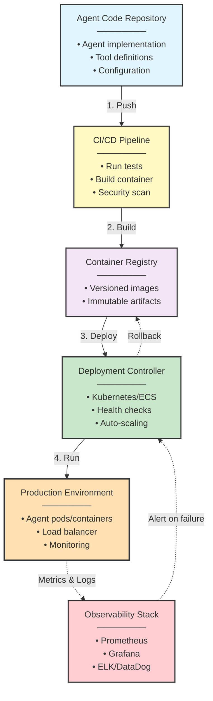

# Production AI Agent Systems Architecture

## Part IV: Production Operations

## Introduction: The Operations Gap

**Problem Statement**: Organizations successfully architect agent systems with robust runtime harnesses, sophisticated memory management, and well-designed multi-agent communication patterns—then deploy to production and encounter operational failures that have nothing to do with agent intelligence.

Production agent systems fail not because models are inadequate, but because operations teams lack the infrastructure, processes, and tooling to deploy, monitor, and maintain agents as production services.

**Operational Reality**:
```
Development: Agent works perfectly in local testing
Staging: Agent handles test scenarios successfully
Production Day 1: System processes 10K requests without issues
Production Day 7: Memory leak crashes agents every 4 hours
Production Day 14: Token costs exceed budget by 300%
Production Day 30: Incident response time averages 45 minutes
```

**Architectural Insight**: Production operations for agent systems require the same discipline as operating distributed microservices—deployment strategies, observability infrastructure, incident response procedures, cost management, and performance optimization.

---

## Part I: Theoretical Foundations

### Operations as System Reliability Engineering

**Theoretical Foundation**: Production operations implement the principles of Site Reliability Engineering (SRE) as defined by Google (Beyer et al., 2016). SRE treats operations as a software engineering problem—applying automation, monitoring, and systematic processes to achieve reliability targets.

For agent systems, this translates to:

| SRE Principle | Agent System Application |
|---------------|-------------------------|
| **Service Level Objectives (SLOs)** | Define target response time, success rate, availability |
| **Error Budgets** | Allocate acceptable failure rate (e.g., 0.1% errors) |
| **Toil Reduction** | Automate repetitive operational tasks |
| **Incident Management** | Structured response to production failures |
| **Postmortems** | Blameless analysis of incidents |
| **Capacity Planning** | Predict resource needs before shortages |

**Design Principle**: Operations is not manual intervention—it is systematic engineering of reliability.

### The Four Golden Signals for Agent Systems

**Theoretical Foundation**: The Four Golden Signals (Latency, Traffic, Errors, Saturation) from Google's SRE Book provide a framework for monitoring distributed systems. For agent systems, we adapt these signals to capture agent-specific operational characteristics.

Traditional monitoring focuses on infrastructure metrics (CPU, memory, disk). Agent systems require **application-level operational metrics**:

```
┌──────────────────────────────────────────────────────────────────┐
│               The Four Golden Signals for Agents                 │
├──────────────────────────────────────────────────────────────────┤
│                                                                  │
│ 1. LATENCY                                                       │
│    • End-to-end request latency (P50/P95/P99)                   │
│    • LLM inference latency                                       │
│    • Tool execution latency                                      │
│    • Context assembly latency                                    │
│                                                                  │
│ 2. TRAFFIC                                                       │
│    • Requests per second                                         │
│    • Token consumption rate                                      │
│    • Tool invocation rate                                        │
│    • Active session count                                        │
│                                                                  │
│ 3. ERRORS                                                        │
│    • Request failure rate                                        │
│    • LLM provider errors (rate limits, timeouts)                │
│    • Tool execution failures                                     │
│    • Context window overflows                                    │
│                                                                  │
│ 4. SATURATION                                                    │
│    • Context window utilization                                  │
│    • Queue depth (pending requests)                              │
│    • LLM rate limit consumption                                  │
│    • Database connection pool utilization                        │
│                                                                  │
└──────────────────────────────────────────────────────────────────┘
```

**Measurement Strategy**:

```python
@dataclass
class GoldenSignalMetrics:
    """Track four golden signals for agent operations"""
    # Latency
    latency_p50: float
    latency_p95: float
    latency_p99: float

    # Traffic
    requests_per_minute: int
    tokens_per_minute: int

    # Errors
    error_rate: float
    timeout_rate: float

    # Saturation
    context_utilization: float
    queue_depth: int
    rate_limit_usage: float

# Track metrics per request
async def track_request(agent_fn):
    start = time.time()
    try:
        result = await agent_fn()
        metrics.histogram("agent.latency_ms", (time.time() - start) * 1000)
        metrics.increment("agent.success")
        return result
    except Exception as e:
        metrics.increment("agent.error", tags={"type": type(e).__name__})
        raise
```

---

## Part II: Deployment Strategies

### Deployment as Code

**Problem**: Manual deployment of agents leads to configuration drift, inconsistent environments, and difficult rollbacks.

**Solution**: Infrastructure as Code (IaC) for agent deployments.

**Architecture**:



### Blue-Green Deployment Pattern

**Concept**: Maintain two identical production environments (Blue and Green). Deploy new version to inactive environment, validate, then switch traffic.

**Architecture**:

```
Current State (Blue Active):
┌────────────────────────────────────────────────────────────┐
│  Load Balancer  → Blue Environment (v1.2.0) [100% traffic] │
│                   Green Environment (idle)                  │
└────────────────────────────────────────────────────────────┘

Deployment Phase:
┌────────────────────────────────────────────────────────────┐
│  Load Balancer  → Blue Environment (v1.2.0) [100% traffic] │
│                   Green Environment (v1.3.0) [deploying]   │
└────────────────────────────────────────────────────────────┘

Validation Phase:
┌────────────────────────────────────────────────────────────┐
│  Load Balancer  → Blue Environment (v1.2.0) [95% traffic]  │
│                   Green Environment (v1.3.0) [5% canary]   │
└────────────────────────────────────────────────────────────┘

Cutover (if validation succeeds):
┌────────────────────────────────────────────────────────────┐
│  Load Balancer  → Blue Environment (v1.2.0) [idle]         │
│                   Green Environment (v1.3.0) [100% traffic]│
└────────────────────────────────────────────────────────────┘

Rollback (if validation fails):
┌────────────────────────────────────────────────────────────┐
│  Load Balancer  → Blue Environment (v1.2.0) [100% traffic] │
│                   Green Environment (terminated)            │
└────────────────────────────────────────────────────────────┘
```

**Implementation Pattern**:

```python
# Blue-Green: Deploy to inactive, validate, then switch
async def deploy_blue_green(version):
    # Deploy to inactive environment
    await inactive_env.deploy(version)

    # Canary validation (5% traffic, 5 minutes)
    await route_traffic(active=0.95, canary=0.05)
    await asyncio.sleep(300)

    metrics = await collect_metrics(duration=300)

    # Validate against SLOs
    if (metrics.error_rate < 0.01 and
        metrics.latency_p95 < 2000 and
        metrics.timeout_rate < 0.005):
        # Success: full cutover
        await route_traffic(active=0.0, canary=1.0)
    else:
        # Failure: instant rollback
        await route_traffic(active=1.0, canary=0.0)
        raise DeploymentError("Validation failed")
```

**Design Principle**: Blue-green deployments provide **zero-downtime deployments with instant rollback capability**.

---

### Canary Deployment Pattern

**Concept**: Gradually roll out new version to increasing percentage of traffic while monitoring for regressions.

**Progression**:
```
Stage 1: Deploy to 5% traffic (duration: 15 minutes)
  → Validate: error_rate < SLO, latency < SLO

Stage 2: Increase to 25% traffic (duration: 30 minutes)
  → Validate: sustained performance within SLO

Stage 3: Increase to 50% traffic (duration: 1 hour)
  → Validate: no degradation across metrics

Stage 4: Complete rollout to 100% traffic
  → Monitor: continue observability for 24 hours
```

**Automatic Rollback Conditions**:
- Error rate exceeds baseline by 2x
- P95 latency exceeds baseline by 50%
- LLM provider errors spike above threshold
- Memory leak detected (heap growth >10%/hour)

**Implementation Pattern**:

```python
# Canary: Progressive rollout with validation at each stage
STAGES = [(0.05, 15), (0.25, 30), (0.50, 60), (1.00, 0)]

async def canary_deploy(version):
    await deploy_canary(version)

    for traffic_pct, duration_min in STAGES:
        # Route traffic to canary
        await route_traffic(stable=1.0-traffic_pct, canary=traffic_pct)
        await asyncio.sleep(duration_min * 60)

        # Validate: canary vs baseline
        stable_metrics = await get_metrics("stable")
        canary_metrics = await get_metrics("canary")

        # Rollback if degraded (error rate 2x, latency 1.5x thresholds)
        if (canary_metrics.error_rate > stable_metrics.error_rate * 2.0 or
            canary_metrics.latency_p95 > stable_metrics.latency_p95 * 1.5):
            await rollback()
            raise DeploymentError(f"Degraded at {traffic_pct*100}% traffic")

    # Success: canary becomes stable
```

---

## Part III: Monitoring and Alerting

### Alert Design Principles

**Problem**: Alerting fatigue—operations teams receive hundreds of alerts daily, most non-actionable.

**Solution**: Symptom-based alerting, not cause-based alerting.

**Anti-Pattern**: Alert on every error
```yaml
# BAD: Alerts on individual errors (noisy)
alerts:
  - name: LLMProviderError
    condition: llm_error_count > 0
    severity: critical

  - name: ToolExecutionError
    condition: tool_error_count > 0
    severity: critical
```

**Pattern**: Alert on SLO violations
```yaml
# GOOD: Alerts on user-impacting violations
alerts:
  - name: HighErrorRate
    condition: error_rate > 1%  # SLO: 99% success
    duration: 5m
    severity: critical
    description: "User-facing error rate exceeds SLO"
    runbook: "https://wiki.company.com/runbooks/agent-high-error-rate"

  - name: HighLatency
    condition: latency_p95 > 3s  # SLO: <3s P95
    duration: 5m
    severity: warning
    description: "Response time degraded beyond SLO"

  - name: RateLimitApproaching
    condition: rate_limit_usage > 80%
    severity: warning
    description: "LLM rate limit approaching threshold"
```

**Alert Taxonomy**:

| Severity | Condition | Response Time | Example |
|----------|-----------|---------------|---------|
| **Critical** | User-facing outage | Immediate (page on-call) | Error rate >5%, all agents down |
| **Warning** | Approaching SLO violation | 15 minutes | Error rate >1%, latency >3s P95 |
| **Info** | Operational concern | Next business day | High token usage, queue depth growing |

### Operational Dashboard

```
┌──────────────────────────────────────────────────────────────────────┐
│              Production Agent Operations Dashboard                   │
├──────────────────────────────────────────────────────────────────────┤
│                                                                       │
│ System Health [HEALTHY] ✓                                            │
│   ├─ Error Rate: 0.3% (Target: <1%)         [OK]                   │
│   ├─ P95 Latency: 1.8s (Target: <3s)        [OK]                   │
│   ├─ Availability: 99.95% (Target: 99.9%)    [OK]                   │
│   └─ Active Sessions: 1,234                                          │
│                                                                       │
├───────────────────────────────────────────────────────────────────────┤
│                                                                       │
│ Infrastructure Metrics                                                │
│   ├─ Agent Instances: 8 (Target: 6-10)       [OK]                   │
│   ├─ CPU Usage: 45% average                   [OK]                   │
│   ├─ Memory Usage: 62% average                [OK]                   │
│   ├─ Queue Depth: 12 requests                 [OK]                   │
│   └─ Database Connections: 48/100 used        [OK]                   │
│                                                                       │
├───────────────────────────────────────────────────────────────────────┤
│                                                                       │
│ Cost Metrics (Last 24h)                                              │
│   ├─ Total Token Usage: 45.2M tokens                                 │
│   ├─ LLM Cost: $226 ($0.005/1K tokens)                              │
│   ├─ Infrastructure: $48 (compute + storage)                         │
│   ├─ Total Daily Cost: $274                                          │
│   └─ Cost per Request: $0.0061                                       │
│                                                                       │
├───────────────────────────────────────────────────────────────────────┤
│                                                                       │
│ Active Alerts                                                         │
│   [WARN] High Token Usage Detected                                   │
│     • Token consumption 15% above baseline                            │
│     • Trigger: Investigation recommended                              │
│     • Runbook: /runbooks/token-usage-spike                           │
│                                                                       │
│   [INFO] Canary Deployment in Progress                               │
│     • Version v2.3.1 at 25% traffic                                  │
│     • Stage 2/4 - Duration: 18/30 minutes                            │
│     • Metrics: Within acceptable range                                │
│                                                                       │
├───────────────────────────────────────────────────────────────────────┤
│                                                                       │
│ Recent Incidents                                                      │
│   ├─ INC-2024-0312: Rate limit exceeded (Resolved)                  │
│   │   Duration: 12 minutes | Impact: 3% error rate                  │
│   │   Resolution: Increased rate limit quota                         │
│   │                                                                   │
│   └─ INC-2024-0308: Memory leak in v2.2.0 (Resolved)               │
│       Duration: 4 hours | Impact: 3 restarts                         │
│       Resolution: Rollback to v2.1.9, bug fix deployed               │
│                                                                       │
└───────────────────────────────────────────────────────────────────────┘
```

---

## Part IV: Cost Management

### Token Cost Optimization

**Problem**: Token costs grow unpredictably in production—monthly bills exceed budgets by 200-400%.

**Root Causes**:
1. Unoptimized context windows (including irrelevant data)
2. Excessive retries without backoff
3. Tool results containing verbose responses
4. Memory bloat from poor compression

**Cost Structure Analysis**:

```
┌──────────────────────────────────────────────────────────────┐
│              Token Cost Breakdown (Example System)           │
├──────────────────────────────────────────────────────────────┤
│                                                              │
│  System Prompt:            2,000 tokens   (Fixed)           │
│  Working Memory:           8,000 tokens   (Per request)     │
│  Episodic Memory:         40,000 tokens   (Variable)        │
│  Semantic Memory:         20,000 tokens   (Retrieved)       │
│  Tool Results:            15,000 tokens   (Variable)        │
│  Response Generation:     10,000 tokens   (Variable)        │
│  ────────────────────────────────────────────────────────   │
│  Total per Request:       95,000 tokens                      │
│                                                              │
│  Cost Calculation:                                           │
│    Input:  85,000 tokens × $0.003/1K  = $0.255             │
│    Output: 10,000 tokens × $0.015/1K  = $0.150             │
│    Total per Request:                    $0.405             │
│                                                              │
│  At 10,000 requests/day:                                    │
│    Daily Cost:  $4,050                                       │
│    Monthly Cost: $121,500                                    │
│                                                              │
└──────────────────────────────────────────────────────────────┘
```

### Cost Optimization Strategies

**Strategy 1: Context Compression**

Context compression reduces token usage by 40-50%. For detailed compression algorithms (hierarchical summarization, importance-weighted retention, semantic deduplication), see **Part 2: Memory & Context Management**.

```python
# Context assembly with token budget enforcement
async def assemble_context(session_id, query, budget=50_000):
    # Fixed components (non-negotiable)
    system_memory = await get_system_memory()  # 2K tokens
    working_memory = await get_working_memory(session_id)  # 8K tokens

    # Allocate remaining budget dynamically
    remaining = budget - len(system_memory) - len(working_memory)
    episodic_budget = int(remaining * 0.5)  # 50% recent history
    semantic_budget = int(remaining * 0.3)  # 30% knowledge
    tool_budget = int(remaining * 0.2)      # 20% tool results

    # Retrieve within budgets
    episodic = await get_episodic_memory(session_id, max_tokens=episodic_budget)
    semantic = await get_semantic_memory(query, max_tokens=semantic_budget)
    tools = await get_tool_results(session_id, max_tokens=tool_budget)

    context = combine(system_memory, working_memory, episodic, semantic, tools)

    # Track cost
    metrics.gauge("agent.cost", len(context) / 1000 * 0.003)
    return context
```

**Strategy 2: Model Tiering**

Use smaller, cheaper models for simple tasks:

```python
# Model tiering: route by complexity
MODELS = {
    "gpt-4": 0.03,           # High complexity
    "gpt-3.5-turbo": 0.002,  # Medium complexity
    "claude-haiku": 0.00025  # Simple queries
}

async def route_request(request, context):
    complexity = await assess_complexity(request)

    # Select model by complexity
    if complexity == "high":
        model = "gpt-4"
    elif complexity == "medium":
        model = "gpt-3.5-turbo"
    else:
        model = "claude-haiku"

    # Track cost
    cost = (len(context) + len(request)) / 1000 * MODELS[model]
    metrics.gauge("agent.cost", cost, tags={"model": model})

    return await call_model(model, request, context)
```

**Strategy 3: Caching**

Cache responses for identical queries:

```python
# Response caching with TTL
cache = {}
TTL = 3600  # 1 hour

async def get_or_compute(query, agent_fn):
    cache_key = hashlib.sha256(query.lower().strip().encode()).hexdigest()

    # Check cache
    if cache_key in cache:
        cached = cache[cache_key]
        if time.time() - cached["timestamp"] < TTL:
            metrics.increment("agent.cache.hit")
            return cached["response"]

    # Cache miss: compute and store
    metrics.increment("agent.cache.miss")
    response = await agent_fn(query)
    cache[cache_key] = {"response": response, "timestamp": time.time()}

    return response
```

**Cost Savings Analysis**:

```
Baseline (No Optimization):
  • 95K tokens/request × 10K requests = 950M tokens/day
  • Cost: $4,050/day

With Compression (50K tokens/request):
  • Savings: 47% reduction → $2,150/day

With Model Tiering (60% requests use cheaper model):
  • Additional savings: 30% → $1,505/day

With Caching (20% cache hit rate):
  • Additional savings: 15% → $1,279/day

Total Optimized Cost: $1,279/day (68% reduction)
Annual Savings: $1,011,615
```

---

## Part V: Incident Response

### Incident Classification

**Theoretical Foundation**: Incident management follows the ITIL framework—structured processes for detecting, responding to, and resolving production incidents.

| Severity | Definition | Response Time | Example |
|----------|-----------|---------------|---------|
| **P0** | Complete system outage | Immediate (page on-call) | All agents down, database unreachable |
| **P1** | Major functionality degraded | 15 minutes | Error rate >10%, latency >10s |
| **P2** | Partial functionality impaired | 1 hour | Single agent failing, elevated errors |
| **P3** | Minor issue, no user impact | Next business day | Logging errors, config warning |

### Incident Response Runbook

**Runbook: High Error Rate (P1 Incident)**

```
INCIDENT: Agent Error Rate Exceeds 5%
SEVERITY: P1
SYMPTOMS: Users experiencing failures, errors in responses

DIAGNOSIS STEPS:

1. Check System Status Dashboard
   → Verify error rate metric
   → Identify affected agents
   → Check recent deployments

2. Check LLM Provider Status
   → Visit status.openai.com (or provider status page)
   → Verify no ongoing outages
   → Check rate limit consumption

3. Check Infrastructure Metrics
   → CPU/Memory usage on agent instances
   → Database connection pool status
   → Queue depth and processing latency

4. Review Recent Changes
   → Check deployment log for recent releases
   → Review configuration changes
   → Check tool modifications

RESOLUTION PROCEDURES:

If LLM provider outage:
  → Implement graceful degradation mode
  → Return cached responses where available
  → Queue non-critical requests for retry

If rate limit exceeded:
  → Implement exponential backoff
  → Request emergency quota increase
  → Route traffic to backup provider

If deployment introduced regression:
  → Initiate rollback to previous version
  → Verify error rate returns to baseline
  → Schedule postmortem

If infrastructure capacity exceeded:
  → Scale up agent instances immediately
  → Review auto-scaling policies
  → Plan capacity increase

COMMUNICATION TEMPLATE:

"We are investigating elevated error rates affecting agent
responses. Current error rate: X%. Engineering team engaged.
Updates every 15 minutes. Status page: status.company.com"

POSTMORTEM REQUIRED: Yes
```

### Incident Response Automation

```python
# Automated incident detection and response
async def monitor_and_respond():
    while True:
        metrics = await collect_metrics()

        # Detect anomalies and auto-remediate
        if metrics.error_rate > 0.05:
            incident = await create_incident(severity="P1", title="High Error Rate")
            await page_oncall(incident.id)

            # Automated diagnosis
            diagnosis = await run_diagnostics()

            # Auto-remediate based on diagnosis
            if diagnosis.issue_type == "rate_limit":
                await enable_backoff()
            elif diagnosis.issue_type == "bad_deployment":
                await initiate_rollback()
            elif diagnosis.issue_type == "capacity":
                await scale_up_instances()

            await update_incident(incident.id, diagnosis=diagnosis)

        await asyncio.sleep(60)  # Check every minute

# Diagnostic checks to identify root cause
async def run_diagnostics():
    if not await check_llm_provider_healthy():
        return Diagnosis("provider_outage")
    elif await check_recent_deployment(within_hours=1):
        return Diagnosis("bad_deployment")
    elif await check_rate_limit_usage() > 0.9:
        return Diagnosis("rate_limit")
    else:
        return Diagnosis("unknown")
```

---

## Part VI: Performance Optimization

### Performance Tuning Strategies

**Strategy 1: Parallel Tool Execution**

```python
# Parallel tool execution using dependency graph
async def execute_plan(plan):
    graph = build_dependency_graph(plan)

    # Execute in waves (topological order)
    while graph.has_unexecuted_steps():
        ready_steps = graph.get_ready_steps()

        # Execute all ready steps in parallel
        results = await asyncio.gather(*[
            execute_step(step) for step in ready_steps
        ])

        for step, result in zip(ready_steps, results):
            graph.mark_completed(step, result)

    return graph.get_final_results()
```

**Performance Improvement**: 3-5x faster for plans with independent steps.

**Strategy 2: Context Preloading**

```python
# Context preloading: predict and fetch before needed
async def preload_for_session(session_id):
    recent_messages = await get_recent_messages(session_id)
    predicted_topics = await predict_topics(recent_messages)

    # Preload top 3 predicted topics in background
    for topic in predicted_topics[:3]:
        asyncio.create_task(preload_semantic_memory(topic))
```

**Performance Improvement**: Reduces context assembly latency from 200ms → 50ms (4x faster).

---

**Strategy 3: Semantic Caching**

**Problem**: Traditional caching only works for identical queries. Similar questions miss the cache entirely:
- "How do I reset my password?" → Cache miss
- "Help me reset password" → Cache miss
- "Password reset instructions?" → Cache miss

All three questions have the same answer, but exact-match caching requires computing the response three times.

**Solution**: Cache based on semantic similarity, not string matching.

```python
# Semantic cache: match on meaning, not exact text
async def semantic_cache_get(query):
    query_embedding = await embed(query)

    # Search for similar cached queries (95% similarity threshold)
    similar = await vector_db.search(
        embedding=query_embedding,
        threshold=0.95,
        limit=1
    )

    if similar:
        metrics.increment("agent.cache.semantic_hit")
        return similar[0].response  # Return cached response

    metrics.increment("agent.cache.miss")
    return None

async def semantic_cache_set(query, response):
    await vector_db.insert({
        "query": query,
        "response": response,
        "embedding": await embed(query),
        "timestamp": time.time()
    })
```

**Impact Analysis**:

```
Baseline (Exact Match Caching):
  • Cache hit rate: 35%
  • Queries requiring LLM call: 6,500/day
  • Cost: $1,279/day (from Part IV analysis)

With Semantic Caching:
  • Cache hit rate: 60% (+25 percentage points)
  • Queries requiring LLM call: 4,000/day
  • Cost: $879/day

Additional savings: $400/day ($146,000/year)
Latency improvement: Cached responses in <10ms vs 1,800ms LLM calls
```

**Design Principle**: Cache on **meaning**, not **matching**. Users ask the same questions in different ways—your cache should recognize this.

---

## Part VII: Capacity Planning

### Capacity Forecasting

**Theoretical Foundation**: Capacity planning applies queuing theory—specifically M/M/c queues (Poisson arrivals, exponential service times, c servers) to predict system behavior under load.

**Capacity Model**:

```python
# Capacity planning using Little's Law: L = λ × W
def calculate_required_capacity(
    requests_per_second: float,
    avg_processing_time: float,
    target_utilization: float = 0.70
) -> int:
    # L = average concurrent requests
    # λ = arrival rate, W = processing time
    avg_concurrent = requests_per_second * avg_processing_time

    # Account for target utilization (don't run at 100%)
    required = avg_concurrent / target_utilization

    return math.ceil(required)  # Round up to integer instances

# Forecast growth
def forecast_growth(current_rps, growth_rate, months):
    forecasts = []
    for month in range(1, months + 1):
        projected_rps = current_rps * ((1 + growth_rate) ** month)
        instances = calculate_required_capacity(projected_rps, 2.5)
        forecasts.append({
            "month": month,
            "rps": projected_rps,
            "instances": instances,
            "cost": estimate_cost(instances)
        })
    return forecasts
```

**Example Capacity Forecast**:

```
Current State:
  • 50 requests/second
  • 2.5s average processing time
  • 6 agent instances

Growth Projection (20% monthly growth):

Month 1:  60 RPS  → 7 instances  → $1,200/month
Month 3:  86 RPS  → 10 instances → $1,700/month
Month 6:  149 RPS → 18 instances → $3,100/month
Month 12: 446 RPS → 53 instances → $9,000/month
```

---

## Part VIII: Security Operations

### Operational Security Checklist

```
┌──────────────────────────────────────────────────────────────┐
│          Production Security Operations Checklist            │
├──────────────────────────────────────────────────────────────┤
│                                                              │
│ [✓] Secrets Management                                       │
│     • API keys stored in secret manager (not code)          │
│     • Automatic key rotation (90 days)                      │
│     • Secrets injected at runtime (not environment vars)    │
│                                                              │
│ [✓] Network Security                                         │
│     • Agents run in private subnets                         │
│     • TLS for all inter-service communication               │
│     • Rate limiting on API gateway                          │
│                                                              │
│ [✓] Tenant Isolation                                         │
│     • Tenant ID enforced at infrastructure layer            │
│     • Database row-level security (RLS) enabled             │
│     • Vector search filtered by tenant                      │
│                                                              │
│ [✓] Audit Logging                                            │
│     • All requests logged with tenant context               │
│     • Sensitive operations logged (deletions, approvals)    │
│     • Logs retained for 90 days (compliance)                │
│                                                              │
│ [✓] Input Validation                                         │
│     • User inputs sanitized before processing               │
│     • Tool parameters validated (prevent injection)         │
│     • Maximum input length enforced                         │
│                                                              │
│ [✓] Model Output Filtering                                   │
│     • PII detection and redaction                           │
│     • Profanity/harmful content filtering                   │
│     • Hallucination detection for factual claims            │
│                                                              │
└──────────────────────────────────────────────────────────────┘
```

### Security Monitoring

```python
# Security monitoring: detect anomalies in real-time
async def monitor_security():
    # Check for suspicious patterns
    anomalies = {
        "excessive_failures": await check_auth_failures(),
        "unusual_access": await check_access_patterns(),
        "data_exfiltration": await check_data_exfiltration(),
        "prompt_injection": await check_prompt_injection()
    }

    for anomaly_type, detected in anomalies.items():
        if detected:
            await raise_security_alert(anomaly_type, detected)

# Detect prompt injection attempts
async def check_prompt_injection():
    recent = await get_recent_requests(minutes=10)

    injection_patterns = [
        "ignore previous instructions",
        "you are now",
        "system:",
        "disregard your programming"
    ]

    suspicious = [r for r in recent
                  if any(p in r.input.lower() for p in injection_patterns)]

    if len(suspicious) > 5:  # Multiple attempts
        return {"count": len(suspicious), "source_ips": [r.ip for r in suspicious]}

    return None
```

---

## Part IX: Production Failure Modes

### Failure Mode 1: Memory Leak

**Symptom**: Agent memory usage grows continuously until out-of-memory crash.

**Root Cause**: Context accumulation without cleanup, circular references, unclosed resources.

**Detection**:
```python
# Monitor heap growth over time
async def detect_memory_leak():
    measurements = []

    for i in range(6):  # 1 hour (10 min intervals)
        heap_size = psutil.Process().memory_info().rss
        measurements.append(heap_size)
        await asyncio.sleep(600)

    # Check for continuous growth
    growth_rate = (measurements[-1] - measurements[0]) / measurements[0]

    if growth_rate > 0.10:  # >10% growth per hour
        alert("Memory leak detected", growth_rate=growth_rate)
```

**Mitigation**:
1. Implement periodic context cleanup
2. Use weak references for caches
3. Set maximum session duration
4. Monitor and alert on heap growth

---

### Failure Mode 2: Token Budget Exhaustion

**Symptom**: Requests start failing with "context window exceeded" errors.

**Root Cause**: Context accumulation without compression, verbose tool results, uncontrolled memory retrieval.

**Mitigation**:

```python
# Token budget enforcement with safety margin
async def assemble_context(components, max_tokens=100_000):
    budget = int(max_tokens * 0.8)  # 80% safety margin
    assembled = {}
    remaining = budget

    # Fixed components (must include)
    for key in ["system", "working"]:
        assembled[key] = components[key]
        remaining -= count_tokens(components[key])

    # Variable components (include within budget, prioritized)
    for key in ["episodic", "semantic", "tools"]:
        if key not in components:
            continue

        tokens = count_tokens(components[key])

        if tokens <= remaining:
            assembled[key] = components[key]
            remaining -= tokens
        else:
            # Truncate to fit remaining budget
            assembled[key] = truncate(components[key], max_tokens=remaining)
            break

    # Verify budget not exceeded
    total = sum(count_tokens(v) for v in assembled.values())
    assert total <= budget, f"Budget exceeded: {total} > {budget}"

    return assembled
```

---

### Failure Mode 3: Cascading Deployment Failures

**Symptom**: Deployment to production succeeds initially, then fails catastrophically hours later.

**Root Cause**: Deployment validation insufficient—doesn't catch issues that manifest under sustained load.

**Example**:
```
Deployment: v2.3.0
Hour 0: Canary validation passes (5% traffic, 15 minutes)
Hour 1: Full rollout to 100% traffic
Hour 4: Memory leak becomes apparent (heap growth)
Hour 6: Instances start crashing, error rate spikes
Hour 7: Emergency rollback initiated
```

**Mitigation**:

```python
# Extended canary validation: multi-hour with load patterns
async def validate_deployment(version):
    # Phase 1: Low traffic (15 min)
    await validate_phase(version, traffic=5, duration=15)

    # Phase 2: Sustained load (2 hours) - check for memory leaks
    await validate_phase(version, traffic=25, duration=120,
                        checks=["memory_leak", "performance_degradation"])

    # Phase 3: Peak load simulation (1 hour)
    await simulate_peak_load(version)

    # Phase 4: Gradual rollout
    for traffic in [50, 75, 100]:
        await validate_phase(version, traffic=traffic, duration=60)
```

---

## Conclusion

Production operations for agent systems require the same engineering discipline as operating distributed microservices—deployment automation, comprehensive monitoring, incident response procedures, cost management, and security operations.

### The Eight Operational Principles

1. **SRE Mindset for Agent Operations**
   - Define SLOs (latency, error rate, availability)
   - Track golden signals (latency, traffic, errors, saturation)
   - Implement error budgets and alert on violations

2. **Deployment as Code**
   - Infrastructure as Code for reproducibility
   - Blue-green deployments for zero-downtime releases
   - Canary deployments with automatic rollback

3. **Symptom-Based Alerting**
   - Alert on user-impacting conditions, not individual errors
   - Link alerts to runbooks for rapid response
   - Classify by severity with appropriate response times

4. **Cost Optimization is Continuous**
   - Context compression reduces token usage
   - Model tiering uses cheaper models when appropriate
   - Caching eliminates duplicate processing

5. **Incidents Are Learning Opportunities**
   - Structured incident response with severity classification
   - Automated diagnostics and remediation where possible
   - Postmortems focus on systemic improvements

6. **Performance Optimization Through Architecture**
   - Parallel tool execution for independent operations
   - Context preloading reduces latency
   - Caching and compression at multiple layers

7. **Capacity Planning Prevents Outages**
   - Forecast growth using queuing theory models
   - Plan infrastructure capacity 3-6 months ahead
   - Auto-scaling handles traffic spikes

8. **Security is Operational, Not Just Design**
   - Secrets management with automatic rotation
   - Tenant isolation enforced at infrastructure layer
   - Security monitoring detects anomalies in real-time

### The Cost of Neglecting Operations

**Without production operations discipline**:
- Deployments cause outages (no rollback capability)
- Incidents extend for hours (no runbooks, slow diagnosis)
- Costs explode unpredictably (no optimization, no budgeting)
- Security incidents go undetected (no monitoring)
- Performance degrades over time (no tuning, no capacity planning)

**With production-grade operations**:
- Zero-downtime deployments with instant rollback
- Incidents resolved in minutes (automated response)
- Predictable costs within budget (continuous optimization)
- Security incidents detected and responded to immediately
- Performance maintained through proactive optimization

### Final Thoughts

**Agents without operations are experiments.**
**Agents with production operations are services.**

Organizations that invest in operational excellence will build agent systems that operate reliably at scale, meet SLAs, stay within budget, and respond quickly to incidents. Organizations that neglect operations will encounter frequent outages, unpredictable costs, long incident response times, and user frustration.

The difference between experimental agents and production systems is not model intelligence—it is **operational maturity**.

**Architectural Principle**: Operations engineering is as critical as system architecture. The best-designed agent will fail in production without deployment automation, monitoring, incident response, cost management, and performance optimization.

Build agents as production services from day one. Define SLOs. Automate deployments. Monitor continuously. Respond to incidents systematically. Optimize costs relentlessly. Plan capacity proactively. Treat security as an operational concern.

The patterns documented here—blue-green deployments, canary releases, symptom-based alerting, automated incident response, cost optimization, capacity forecasting—are not aspirational best practices. They are **minimum requirements for production operation at scale**.
