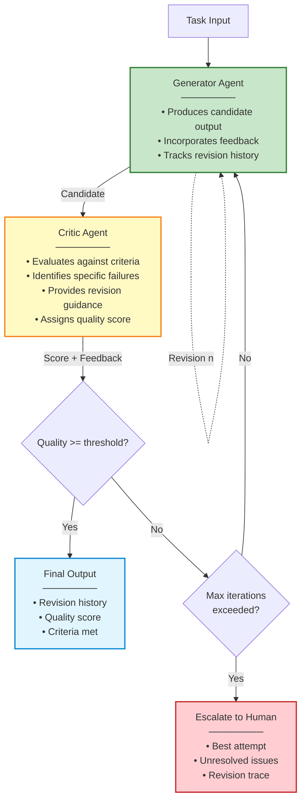
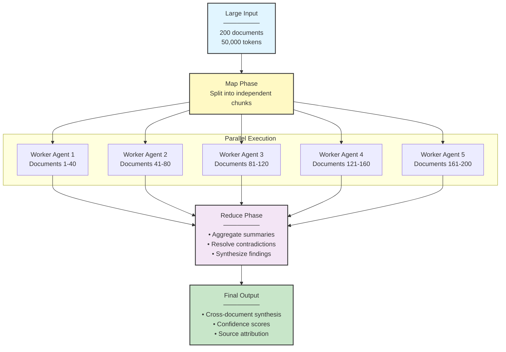
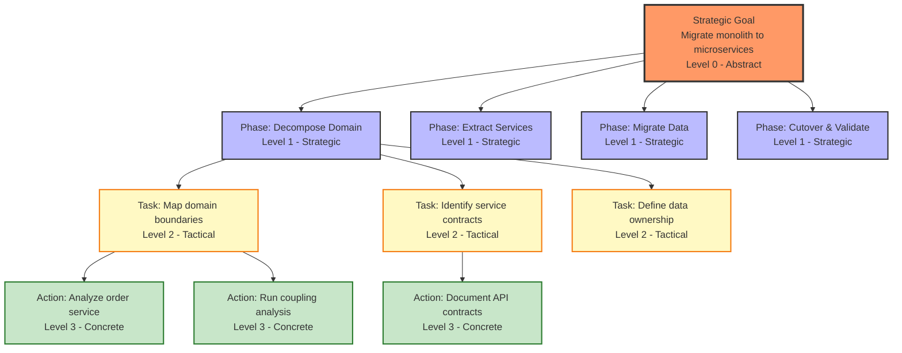
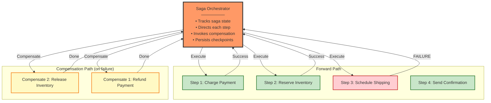
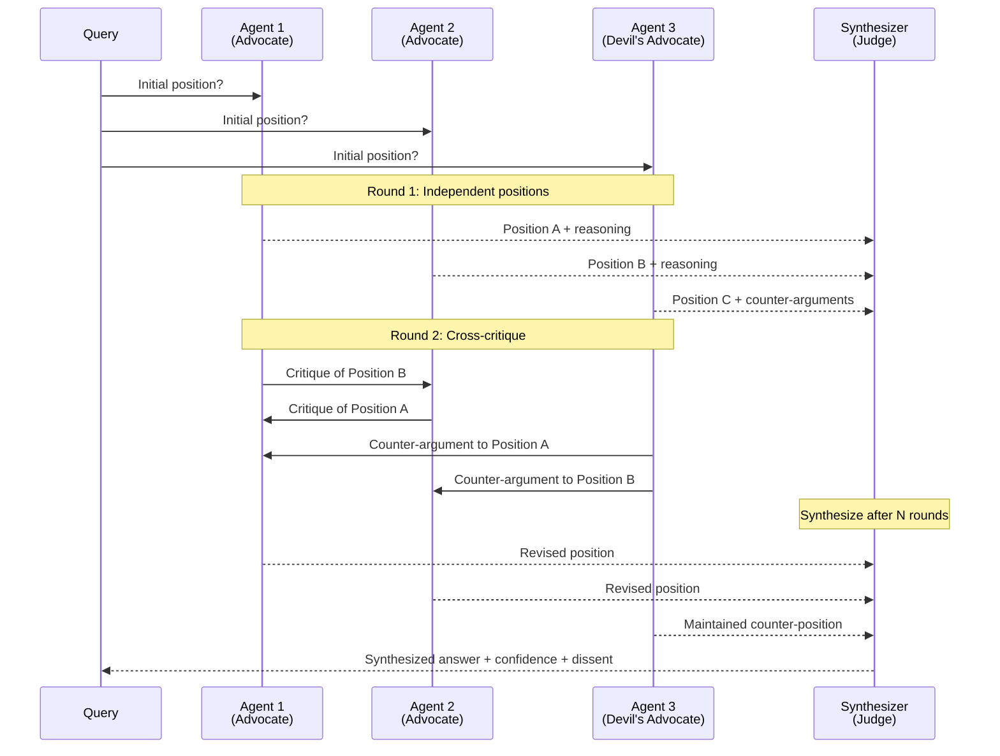

# Production AI Agent Systems Architecture

## Part VI: Advanced Patterns

## Introduction: The Pattern Ceiling

**Problem Statement**: Organizations that successfully implement the foundational patterns—runtime harnesses, memory hierarchies, multi-agent communication, production operations, and comprehensive testing—eventually encounter tasks that exceed the capability of these standard approaches.

A research agent exhausts its context window synthesizing a 200-document corpus. A code-generation agent produces output that passes unit tests but fails integration tests—repeatedly. A financial analysis workflow requires ten sequential agents, each depending on the previous, with no ability to recover from mid-chain failures.

**Architectural Reality**:
```
Standard Patterns Handle:
  → Single-turn question answering
  → Well-defined multi-step workflows
  → Bounded information retrieval tasks
  → Predictable tool chains

Advanced Patterns Required For:
  → Long-horizon tasks spanning hours or days
  → Self-improving output quality through iteration
  → Distributed transactions requiring rollback guarantees
  → Tasks where quality is contested (no single correct answer)
  → Dynamic workflows that reshape themselves at runtime
```

**Architectural Insight**: Advanced patterns are not improvements over standard patterns—they are solutions to fundamentally different problem classes. Applying an advanced pattern to a simple problem creates unnecessary complexity. Applying a standard pattern to a complex problem creates silent failure.

---

## Part I: Theoretical Foundations

### Compositional Complexity

**Theoretical Foundation**: Computational complexity theory distinguishes problems by the resources required to solve them. Agent system complexity follows similar structure—some problems are tractable with linear composition of tools and agents; others exhibit superlinear complexity requiring qualitatively different architectural approaches.

**Complexity Classes for Agent Tasks**:

```
Class P (Polynomial): Standard patterns sufficient
  → Well-defined queries
  → Bounded tool chains
  → Single-domain tasks
  → Deterministic workflows

Class NP (Non-deterministic Polynomial): Advanced patterns required
  → Tasks requiring verification harder than generation
  → Optimization over large solution spaces
  → Multi-constraint satisfaction
  → Quality-dependent iteration

Class PSPACE: Long-horizon planning required
  → Tasks with state spaces exponential in horizon length
  → Sequential decisions where early choices constrain future options
  → Reversible but costly actions requiring lookahead
```

**Decision Criterion**: When the cost of verifying a solution approaches the cost of generating it, standard single-pass patterns are sufficient. When verification is cheap but generation is error-prone, reflection patterns become necessary.

### Emergence in Multi-Agent Systems

**Theoretical Foundation**: Emergence—system-level behaviors not predictable from individual component behaviors—is well-documented in complex adaptive systems theory (Holland, 1998). Multi-agent systems exhibit two forms:

**Positive Emergence**: Collective capability exceeding individual agent capability
- Multi-agent debate improves factual accuracy beyond any single agent
- Ensemble voting reduces variance beyond individual confidence scores
- Parallel search explores solution spaces no single agent could traverse

**Negative Emergence**: System-level failure modes absent from individual agents
- Consensus collapse—agents converge on wrong answer through social influence
- Responsibility diffusion—no agent takes ownership of shared failure
- Oscillation—agents in feedback loops producing cyclic, non-convergent behavior

**Design Principle**: Architect for positive emergence; explicitly design against negative emergence through isolation, independent judgment, and dissenting opinion mechanisms.

### Information Flow and Bottlenecks

**Theoretical Foundation**: Shannon's information theory (1948) provides a formal basis for analyzing information flow in agent pipelines. Every agent-to-agent communication channel has finite capacity (tokens/second). Architectures that concentrate information flow create bottlenecks analogous to network chokepoints.

**Information Flow Anti-Pattern**:
```
All agents → Central orchestrator → All agents
(Star topology: orchestrator is bottleneck)
```

**Information Flow Pattern**:
```
Agents ↔ Shared state store ↔ Agents
(Mesh topology: no single bottleneck)
```

**Amdahl's Law for Agent Systems**: The maximum speedup from parallelizing an agent workflow is bounded by its sequential fraction:

```
Speedup = 1 / (S + (1-S)/N)

Where:
S = fraction of workflow that must run sequentially
N = number of parallel agents
1-S = parallelizable fraction

Example:
  Sequential fraction S = 0.4 (40% of workflow is sequential)
  N = 10 parallel agents

  Max speedup = 1 / (0.4 + 0.6/10) = 1 / 0.46 = 2.17x

  No matter how many agents we add, speedup is capped at 2.5x
```

**Design Principle**: Before adding parallel agents, identify and minimize the sequential fraction. A 2.5x cap on speedup may not justify the operational complexity of 10 parallel agents.

---

## Part II: Reflection and Self-Evaluation Patterns

### The Quality Gap

**Problem Statement**: Single-pass generation—whether by human or LLM—produces first drafts, not final outputs. Professional writers revise. Architects peer-review designs. Code undergoes code review. Agent systems that lack structured revision mechanisms produce first-draft quality regardless of how many inference cycles they consume.

**Empirical Evidence**: Research by Shinn et al. (2023) demonstrates that agents given the opportunity to reflect on and revise their outputs show 15-30% improvement in task success rates across coding, decision-making, and reasoning tasks—without any change to the underlying model.

### Pattern 1: Critic-Generator Architecture

**Architecture**: Two specialized agents collaborate—a Generator produces candidate outputs; a Critic evaluates them against explicit quality criteria and provides structured feedback; the Generator revises based on feedback.



**When to Use**:
- Tasks with verifiable quality criteria (code correctness, factual accuracy, compliance requirements)
- Outputs that will be consumed by external systems (API responses, documents, structured data)
- High-stakes generation where first-draft quality is unacceptable

**Code Snippet** (Revision loop with structured feedback):

```python
@dataclass
class CriticFeedback:
    score: float                    # 0.0-1.0 quality score
    passed_criteria: List[str]      # Criteria met
    failed_criteria: List[str]      # Criteria not met
    revision_guidance: str          # Specific improvement instructions
    is_acceptable: bool             # Score >= threshold

class CriticGeneratorAgent:
    def __init__(self, quality_threshold=0.85, max_iterations=3):
        self.generator = GeneratorAgent()
        self.critic = CriticAgent()
        self.quality_threshold = quality_threshold
        self.max_iterations = max_iterations

    async def execute(self, task: str, criteria: List[str]) -> GenerationResult:
        candidate = await self.generator.generate(task)
        revision_history = []

        for iteration in range(self.max_iterations):
            feedback = await self.critic.evaluate(candidate, criteria)
            revision_history.append({"iteration": iteration, "score": feedback.score})

            if feedback.is_acceptable:
                return GenerationResult(
                    output=candidate,
                    score=feedback.score,
                    iterations=iteration + 1,
                    revision_history=revision_history
                )

            # Revise with structured feedback, not just "try again"
            candidate = await self.generator.revise(
                original_task=task,
                previous_output=candidate,
                feedback=feedback.revision_guidance,
                failed_criteria=feedback.failed_criteria
            )

        # Max iterations reached: escalate with best attempt
        return GenerationResult(
            output=candidate,
            score=feedback.score,
            iterations=self.max_iterations,
            escalation_required=True,
            unresolved_criteria=feedback.failed_criteria
        )
```

**Design Principle**: **Structured feedback, not vague rejection**. A critic that returns "improve this" produces no better second draft. A critic that identifies specific failed criteria and explains why enables targeted revision.

---

### Pattern 2: Self-Consistency via Sampling

**Theoretical Foundation**: Wang et al. (2022) demonstrate that sampling multiple reasoning paths and selecting the most consistent answer—self-consistency—outperforms greedy decoding on complex reasoning tasks by 10-20%. The intuition: correct reasoning paths are more likely to agree; incorrect paths are more likely to diverge.

**Architecture**:

```
Input Query
    │
    ├─── Generate reasoning path 1 → Answer A
    ├─── Generate reasoning path 2 → Answer A
    ├─── Generate reasoning path 3 → Answer B
    ├─── Generate reasoning path 4 → Answer A
    └─── Generate reasoning path 5 → Answer A

Aggregate: Answer A (4/5 paths) → Final Answer
```

**When to Use**:
- Mathematical reasoning
- Logical deduction
- Factual questions with verifiable answers
- Any task where multiple independent derivations can be compared

**Not Suitable For**:
- Creative generation (divergence is desirable)
- Tasks requiring sequential context (paths are not independent)
- Latency-sensitive applications (N parallel calls)

**Code Snippet**:
```python
async def self_consistent_answer(query: str, n_samples: int = 5) -> str:
    """Sample n reasoning paths, return majority answer"""

    # Generate n independent reasoning paths in parallel
    paths = await asyncio.gather(*[
        agent.reason_and_answer(query) for _ in range(n_samples)
    ])

    # Extract answers (ignore reasoning chains for voting)
    answers = [path.answer for path in paths]

    # Return majority vote answer
    answer_counts = Counter(answers)
    winner, count = answer_counts.most_common(1)[0]

    # Log confidence as fraction of agreement
    confidence = count / n_samples

    return ConsistencyResult(
        answer=winner,
        confidence=confidence,
        agreement_fraction=count / n_samples,
        sampled_paths=paths
    )
```

**Cost/Quality Trade-off**:
```
N=1 (greedy): Baseline quality, 1x cost
N=3: +8% accuracy, 3x cost
N=5: +15% accuracy, 5x cost
N=10: +18% accuracy, 10x cost

Diminishing returns beyond N=5 for most tasks.
Optimal: N=5 for high-stakes tasks, N=3 for standard quality.
```

---

### Pattern 3: Reflexion (Verbal Reinforcement)

**Theoretical Foundation**: Shinn et al. (2023) introduce Reflexion—an architecture where agents generate verbal self-reflection after task failure and store these reflections in episodic memory. Unlike gradient-based reinforcement learning, Reflexion requires no parameter updates; it improves through accumulated textual experience.

**Architecture**:

```
Attempt N:
  Execute task → Failure/Suboptimal result
      ↓
  Reflect: "Why did this fail? What should I do differently?"
      ↓
  Store reflection in episodic memory
      ↓
  Attempt N+1:
  Retrieve relevant reflections → Inform next attempt
  Execute task (with reflection context) → Improved result
```

**Code Snippet** (Reflection store integration):
```python
class ReflexionAgent:
    def __init__(self):
        self.reflection_store = EpisodicMemory()  # See Part 2 architecture

    async def execute_with_reflection(self, task: str, max_attempts: int = 3):
        for attempt in range(max_attempts):
            # Retrieve relevant past reflections
            past_reflections = await self.reflection_store.retrieve(
                query=task,
                filter={"type": "failure_reflection"}
            )

            # Execute with reflection context
            result = await self.agent.execute(
                task=task,
                context={"past_reflections": past_reflections}
            )

            if result.success:
                # Store success pattern
                await self.reflection_store.store({
                    "task_type": classify_task(task),
                    "successful_strategy": result.reasoning_trace,
                    "type": "success_reflection"
                })
                return result

            # Generate verbal reflection on failure
            reflection = await self.agent.reflect(
                task=task,
                attempt=result,
                question="What went wrong? What should I try differently?"
            )

            await self.reflection_store.store({
                "task_type": classify_task(task),
                "failed_approach": result.reasoning_trace,
                "reflection": reflection,
                "type": "failure_reflection"
            })

        return ExecutionResult(success=False, attempts=max_attempts)
```

**Design Principle**: **Failures are training data**. Agents that discard failure context repeat identical mistakes. Reflexion converts failures into durable, retrievable experience.

---

## Part III: Parallel Execution Patterns

### The Sequential Bottleneck

**Problem Statement**: Standard agent workflows execute sequentially—each step waits for the previous step's output. For tasks with independent subtasks, this serialization wastes available parallelism and inflates latency proportionally with task size.

**Latency Comparison**:
```
Sequential (10 subtasks × 2s each):  20 seconds total
Parallel  (10 subtasks × 2s each):    2 seconds total + coordination overhead

Net improvement: ~8-9x for fully independent tasks
```

### Pattern 4: Map-Reduce for Agent Workflows

**Concept**: Decompose a large task into independent subtasks (Map), execute all subtasks in parallel, then aggregate results (Reduce). Directly analogous to MapReduce in distributed computing (Dean & Ghemawat, 2004).



**Implementation Pattern**:

```python
class MapReduceAgent:
    """Execute large tasks via parallel decomposition and aggregation"""

    def __init__(self, worker_agent_class, reducer_agent, chunk_size=10):
        self.worker_class = worker_agent_class
        self.reducer = reducer_agent
        self.chunk_size = chunk_size

    async def execute(self, task: str, items: List[Any]) -> MapReduceResult:
        # Map: Split into chunks
        chunks = [items[i:i+self.chunk_size]
                  for i in range(0, len(items), self.chunk_size)]

        # Execute all chunks in parallel
        worker_results = await asyncio.gather(*[
            self._process_chunk(task, chunk, idx)
            for idx, chunk in enumerate(chunks)
        ], return_exceptions=True)

        # Separate successes from failures
        successful = [r for r in worker_results if not isinstance(r, Exception)]
        failed = [r for r in worker_results if isinstance(r, Exception)]

        if failed:
            # Partial results: log failures, continue with successful
            logger.warning(f"{len(failed)}/{len(chunks)} chunks failed")

        # Reduce: Aggregate successful results
        final_result = await self.reducer.aggregate(
            task=task,
            partial_results=successful,
            failed_count=len(failed)
        )

        return MapReduceResult(
            output=final_result,
            chunks_total=len(chunks),
            chunks_succeeded=len(successful),
            chunks_failed=len(failed)
        )

    async def _process_chunk(self, task, chunk, chunk_id):
        worker = self.worker_class()
        return await worker.process(task=task, items=chunk, chunk_id=chunk_id)
```

**Applicability Criteria**:
- Items are independent (no inter-item dependencies)
- Task can be meaningfully decomposed (partial results are useful)
- Aggregation is tractable (reducer can synthesize N partial results)

**Non-Applicable**:
- Sequential dependency chains (each item depends on previous)
- Tasks requiring global state during processing
- Tasks where partial failure invalidates all results

---

### Pattern 5: Speculative Execution

**Theoretical Foundation**: Speculative execution, pioneered in CPU microarchitecture (Tomasulo, 1967), executes future work before knowing if it's needed—discarding speculative work when the prediction is wrong. Applied to agents, this eliminates waiting time in workflows with predictable branching.

**Architecture**:

```
Traditional Sequential:
  Step 1 (2s) → Branch decision → Step 2A (2s)  = 4s total
                                ↘ Step 2B (2s)

With Speculative Execution:
  Step 1 (2s) ──────────────────────────────────── = 2s total
  Step 2A (2s) ← speculative (parallel)
  Step 2B (2s) ← speculative (parallel)
  → Branch resolves: use 2A, discard 2B
```

**When Speculation is Profitable**:
```
Speculation profitable when:
  P(correct branch) × cost_saved > cost_of_wasted_speculation

Example:
  cost_saved = 2s
  P(correct branch) = 0.7
  cost_of_speculation = 0.3 × 2s = 0.6s overhead

  Expected saving: 0.7 × 2s = 1.4s
  Overhead: 0.6s
  Net: +0.8s improvement → Speculation is profitable
```

**Code Snippet**:
```python
class SpeculativeExecutor:
    """Execute likely next steps before branch resolves"""

    async def execute_with_speculation(self, workflow: Workflow):
        current_step = workflow.first_step()

        while not workflow.complete():
            # Execute current step
            current_task = asyncio.create_task(current_step.execute())

            # Speculatively start likely-next steps (don't await yet)
            predictions = workflow.predict_next_steps(current_step)
            speculative_tasks = {
                step: asyncio.create_task(step.execute())
                for step in predictions
                if step.speculation_profitable()
            }

            # Await current step result
            result = await current_task

            # Determine actual next step from result
            next_step = workflow.resolve_next(current_step, result)

            if next_step in speculative_tasks:
                # Speculation was correct: result already computing
                speculative_result = await speculative_tasks[next_step]
                metrics.increment("speculation.hit")
            else:
                # Speculation was wrong: cancel and execute correctly
                for task in speculative_tasks.values():
                    task.cancel()
                speculative_result = await next_step.execute()
                metrics.increment("speculation.miss")

            current_step = next_step
```

---

### Pattern 6: Fan-Out / Fan-In with Threshold Completion

**Problem**: Standard `asyncio.gather` waits for all tasks. For large parallel workloads, a single slow agent blocks the entire workflow. **Threshold completion** allows the workflow to proceed once a sufficient fraction of results are available.

**Architecture**:

```
Fan-Out: 10 parallel agents start

Fan-In options:
  ALL_COMPLETE:   Wait for all 10     (P99 latency)
  THRESHOLD(0.8): Proceed when 8/10 complete (P80 latency)
  FIRST:          Proceed when 1 completes   (P1 latency)
```

**Code Snippet** (Threshold completion):
```python
async def fan_out_with_threshold(
    tasks: List[Coroutine],
    threshold: float = 0.8,
    timeout: float = 30.0
) -> ThresholdResult:
    """Complete when threshold fraction of tasks finish"""

    pending = {asyncio.create_task(t): i for i, t in enumerate(tasks)}
    completed = {}
    required_count = math.ceil(len(tasks) * threshold)

    try:
        async with asyncio.timeout(timeout):
            while len(completed) < required_count and pending:
                done, still_pending = await asyncio.wait(
                    pending.keys(),
                    return_when=asyncio.FIRST_COMPLETED
                )

                for task in done:
                    idx = pending.pop(task)
                    if not task.exception():
                        completed[idx] = task.result()

    except TimeoutError:
        logger.warning(f"Fan-out timeout: {len(completed)}/{len(tasks)} complete")

    # Cancel remaining tasks (threshold reached or timeout)
    for task in pending:
        task.cancel()

    return ThresholdResult(
        results=list(completed.values()),
        completed_count=len(completed),
        total_count=len(tasks),
        threshold_met=len(completed) >= required_count
    )
```

**Design Trade-off**:
```
Threshold 1.0 (ALL):   Maximum result quality, maximum latency
Threshold 0.8 (MOST):  Slight quality reduction, ~40% latency reduction
Threshold 0.5 (HALF):  Moderate quality reduction, ~60% latency reduction

Recommendation: 0.8 threshold balances quality and latency for most use cases.
```

---

## Part IV: Long-Horizon Planning Patterns

### The Planning Horizon Problem

**Problem Statement**: Standard Plan-and-Execute (Part 1) works well for tasks decomposable into 5-10 steps. Tasks requiring 50-200 steps—large-scale migrations, multi-week research projects, complex code generation—exhibit planning horizon collapse: the agent cannot maintain coherent intent across the full plan while managing step-level execution detail.

**Symptoms of Planning Horizon Collapse**:
- Agent completes individual steps correctly but loses sight of overall goal
- Plan drift: late steps no longer serve early-defined objectives
- Context window saturation forces compression of early plan steps
- No mechanism to recognize when original plan is no longer valid

### Pattern 7: Hierarchical Task Networks (HTN)

**Theoretical Foundation**: Hierarchical Task Networks (Nau et al., 1999) decompose tasks into hierarchies of abstract plans refined into concrete actions. Planning at multiple levels of abstraction allows each level to maintain coherence within its scope.



**Key Property**: Each level plans only within its scope.
- Level 0 (Strategic): Defines phases and success criteria
- Level 1 (Tactical): Decomposes phases into tasks
- Level 2 (Operational): Decomposes tasks into concrete actions
- Execution happens only at Level 2; planning at Levels 0-1

**Code Snippet** (HTN planner):
```python
@dataclass
class HTNPlan:
    level: int                   # 0=strategic, 1=tactical, 2=operational
    description: str
    success_criteria: List[str]
    subtasks: List['HTNPlan']
    is_primitive: bool           # True if directly executable

class HierarchicalPlanner:
    """Plan at multiple levels of abstraction"""

    async def plan(self, goal: str, max_levels: int = 3) -> HTNPlan:
        # Level 0: Strategic decomposition
        strategic_plan = await self.planner.decompose(
            goal=goal,
            granularity="phases",
            context="high-level milestones only"
        )

        # Recursively refine each phase
        return await self._refine_plan(strategic_plan, level=0, max_levels=max_levels)

    async def _refine_plan(self, plan: HTNPlan, level: int, max_levels: int) -> HTNPlan:
        if level >= max_levels or plan.is_primitive:
            return plan

        # Decompose each subtask at next level of detail
        refined_subtasks = []
        for subtask in plan.subtasks:
            refined = await self.planner.decompose(
                goal=subtask.description,
                granularity="concrete actions" if level == max_levels - 1 else "sub-phases",
                parent_context=plan.description,
                success_criteria=subtask.success_criteria
            )
            refined_subtasks.append(
                await self._refine_plan(refined, level + 1, max_levels)
            )

        return HTNPlan(
            level=plan.level,
            description=plan.description,
            success_criteria=plan.success_criteria,
            subtasks=refined_subtasks,
            is_primitive=False
        )
```

---

### Pattern 8: Plan Repair vs. Full Replan

**Problem**: Standard Plan-and-Execute replans from scratch on failure. For long-horizon plans, this discards completed work and produces inconsistent new plans that don't account for already-executed steps.

**Decision Framework**:

| Failure Type | Approach | Rationale |
|---|---|---|
| **Transient error** (network, timeout) | Retry same step | Plan remains valid |
| **Tool unavailability** | Local repair (substitute tool) | Only affected step changes |
| **Invalid assumption** at step N | Repair steps N..end | Steps 1..N-1 remain valid |
| **Goal invalidation** | Full replan | Entire plan is obsolete |
| **Precondition failure** at step N | Repair steps N-k..end | May need to undo k steps |

**Code Snippet** (Plan repair):
```python
class PlanRepairAgent:
    async def execute_with_repair(self, plan: HTNPlan) -> ExecutionResult:
        completed_steps = []
        remaining_steps = plan.get_executable_steps()

        for step in remaining_steps:
            result = await self._execute_step(step)

            if result.success:
                completed_steps.append(step)
                continue

            # Classify failure
            failure_type = await self.classifier.classify(result.error)

            if failure_type == "transient":
                # Retry same step
                result = await self._execute_step(step, retry=True)

            elif failure_type == "invalid_assumption":
                # Repair: regenerate remaining steps given completed context
                remaining_steps = await self.planner.repair(
                    original_plan=plan,
                    completed_steps=completed_steps,
                    failed_step=step,
                    failure_context=result.error
                )
                # Don't add failed step to completed; continue with repaired plan

            elif failure_type == "goal_invalidation":
                # Full replan: original goal is no longer valid
                new_plan = await self.planner.replan(
                    original_goal=plan.description,
                    completed_work=completed_steps,
                    invalidation_reason=result.error
                )
                remaining_steps = new_plan.get_executable_steps()

            else:
                # Escalate: failure type not automatically recoverable
                return ExecutionResult(
                    status="escalated",
                    completed_steps=completed_steps,
                    failure_context=result.error
                )

        return ExecutionResult(status="complete", completed_steps=completed_steps)
```

**Design Principle**: **Preserve completed work**. A plan repair that discards 80% of completed steps to replan the remaining 20% is worse than no repair at all.

---

## Part V: Saga and Compensation Patterns

### Distributed Transactions Without Two-Phase Commit

**Problem Statement**: Multi-agent workflows that modify shared state across multiple services—charge a payment, reserve inventory, schedule shipping—face the distributed transaction problem. Classic two-phase commit (2PC) provides ACID guarantees but requires a coordinator that becomes a single point of failure and blocks all participants during commit.

**The Saga Alternative**: Garcia-Molina and Salem (1987) introduce sagas—long-lived transactions decomposed into a sequence of local transactions. Each local transaction publishes an event or leaves a message; if a step fails, compensating transactions undo the effects of all preceding steps.

**Saga vs. 2PC**:

| Property | Two-Phase Commit | Saga |
|---|---|---|
| **Atomicity** | Strong (all-or-nothing) | Eventual (via compensation) |
| **Availability** | Low (coordinator SPOF) | High (no central coordinator) |
| **Isolation** | Strong | Weak (intermediate states visible) |
| **Latency** | High (lock-based) | Low (async compensation) |
| **Recovery** | Automatic (log-based) | Manual (compensating transactions) |

**When to Use Saga**: Agent workflows spanning multiple services where availability and latency are more important than strict isolation. Financial workflows should use 2PC or sagas with idempotent compensation.

### Pattern 9: Orchestration Saga

**Architecture**: A central Saga Orchestrator directs each step and invokes compensating transactions on failure.



**Critical Design Requirement**: Compensating transactions must be **idempotent**—executing them multiple times must produce the same result as executing them once. Network failures may cause compensation to be attempted multiple times.

```python
@dataclass
class SagaStep:
    name: str
    execute: Callable        # Forward transaction
    compensate: Callable     # Compensating transaction (must be idempotent)
    idempotency_key: str     # Prevents duplicate execution

class SagaOrchestrator:
    def __init__(self, steps: List[SagaStep], state_store):
        self.steps = steps
        self.state_store = state_store  # Persistent saga state

    async def execute_saga(self, saga_id: str, context: dict) -> SagaResult:
        # Persist saga initiation (enables recovery on restart)
        await self.state_store.save_saga(saga_id, status="started", step=0)

        completed_steps = []

        for i, step in enumerate(self.steps):
            # Check idempotency: was this step already executed?
            if await self.state_store.step_completed(saga_id, step.name):
                completed_steps.append(step)
                continue

            try:
                await step.execute(context)
                completed_steps.append(step)
                await self.state_store.mark_step_complete(saga_id, step.name)

            except Exception as e:
                logger.error(f"Saga {saga_id} failed at step {step.name}: {e}")
                await self._compensate(saga_id, completed_steps, context)
                return SagaResult(status="compensated", failed_step=step.name)

        await self.state_store.save_saga(saga_id, status="completed")
        return SagaResult(status="completed")

    async def _compensate(self, saga_id: str, completed_steps: List[SagaStep], context):
        """Execute compensating transactions in reverse order"""
        await self.state_store.save_saga(saga_id, status="compensating")

        for step in reversed(completed_steps):
            try:
                # Idempotency check: compensation may already have run
                if not await self.state_store.compensation_completed(saga_id, step.name):
                    await step.compensate(context)
                    await self.state_store.mark_compensation_complete(saga_id, step.name)
            except Exception as e:
                # Compensation failure: requires human intervention
                logger.critical(f"Compensation failed for {step.name}: {e}")
                await self._escalate_compensation_failure(saga_id, step, e)
```

**Design Principle**: **Saga state is sacred**. A saga whose state is lost cannot be compensated. Always persist saga state durably before executing each step.

---

### Pattern 10: Choreography Saga

**Architecture**: No central orchestrator. Each service listens for events and publishes success or failure events. Compensation is triggered by failure events.

**When to Use Choreography vs Orchestration Saga**:

| Factor | Orchestration | Choreography |
|---|---|---|
| **Complexity** | Lower (linear flow) | Higher (distributed logic) |
| **Visibility** | High (central state) | Low (distributed state) |
| **Coupling** | Tighter (knows all services) | Looser (event-based) |
| **Scaling** | Orchestrator bottleneck | Scales independently |
| **Debugging** | Simpler (single trace) | Harder (distributed trace required) |

**Recommendation**: Orchestration saga for workflows with complex conditional compensation logic. Choreography saga for high-throughput pipelines with simple linear compensation.

---

## Part VI: Debate and Ensemble Patterns

### When Single-Agent Judgment Is Insufficient

**Problem Statement**: A single agent operating on ambiguous data, contested facts, or high-stakes decisions exhibits systematic biases—anchoring to its first interpretation, overconfidence in incorrect assessments, and inability to consider contradictory evidence without human prompting.

**Research Evidence**: Du et al. (2023) demonstrate that multi-agent debate—where agents argue for their positions and critique others—significantly improves factual accuracy and reasoning quality compared to single-agent approaches. The mechanism: debate forces explicit articulation of reasoning, making errors visible and correctable.

### Pattern 11: Multi-Agent Debate

**Architecture**: Multiple agents independently form positions, then engage in structured debate before a synthesizer produces the final answer.



**Code Snippet**:
```python
class MultiAgentDebate:
    def __init__(self, n_agents: int = 3, n_rounds: int = 2):
        self.agents = [DebateAgent(role=self._assign_role(i)) for i in range(n_agents)]
        self.synthesizer = SynthesizerAgent()
        self.n_rounds = n_rounds

    def _assign_role(self, idx: int) -> str:
        """Diverse roles prevent groupthink"""
        roles = ["advocate", "skeptic", "devil's advocate", "domain expert"]
        return roles[idx % len(roles)]

    async def debate(self, question: str) -> DebateResult:
        # Round 0: Independent initial positions (no cross-pollination)
        positions = await asyncio.gather(*[
            agent.form_position(question) for agent in self.agents
        ])

        # Debate rounds: agents critique each other
        for round_num in range(self.n_rounds):
            # Each agent sees all other agents' positions
            critiques = await asyncio.gather(*[
                agent.critique_and_update(
                    question=question,
                    own_position=positions[i],
                    other_positions=[p for j, p in enumerate(positions) if j != i]
                )
                for i, agent in enumerate(self.agents)
            ])
            positions = critiques

        # Synthesizer produces final answer from debate transcript
        return await self.synthesizer.synthesize(
            question=question,
            positions=positions,
            produce_dissent=True  # Include minority views
        )
```

**Critical Design Requirement**: Agent positions must be formed **independently** before the first debate round. Cross-pollination in Round 0 eliminates the diversity that makes debate valuable—agents anchor to the first position they see.

**When Debate Is Appropriate**:
- Ambiguous questions with no single correct answer
- High-stakes decisions where overconfidence is dangerous
- Contested factual domains where sources disagree
- Ethical decisions requiring multiple perspectives

**When Debate Is Inappropriate**:
- Latency-sensitive tasks (debate requires 3-5x more inference)
- Simple factual queries with deterministic answers
- Tasks requiring a single decisive action

---

### Pattern 12: Ensemble Voting with Confidence Weighting

**Architecture**: Multiple agents produce independent answers. Results are aggregated by weighted vote, where weights reflect agent-specific confidence scores and historical accuracy.

**Voting Strategies**:

| Strategy | Method | Best For |
|---|---|---|
| **Majority Vote** | Count occurrences, take winner | Equal-capability agents |
| **Confidence Weighted** | Weight by reported confidence | Agents with calibrated confidence |
| **Performance Weighted** | Weight by historical accuracy | Agents with tracked history |
| **Borda Count** | Rank alternatives, sum ranks | Multi-option ranking tasks |

**Code Snippet** (Performance-weighted ensemble):
```python
class WeightedEnsemble:
    def __init__(self, agents: List[Agent], history_store):
        self.agents = agents
        self.history = history_store

    async def answer(self, question: str) -> EnsembleResult:
        # Get independent answers (no cross-pollination)
        responses = await asyncio.gather(*[
            agent.answer(question) for agent in self.agents
        ])

        # Weight each agent by historical accuracy on similar questions
        weighted_votes = {}
        for agent, response in zip(self.agents, responses):
            weight = await self.history.get_accuracy(
                agent_id=agent.id,
                question_type=classify_question(question)
            )

            answer = response.answer
            weighted_votes[answer] = weighted_votes.get(answer, 0) + weight

        # Winner by weighted vote
        winner = max(weighted_votes, key=weighted_votes.get)
        total_weight = sum(weighted_votes.values())
        winner_weight = weighted_votes[winner]

        return EnsembleResult(
            answer=winner,
            confidence=winner_weight / total_weight,
            vote_distribution=weighted_votes,
            unanimous=(len(weighted_votes) == 1)
        )
```

---

## Part VII: Dynamic Tool Composition

### Static vs. Dynamic Tool Registries

**Problem Statement**: Standard agent architectures define tool registries at initialization. This works for stable, predictable workflows but fails when tasks require capabilities not anticipated at design time, or when tool composition patterns are task-specific and cannot be pre-defined.

**Dynamic tool composition** allows agents to construct task-specific tool pipelines at runtime.

### Pattern 13: Tool Pipeline Composition

**Concept**: Rather than invoking tools individually, agents compose tools into pipelines where each tool's output is the next tool's input. The pipeline is constructed at runtime based on the task requirements.

```
Static (Predefined):
  Agent → search_tool → Agent → summarize_tool → Agent → ...

Dynamic (Runtime Composed):
  Task Analysis → Construct pipeline:
    [search_tool | filter_tool | rank_tool | summarize_tool | format_tool]
  Execute pipeline as unit
```

**Code Snippet**:
```python
@dataclass
class ToolPipeline:
    stages: List[Tool]
    name: str

    async def execute(self, input_data: Any) -> PipelineResult:
        data = input_data
        stage_results = []

        for tool in self.stages:
            result = await tool.execute(data)
            if not result.success:
                return PipelineResult(
                    success=False,
                    failed_stage=tool.name,
                    partial_results=stage_results
                )
            data = result.output
            stage_results.append(result)

        return PipelineResult(success=True, output=data, stages=stage_results)

class ToolComposer:
    """Dynamically compose tool pipelines for task requirements"""

    def __init__(self, tool_registry: ToolRegistry):
        self.registry = tool_registry

    async def compose_pipeline(self, task: str, constraints: dict) -> ToolPipeline:
        """Use LLM to determine optimal tool sequence for task"""

        available_tools = await self.registry.list_all()

        pipeline_spec = await self.planner.plan(
            prompt=f"""
            Task: {task}
            Available tools: {[t.schema for t in available_tools]}
            Constraints: {constraints}

            Design an ordered pipeline of tools to complete this task.
            Each tool's output must be compatible with the next tool's input.
            Return: ordered list of tool names with rationale.
            """
        )

        # Validate compatibility before executing
        pipeline_tools = [self.registry.get(name) for name in pipeline_spec.tool_names]
        await self._validate_compatibility(pipeline_tools)

        return ToolPipeline(stages=pipeline_tools, name=f"pipeline_{task[:30]}")

    async def _validate_compatibility(self, tools: List[Tool]):
        """Verify each tool's output schema matches the next tool's input schema"""
        for i in range(len(tools) - 1):
            output_schema = tools[i].output_schema
            input_schema = tools[i+1].input_schema

            if not schema_compatible(output_schema, input_schema):
                raise IncompatibleToolPipelineError(
                    f"Output of {tools[i].name} incompatible with input of {tools[i+1].name}"
                )
```

**Design Principle**: **Validate before execute**. A pipeline that fails at stage 7 of 10 after significant processing time is worse than a pipeline that fails fast at composition time.

---

## Part VIII: Production Failure Modes

### Failure Mode 1: Reflection Loops

**Symptom**: Critic-Generator architecture enters infinite refinement cycle—each revision passes some criteria but fails others. Net quality improvement is negligible; token cost grows linearly with iteration count.

**Root Cause**: Criteria set is internally contradictory or underspecified. Improving correctness reduces conciseness; improving safety reduces helpfulness.

**Detection**:
```python
def detect_reflection_loop(revision_history: List[float]) -> bool:
    """Detect when quality scores oscillate without improvement"""
    if len(revision_history) < 4:
        return False

    # Check for oscillation: alternating improvement and regression
    deltas = [revision_history[i+1] - revision_history[i]
              for i in range(len(revision_history)-1)]

    # Loop if: recent delta < 0.02 AND max delta ever < 0.1
    recent_improvement = max(deltas[-2:])
    historical_max = max(deltas)

    return recent_improvement < 0.02 and historical_max < 0.10
```

**Mitigation**:
1. Hard iteration limits (max 3-5 revisions)
2. Criteria conflict detection before reflection begins
3. Minimum improvement threshold: if score didn't improve by ≥0.05, stop iterating
4. Escalate when loop detected—criteria review required

---

### Failure Mode 2: Debate Consensus Collapse

**Symptom**: Multi-agent debate converges on a wrong answer. All agents eventually agree, projecting false confidence in an incorrect result.

**Root Cause**: Insufficient agent diversity. When agents share the same base model, training data, and role assignments, they are susceptible to the same systematic errors. Social influence during debate amplifies rather than corrects the error.

**Mitigation**:
1. **Role-forced dissent**: One agent always assigned devil's advocate role, prohibited from agreeing without explicit refutation
2. **Independence enforcement**: Agents form initial positions without seeing each other's reasoning
3. **Minority report**: Synthesizer required to document dissenting views, even when overruled
4. **External validation**: For high-stakes debates, synthesizer queries external knowledge source before finalizing

---

### Failure Mode 3: Saga Orphan Transactions

**Symptom**: Forward transaction executed; compensation transaction never executes. System left in partial state—payment charged without inventory reserved.

**Root Cause**: Saga orchestrator crashes between step execution and state persistence, or between state persistence and compensation invocation.

**Prevention Strategy** (Write-Ahead Logging):
```python
async def execute_saga_step(saga_id: str, step: SagaStep, context: dict):
    """Execute step with write-ahead log for crash recovery"""

    # 1. Write intent BEFORE executing (survives orchestrator crash)
    await wal.write({
        "saga_id": saga_id,
        "step": step.name,
        "status": "EXECUTING",
        "context": context
    })

    try:
        result = await step.execute(context)

        # 2. Write completion AFTER executing
        await wal.write({
            "saga_id": saga_id,
            "step": step.name,
            "status": "COMPLETED",
            "result": result
        })

        return result

    except Exception as e:
        # 3. Write failure for compensation
        await wal.write({
            "saga_id": saga_id,
            "step": step.name,
            "status": "FAILED",
            "error": str(e)
        })
        raise
```

**Recovery Process**: On restart, orchestrator reads WAL, identifies incomplete sagas, and resumes from last known state. Idempotency guarantees steps can be retried or compensated without double-execution.

---

### Failure Mode 4: Map-Reduce Reducer Overload

**Symptom**: 100 worker agents return 100 partial results. Reducer agent receives context that exceeds its token budget; quality degrades as it cannot synthesize all inputs.

**Root Cause**: Map-Reduce architecture assumes the reducer can handle N partial results within context. For large N, this assumption fails.

**Mitigation**: Hierarchical reduction (tree reduction)
```
Level 1: 100 workers → 10 group reducers (each receives 10 results)
Level 2: 10 group reducers → 1 final reducer (receives 10 summaries)

Context per reducer: bounded to chunk_size × result_size
```

```python
class HierarchicalReducer:
    async def reduce(self, results: List[Any], branching_factor: int = 10):
        """Reduce results via tree structure, not flat aggregation"""
        current_level = results

        while len(current_level) > 1:
            # Group into chunks
            chunks = [current_level[i:i+branching_factor]
                      for i in range(0, len(current_level), branching_factor)]

            # Reduce each chunk in parallel
            current_level = await asyncio.gather(*[
                self.reducer_agent.aggregate(chunk) for chunk in chunks
            ])

        return current_level[0]
```

**Context per reduction**: `branching_factor × result_size` — bounded regardless of total worker count.

---

## Conclusion: Applying Advanced Patterns Judiciously

Advanced patterns are architecturally powerful and operationally expensive. Applying them without justification creates complexity without benefit.

### The Selection Framework

```
Decision: Do I need an advanced pattern?

1. Is quality verification cheap but generation error-prone?
   → YES: Critic-Generator, Self-Consistency, Reflexion

2. Does the task decompose into independent subtasks?
   → YES, with simple aggregation: Map-Reduce
   → YES, with conditional branching: Speculative Execution

3. Does the task span 20+ steps or multiple sessions?
   → YES: Hierarchical Task Networks, Plan Repair

4. Does the workflow modify state across multiple services?
   → YES: Saga (Orchestration or Choreography)

5. Is the answer contested or ambiguous?
   → YES, with time budget: Multi-Agent Debate
   → YES, without time budget: Ensemble Voting

6. Are tool requirements unpredictable at design time?
   → YES: Tool Pipeline Composition

If NO to all → Standard patterns are sufficient.
```

### The Eight Principles of Advanced Patterns

1. **Reflection Requires Structured Feedback**
   - Vague criticism produces vague revisions
   - Critics must identify specific failed criteria with revision guidance

2. **Independence Precedes Debate**
   - Agent positions formed independently are diverse; positions formed collaboratively are not
   - Initial round must prohibit cross-pollination

3. **Parallelism Is Bounded by Sequential Fraction**
   - Apply Amdahl's Law before adding parallel agents
   - Minimize sequential dependencies before maximizing parallelism

4. **Plans Exist at Multiple Levels**
   - Strategic plans should not contain execution details
   - Execution agents should not require strategic context
   - Each level manages complexity within its scope

5. **Sagas Require Idempotent Compensation**
   - Compensating transactions executed once or many times must produce identical state
   - Idempotency keys prevent double-execution

6. **Speculation Is Profitable Only When Branches Are Predictable**
   - Track branch prediction accuracy; disable speculation when accuracy drops below threshold

7. **Tool Pipelines Must Be Validated Before Execution**
   - Schema compatibility verified at composition time, not execution time
   - Fail fast: a pipeline with incompatible stages should not start

8. **Advanced Patterns Have Characteristic Failure Modes**
   - Reflection → loops
   - Debate → consensus collapse
   - Saga → orphan transactions
   - Map-Reduce → reducer overload
   - Each failure mode has a known, implementable mitigation

### The Cost of Advanced Patterns

```
Pattern                  | Latency Overhead | Cost Overhead | Complexity Added
─────────────────────────┼──────────────────┼───────────────┼──────────────────
Critic-Generator (3 iter)| 3x               | 3x            | Low
Self-Consistency (N=5)   | 1x (parallel)    | 5x            | Low
Reflexion                | 1x per attempt   | 1.5-3x        | Medium
Map-Reduce               | 1x (parallel)    | Nx workers    | Medium
HTN Planning             | 1.5-2x planning  | 1.5x          | High
Saga (Orchestration)     | 1.2x             | 1.1x          | Medium
Multi-Agent Debate (2rnd)| 3-5x             | 3-5x          | Medium
Ensemble (N=5)           | 1x (parallel)    | 5x            | Low
```

### Final Thoughts

**Standard patterns solve standard problems.**
**Advanced patterns solve problems that standard patterns cannot.**

The engineering discipline lies in correctly classifying the problem before selecting the solution. An agent system that applies Critic-Generator iteration to every response, runs multi-agent debate on every decision, and uses Hierarchical Task Networks for every workflow will be slow, expensive, and operationally complex—without proportional quality gain.

The patterns documented in this section—reflection architectures, parallel execution strategies, long-horizon planning, distributed saga transactions, debate and ensemble systems, dynamic tool composition—are not improvements over the foundational architecture. They are extensions for specific problem classes that the foundational architecture cannot address.

**Architectural Principle**: Apply the simplest pattern that solves the problem. Advance to complex patterns only when simpler ones demonstrably fail. The best architecture for a simple problem is a simple architecture; the best architecture for a complex problem is the simplest architecture that handles the complexity correctly.

The difference between sophisticated engineering and over-engineering is the same as the difference between a bridge that holds its load and a bridge that holds 100x its load: both stand, but only one justified the cost.
