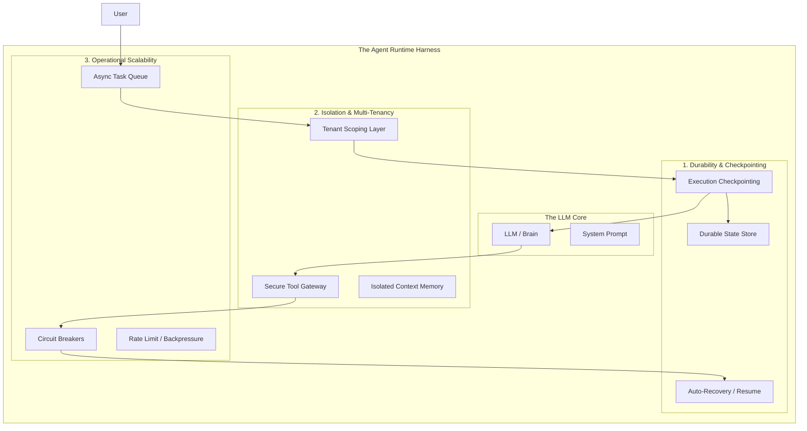

## Your “AI Agent” Is Really a Distributed System

### The Loop Trap

A lot of agent projects start with a simple mental model: **LLM + prompt + tools in a loop**.

That works fine in a notebook or a demo. It completely falls apart in production.

In reality, an agent isn’t a script that runs once and exits. It’s a **long-lived, stateful service**. The moment it needs to handle multiple users, preserve memory across sessions, or recover from a failed tool call, you’ve crossed a line.

At that point, you’re no longer doing “AI engineering.” You’re building a **distributed system**.

---

## The Three Pillars of a Real Agent Runtime

To turn an experiment into a product, the model needs a **runtime harness** around it. That harness stands on three foundations.

### 1. Durability and Checkpointing

If your agent is deep into a multi-step plan and something times out or crashes, starting over is unacceptable.

**The right approach:**  
Design the agent so it can pause and resume. Persist execution state after each step, store it in durable storage (Postgres, Redis, etc.), and allow the system to replay from the last known checkpoint instead of step one.

Agents should be restartable, not fragile.

---

### 2. Hard Multi-Tenancy and Isolation

A production agent serves many users simultaneously. Any bleed-through between users—memory, context, embeddings—is a critical security failure.

**The right approach:**  
Enforce isolation outside the model. Every tool call, database query, and vector lookup must be scoped with a `tenant_id` that the LLM cannot modify or bypass.

Trust infrastructure, not prompts.

---

### 3. Operational Scalability

LLMs and third-party APIs are slow, rate-limited, and occasionally unavailable. If your system assumes they’re always fast and reliable, it will fail under load.

**The right approach:**  
Treat model providers like any other flaky dependency. Use queues, async execution, circuit breakers, and backpressure. The user experience should degrade gracefully instead of hanging when an API stalls.

---



**Bottom line:**  
Agents don’t fail because the model is weak.  
They fail because the system around the model was never designed like production software.

----------

## Governance, Elicitation, and the Move to “Agentic Services”

### Beyond Autonomy: The Governance Tier

The biggest mistake in agentic design is giving an agent a **“Delete”** or **“Refund”** tool with no oversight. True Agentic Software Engineering requires a layered authority model.

### The Three-Tier Execution Model

-   **Passive / Auto-Execute**  
    Low-risk actions (e.g., `get_user_docs`, `format_table`).
    
-   **Elicitation (The “Ask” Tool)**  
    Instead of hallucinating missing data, the agent uses a specialized tool to pause and ask the user a structured question.
    
-   **Human-in-the-Loop (HITL)**  
    High-stakes actions (e.g., `execute_payment`) that require an external **Approval** flag in the database before the runtime allows the tool to fire.
    

----------

## Engineering Example: The Support Agent

Here is a conceptual implementation of how we structure a governed agent service.

```python
# Conceptual Architecture for a Governed Agent Service
class SupportService:
    def __init__(self, session_id, user_context):
        self.runtime = AgentRuntime(
            persistence_layer=PostgresStore(),
            isolation_token=user_context.tenant_id
        )
    
    def get_tools(self):
        return [
            Tool(fn=search_kb, mode="AUTO"),           # Can run freely
            Tool(fn=ask_user, mode="ELICITATION"),     # Pauses for user input
            Tool(fn=issue_refund, mode="AUTHORIZED")   # Requires Admin Sig-off
        ]

    def handle_request(self, user_input):
        # The runtime manages the state machine,
        # handling retries and state persistence automatically.
        return self.runtime.execute(user_input, tools=self.get_tools())

```

----------

## From “Chatbots” to Composable Agentic Services

When you build an agent as a service, it becomes a building block.

-   **Discovery**  
    Use protocols like MCP (Model Context Protocol) so other services can _discover_ what your agent can do.
    
-   **Composability**  
    Your frontend calls the Agent Service; your Slack bot calls the same Agent Service; even other agents can call it via a standard API.
    

----------

## Final Summary for the Lead Engineer

Stop focusing on the **“intelligence”** of the model. That is a commodity.  
Focus on the **Runtime**.

The teams that win will be those who build agents that are **durable**, **governed**, and treated as **first-class citizens in a distributed microservices architecture**.
<!--stackedit_data:
eyJoaXN0b3J5IjpbMTU5NTg4NTcwNiwxNzY1NDYzNDQ3XX0=
-->