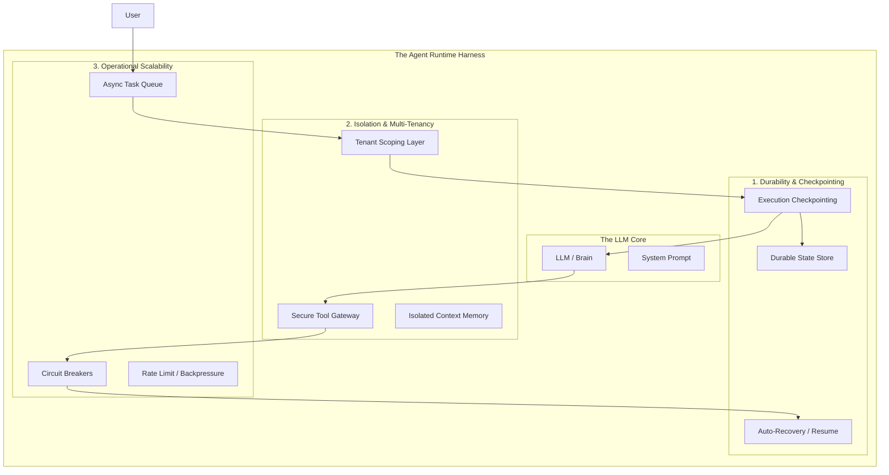

## Your "AI Agent" Is Really a Distributed System

  

### The Loop Trap

  

A lot of agent projects start with a simple mental model: **LLM + prompt + tools in a loop**.

  

That works fine in a notebook or a demo. It completely falls apart in production.

  

In reality, an agent isn't a script that runs once and exits. It's a **long-lived, stateful service**. The moment it needs to handle multiple users, preserve memory across sessions, or recover from a failed tool call, you've crossed a line.

  

At that point, you're no longer doing "AI engineering." You're building a **distributed system**.

  

---

  

## The Three Pillars of a Real Agent Runtime

  

To turn an experiment into a product, the model needs a **runtime harness** around it. That harness stands on three foundations.

  

### 1. Durability and Checkpointing

  

If your agent is deep into a multi-step plan and something times out or crashes, starting over is unacceptable.

  

**The right approach:**

Design the agent so it can pause and resume. Persist execution state after each step, store it in durable storage (Postgres, Redis, etc.), and allow the system to replay from the last known checkpoint instead of step one.

  

Agents should be restartable, not fragile.

  

**Implementation essentials:**

- Save state after each action

- Store checkpoint metadata (step number, context summary, tool results)

- Enable resume from any checkpoint

- Include rollback capability for failed steps

  

---

  

### 2. Hard Multi-Tenancy and Isolation

  

A production agent serves many users simultaneously. Any bleed-through between users—memory, context, embeddings—is a critical security failure.

  

**The right approach:**

Enforce isolation outside the model. Every tool call, database query, and vector lookup must be scoped with a `tenant_id` that the LLM cannot modify or bypass.

  

Trust infrastructure, not prompts.

  

**Key principles:**

- Tenant ID validated at infrastructure layer

- Tools receive tenant context, not from LLM output

- Separate memory stores per tenant

- Database queries automatically scoped

- No cross-tenant data leakage possible

  

---

  

### 3. Operational Scalability

  

LLMs and third-party APIs are slow, rate-limited, and occasionally unavailable. If your system assumes they're always fast and reliable, it will fail under load.

  

**The right approach:**

Treat model providers like any other flaky dependency. Use queues, async execution, circuit breakers, and backpressure. The user experience should degrade gracefully instead of hanging when an API stalls.

  

**Core patterns:**

-  **Async task queues**: Don't block user requests waiting for LLM

-  **Circuit breakers**: Stop calling failing services

-  **Timeouts and retries**: Every external call has limits

-  **Graceful degradation**: Fallback behaviors when services are down

-  **Rate limiting**: Protect your system and respect API limits

  

---

  



  

**Bottom line:**

Agents don't fail because the model is weak.

They fail because the system around the model was never designed like production software.

  

---

  

## Governance, Elicitation, and the Move to "Agentic Services"

  

### Beyond Autonomy: The Governance Tier

  

The biggest mistake in agentic design is giving an agent a **"Delete"** or **"Refund"** tool with no oversight. True Agentic Software Engineering requires a layered authority model.

  

### The Three-Tier Execution Model

  

**1. Passive / Auto-Execute**

Low-risk actions that can run without oversight:

- Reading documentation or knowledge bases

- Formatting or transforming data

- Running queries or searches

- Generating drafts or suggestions

  

**2. Elicitation (The "Ask" Tool)**

Instead of hallucinating missing data, the agent uses a specialized tool to pause and ask the user a structured question. This is critical for:

- Missing configuration values

- Ambiguous requirements

- Choosing between valid approaches

- Clarifying user intent

  

**Key principle**: Never let the agent guess when it can ask.

  

**3. Human-in-the-Loop (HITL)**

High-stakes actions that require external approval:

- Financial transactions (payments, refunds)

- Data deletion or destructive operations

- Deploying to production

- Modifying security settings

  

**Implementation**: Require an **Approval** flag in the database before the runtime allows the tool to execute. The agent can request approval but cannot grant it.

  

---

  

## Engineering Example: The Support Agent

  

Here's the conceptual architecture:

  

```python

class  SupportService:

def  __init__(self, session_id, user_context):

self.runtime = AgentRuntime(

persistence_layer=PostgresStore(),

isolation_token=user_context.tenant_id

)

  

def  get_tools(self):

return [

Tool(fn=search_kb, mode="AUTO"), # Can run freely

Tool(fn=ask_user, mode="ELICITATION"), # Pauses for user input

Tool(fn=issue_refund, mode="AUTHORIZED") # Requires approval

]

  

def  handle_request(self, user_input):

return  self.runtime.execute(user_input, tools=self.get_tools())

```

  

The runtime manages state machine, retries, and persistence automatically.

  

---

  

## From "Chatbots" to Composable Agentic Services

  

When you build an agent as a service, it becomes a building block.

  

**Discovery**: Use protocols like MCP (Model Context Protocol) so other services can discover what your agent can do.

  

**Composability**: Your frontend calls the Agent Service; your Slack bot calls the same Agent Service; even other agents can call it via a standard API.

  

**Benefits:**

- Single implementation, multiple interfaces

- Consistent behavior across channels

- Easier testing and monitoring

- Agent-to-agent communication patterns

  

---

  

## Production Failure Modes and Solutions

  

Understanding what actually breaks in production helps you build better agents from the start.

  

### Scenario 1: The Infinite Loop

  

**What breaks:**

Agent calls tool → gets unhelpful result → rephrases query → calls again → repeats 47 times → timeout.

  

User sees: Spinning loader for 5 minutes, then error.

  

**Solution: Iteration limits + early termination**

- Set maximum iterations (e.g., 10-15)

- Track consecutive failures

- After 3 failures in a row, escalate to human

- Provide context about what was tried

  

### Scenario 2: The Memory Leak

  

**What breaks:**

Agent accumulates full conversation context. Token count grows: 1K → 5K → 50K → 128K (limit).

Result: Hallucinations, task failure, costs spiral from $0.50 to $15.00 per call.

  

**Solution: Selective memory with importance scoring**

  

Organize memory in tiers:

-  **System**: Always keep (instructions, core context)

-  **Critical**: Task-essential information

-  **Recent**: Last N interactions

-  **Summary**: Compressed history of older items

  

When approaching token limits, summarize old "recent" items and move them to "summary" tier. Keep the most recent interactions in full detail.

  

### Scenario 3: The Cascading Tool Failure

  

**What breaks:**

Tool fails → agent retries with identical params → fails again → agent ignores errors → produces confidently wrong output.

  

**Solution: Structured errors + recovery strategies**

  

Tools should return structured errors with:

-  **Type**: `transient`, `invalid_input`, `permission`, `not_found`

-  **Message**: Human-readable explanation

-  **Retry strategy**: `retry_same`, `retry_different`, `escalate`, `skip`

-  **Context**: Additional details for debugging

  

The runtime then applies appropriate recovery based on error type.

  

---

  

## The Fourth Pillar: Observability and Debuggability

  

Production agents are black boxes without proper observability. This deserves equal treatment with the other three pillars.

  

### What You Need to Track

  

**1. Step Tracing**

Every ReAct loop iteration should log:

- Thought (what the agent is considering)

- Action (which tool and why)

- Observation (what the tool returned)

- Context size and token count

  

**2. Tool Call Logging**

Every tool invocation needs:

- Tool name and inputs

- Outputs or errors

- Latency (P50, P95, P99)

- Success/failure status

  

**3. Decision Provenance**

Track *why* the agent made each choice:

- Which parts of context influenced the decision?

- What reasoning led to this action?

- What alternatives were considered?

  

**4. Replay Capability**

Enable re-running from any checkpoint with:

- Full state at that checkpoint

- Tool definitions at that time

- Ability to modify context and replay

  

### Key Metrics to Monitor

  

**Agent Performance:**

- Average steps per task completion

- Task success rate (completed vs escalated)

- Token usage per session

- Cost per successful task

  

**Tool Performance:**

- Tool call frequency

- Tool failure rates

- Tool latency percentiles

- Which tools cause agent loops

  

**User Experience:**

- Tasks completed without human intervention

- Average task completion time

- Escalation reasons

- User satisfaction by task type

  

**System Health:**

- Checkpoint recovery success rate

- Queue depth and processing time

- Circuit breaker trips

- Tenant isolation violations (should be zero)

  

---

  

## The Elicitation Pattern: Deep Dive

  

The "Ask Tool" is where agents fail most often. Here's how to implement it correctly.

  

### Bad vs Good Elicitation

  

**❌ Bad: Vague asking**

```python

response = ask("What should I do about the API error?")

# User responds: "idk, fix it?"

# Agent is stuck with unhelpful input

```

  

**✅ Good: Structured elicitation**

  

Ask with:

-  **Clear question**: Specific, with context

-  **Response type**: Choice, text, number, confirm

-  **Options**: For choice type, provide explicit options

-  **Context**: Why asking? What happens next?

-  **Required**: Can we proceed without this?

-  **Default**: Fallback if user doesn't respond

  

Example:

```

Question: "I need the API key to connect to the payment service. Where is it stored?"

Type: Choice

Options:

- Environment variable (PAYMENT_API_KEY)

- Config file (.env in project root)

- AWS Secrets Manager (production/payment-api-key)

- I don't know

  

Context: Will fetch key from specified location (blocking)

```

  

### Elicitation Patterns

  

**Pattern 1: Missing Configuration**

When a required config value is missing, offer:

- Use default value (specify what default)

- Let me provide the value now

- Skip this service for now

- Stop and let me configure it manually

  

**Pattern 2: Ambiguous Requirements**

When user request has multiple interpretations:

- Present 3-4 specific interpretations

- Include "None of these - let me clarify"

- Show what you'll do with each choice

  

**Pattern 3: Risk Confirmation**

Before risky actions:

- Clearly state what will happen

- List specific risks

- Default to safe option (No)

- Require explicit confirmation

  

---

  

## Planning vs Execution: Choosing the Right Pattern

  

Different tasks need different agent architectures.

  

### When to Use Plan-and-Execute

  

Use when:

- ✓ Task is well-defined and decomposable

- ✓ Tools have predictable behavior

- ✓ Failure recovery requires replanning

  

**Example**: "Build a user authentication system"

  

Process:

1.  **Planning phase**: Decompose into steps (create models, add endpoints, implement JWT, etc.)

2.  **Execution phase**: Execute each step in order

3.  **Replanning**: If a step fails, replan remaining steps based on the failure

  

**Best for**: Construction tasks, implementation work, well-understood workflows.

  

### When to Use ReAct

  

Use when:

- ✓ Task involves exploration or search

- ✓ Next step depends on previous observations

- ✓ Plan would be too rigid

  

**Example**: "Debug why API latency increased"

  

Process:

- Thought: What should I investigate next?

- Action: Based on thought, what tool to use?

- Observation: What did we learn?

- Repeat until answer found or iteration limit

  

Example trace:

1. Check current latency → P95 is 2.3s (was 0.4s)

2. Check database → Query time normal, but connection pool exhausted

3. Check connection lifecycle → Found unclosed connections in user_stats endpoint

4. Conclusion: Connection leak causing pool exhaustion

  

**Best for**: Debugging, research, exploration, troubleshooting.

  

### Hybrid Pattern: Plan-then-React

  

Best of both worlds for complex tasks:

1. Create high-level plan (3-5 major steps)

2. Use ReAct to figure out HOW to complete each step

3. If a step fails completely, replan remaining steps

  

**Best for**: Complex features, migrations, large refactorings.

  

---

  

## Tool Design Patterns

  

Well-designed tools make agents more reliable and easier to debug.

  

### Anti-Pattern: Raw Data Tools

  

**❌ Bad**: Tools that return raw, complex data

```python

def  get_user(user_id: str) -> dict:

return db.users.find_one({"id": user_id})

# Returns 50+ fields of nested JSON

# Agent must parse, interpret, handle missing fields

```

  

### Pattern: Structured, Decision-Ready Tools

  

**✅ Good**: Tools that return structured, decision-ready data

```python

@dataclass

class  UserContext:

user_id: str

account_status: Literal["active", "suspended", "closed"]

auth_level: Literal["basic", "premium", "enterprise"]

recent_issues: List[SupportIssue]

  

def  can_issue_refund(self) -> bool:

return  self.account_status == "active"

  

def  get_user_context(user_id: str) -> UserContext:

# Returns exactly what agent needs to make decisions

```

  

### Pattern: Tools with Built-in Guardrails

  

**✅ Best**: Tools that enforce safety

  

```python

def  issue_refund(amount: float, reason: str, user_id: str, tenant_id: str):

"""

Raises structured errors:

- ApprovalRequired: if amount > $100

- InvalidTenant: if tenant_id doesn't match session

- RateLimitExceeded: if > 3 refunds in last hour

"""

# Guardrails enforced by tool, not prompt

```

  

### Tool Interface Design Principles

  

**Principle 1: Tools should be single-purpose**

- ❌ Bad: `manage_user(action, user_id, **kwargs)` (Swiss-army-knife)

- ✅ Good: `get_user_context()`, `update_user_profile()`, `suspend_user()` (focused)

  

**Principle 2: Tools should validate inputs**

- ❌ Bad: Trust agent inputs (What if amount is negative?)

- ✅ Good: Validate at tool boundary (check ranges, formats, constraints)

  

**Principle 3: Tools should provide context in results**

- ❌ Bad: Return raw list of strings

- ✅ Good: Return structured result with metadata (total found, quality score, suggestions)

  

---

  

## Agent Composability: Practical Patterns

  

Agents should be composable building blocks, not monoliths.

  

### Anti-Pattern: Direct Agent Coupling

  

**❌ Bad**: Agents directly call each other

```python

class  SupportAgent:

def  __init__(self):

self.research_agent = ResearchAgent() # Tight coupling

  

def  handle_query(self, query: str):

research_result = self.research_agent.query(query)

```

  

Problems:

- Hard to swap implementations

- Failures cascade

- Can't add circuit breakers

- Difficult to test

  

### Pattern: Event-Driven Agent Mesh

  

**✅ Good**: Agents communicate via events

  

Agents publish intents instead of making direct calls:

```

Agent needs capability → Publishes to event bus

Other agents subscribed to that capability → Respond

Requesting agent receives response or timeout

```

  

Benefits:

- Agents discover each other dynamically

- Failures don't cascade (circuit breakers per agent)

- Easy to add/remove agents

- Natural load balancing

  

### Pattern: Agent Registry and Discovery

  

Agents register their capabilities at startup:

```

Agent A: ["document_analysis", "web_search"]

Agent B: ["document_analysis v2.0", "code_analysis"]

```

  

Other agents query the registry:

```

find_agent(capability="document_analysis", filters={"version": ">=2.0"})

→ Returns Agent B

```

  

Enables:

- Dynamic agent discovery

- Load balancing (pick agent with lowest load)

- Version management

- Health checking

  

### Pattern: Agent API Gateway

  

Single entry point for all agent interactions:

1.  **Rate limiting per tenant**

2.  **Find appropriate agent** from registry

3.  **Circuit breaker** checks

4.  **Execute with timeout**

5.  **Fallback to secondary agent** if primary fails

6.  **Tracing and observability**

  

Allows:

- Frontend calls gateway

- Slack bot calls gateway

- Other agents call gateway

- Consistent behavior everywhere

  

---

  

## Error Recovery Strategies

  

Agents need clear strategies for handling failures.

  

### Recovery Strategy Types

  

**1. RETRY_SAME** - Transient error, use same parameters

- Use for: Network glitches, temporary unavailability

- Limit: Max 3 attempts with exponential backoff

  

**2. RETRY_DIFFERENT** - Wrong parameters, try new approach

- Use for: Invalid input, bad parameters

- Limit: Max 2 attempts, then escalate

  

**3. ESCALATE** - Can't solve, need human help

- Use for: Permission errors, repeated failures

- Provide: Full context of what was tried

  

**4. SKIP** - Non-critical tool failed

- Use for: Optional enrichment, nice-to-have features

- Mark: Task partially complete

  

**5. ABORT** - Critical failure, rollback

- Use for: Critical tool failures in multi-step workflows

- Action: Rollback to last checkpoint

  

### Selection Logic

  

Based on:

-  **Error type**: What kind of failure?

-  **Attempt number**: How many times tried?

-  **Task criticality**: How important is this?

  

Example:

- Transient error, attempt 1 → RETRY_SAME

- Transient error, attempt 4 → ESCALATE

- Invalid input, attempt 1 → RETRY_DIFFERENT

- Permission error → ESCALATE immediately

- Not found, optional task → SKIP

- Not found, critical task → ESCALATE

  

---

  

## The State Machine View

  

Agents are really state machines. Making this explicit helps with debugging and reliability.

  

### Agent States

  

```

IDLE → PLANNING → EXECUTING → WAITING_TOOL

→ WAITING_USER

→ WAITING_APPROVAL

→ COMPLETE

→ ERROR

```

  

### Valid Transitions

  

Not all transitions are allowed:

- IDLE can only go to PLANNING

- PLANNING can go to EXECUTING, WAITING_USER, or ERROR

- EXECUTING can go to any WAITING state, COMPLETE, or ERROR

- COMPLETE can only go back to IDLE

  

Invalid transitions raise errors immediately.

  

### State-Specific Behavior

  

**WAITING_USER**: Set 5-minute timeout for response

  

**WAITING_TOOL**: Set 30-second timeout for tool execution

  

**ERROR**: Log error context, determine if retry is possible

  

**COMPLETE**: Persist results, cleanup resources

  

### Benefits

  

1.  **Debuggability**: See exactly what state agent is in

2.  **Timeouts**: Each state has its own timeout

3.  **Recovery**: Know what to do based on current state

4.  **Testing**: Easy to test state transitions

5.  **Monitoring**: Dashboard shows agent state distribution

  

Example metrics:

```

Current agent states:

- EXECUTING: 45 agents

- WAITING_USER: 12 agents

- WAITING_TOOL: 8 agents

- ERROR: 3 agents

  

Average time in state:

- EXECUTING: 12s

- WAITING_USER: 2m 34s

- WAITING_TOOL: 1.2s

```

  

---

  

## Conclusion

  

Building production AI agents is a **distributed systems problem** dressed up as an AI problem.

  

The model is the easy part. The hard parts are:

  

1.  **Runtime**: Checkpointing, multi-tenancy, scalability

2.  **Observability**: Tracing, debugging, replay

3.  **Governance**: Approval workflows, tool guardrails, escalation

4.  **Error Handling**: Recovery strategies, graceful degradation

5.  **Tool Design**: Structured interfaces, built-in safety, clear errors

  

Teams that treat agents as distributed systems will build reliable, production-grade AI. Teams that treat them as smart scripts will struggle with infinite loops, security failures, and debugging nightmares.

  

**Focus on the runtime. The intelligence will follow.**
<!--stackedit_data:
eyJoaXN0b3J5IjpbMTczMDkxMjQ2MSwxNTk1ODg1NzA2LDE3Nj
U0NjM0NDddfQ==
-->