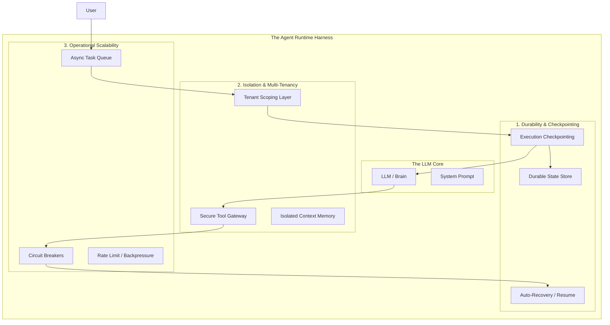

# Production AI Agent Systems Architecture

## Part I: Foundational Architecture

### The Agent Runtime Harness

To operationalize an experimental model, a production runtime harness must implement three foundational pillars.

### Pillar 1: Durability and Checkpointing

**Problem Statement**: When an agent executing a multi-step workflow encounters a timeout or crash, restarting from the beginning represents an unacceptable user experience and operational cost.

**Architectural Solution**: Implement a checkpoint-based execution model where agents persist state incrementally and support resume operations from any checkpoint.

Implementation requirements:

- Persist execution state after each action
- Store checkpoint metadata including step number, context summary, and tool results
- Enable resume operations from arbitrary checkpoints
- Provide rollback capabilities for failed execution paths

**Design Principle**: Agents must be designed as restartable services, not fragile scripts.

### Pillar 2: Multi-Tenancy and Isolation

**Problem Statement**: Production agents serve multiple users concurrently. Any information leakage between tenants—memory, context, or embeddings—constitutes a critical security failure.

**Architectural Solution**: Enforce tenant isolation at the infrastructure layer, external to the model. All tool invocations, database queries, and vector operations must be scoped with a `tenant_id` that the LLM cannot modify or override.

Implementation requirements:

- Validate tenant identifiers at the infrastructure layer
- Supply tenant context to tools through secure channels, not LLM output
- Maintain isolated memory stores per tenant
- Automatically scope database queries by tenant
- Design systems where cross-tenant data leakage is structurally impossible

**Design Principle**: Trust infrastructure boundaries, not prompt engineering.

### Pillar 3: Operational Scalability

**Problem Statement**: LLM providers and third-party APIs exhibit high latency, rate limiting, and intermittent availability. Systems that assume reliable, low-latency responses will fail under production load.

**Architectural Solution**: Treat model providers as unreliable external dependencies. Implement standard distributed systems patterns: async task queues, circuit breakers, timeout enforcement, and graceful degradation.

Core patterns:

- Async task queues to decouple user requests from LLM invocations
- Circuit breakers to halt cascading failures from unavailable services
- Timeout enforcement with exponential backoff for all external calls
- Graceful degradation paths when dependent services are unavailable
- Rate limiting to protect both internal systems and external API quotas

### System Architecture Diagram



**Architectural Insight**: Agent failures stem not from model inadequacy, but from runtime systems that lack production engineering principles.

---

## Part II: Governance and Authorization

### The Authority Model

The most critical architectural flaw in agent systems is providing unrestricted tool access—particularly for destructive operations like deletion or financial transactions—without authorization controls.

### Three-Tier Authorization Framework

**Tier 1: Auto-Execute (Low Risk)**

Operations that can execute without human approval:

- Read operations on documentation and knowledge bases
- Data transformation and formatting
- Query execution and search operations
- Draft generation and suggestions

**Tier 2: Elicitation (Medium Risk)**

The agent must elicit information from users rather than hallucinating missing data. This tier addresses:

- Missing configuration values
- Ambiguous requirements requiring clarification
- Selection between multiple valid implementation approaches
- User intent verification

Architectural principle: Design agent systems that surface uncertainty rather than masking it with hallucinated responses.

**Tier 3: Human-in-the-Loop (High Risk)**

Operations requiring external authorization:

- Financial transactions including payments and refunds
- Destructive operations including data deletion
- Production deployment operations
- Security and access control modifications

Implementation: Require database-persisted approval flags before tool execution. The agent may request approval but cannot self-authorize.

### Reference Implementation

```python
class SupportService:
    def __init__(self, session_id, user_context):
        self.runtime = AgentRuntime(
            persistence_layer=PostgresStore(),
            isolation_token=user_context.tenant_id
        )

    def get_tools(self):
        return [
            Tool(fn=search_kb, mode="AUTO"),           # Auto-execute
            Tool(fn=ask_user, mode="ELICITATION"),     # Elicitation
            Tool(fn=issue_refund, mode="AUTHORIZED")   # Requires approval
        ]

    def handle_request(self, user_input):
        return self.runtime.execute(user_input, tools=self.get_tools())
```

### Composable Service Architecture

Agents designed as services become composable building blocks:

- **Service Discovery**: Implement protocols like MCP (Model Context Protocol) for capability advertisement
- **Multi-Channel Access**: Frontend, Slack bots, and other agents access identical service interfaces
- **Consistent Behavior**: Single implementation ensures uniform behavior across all access patterns
- **Agent-to-Agent Communication**: Enables sophisticated multi-agent orchestration

---

## Part III: Production Failure Modes

Understanding common production failures enables proactive architectural solutions.

### Failure Mode 1: Infinite Iteration Loops

**Symptom**: Agent invokes tool → receives unhelpful result → rephrases query → repeats 47 times → timeout.

**User Impact**: Extended wait time followed by error state.

**Mitigation Strategy**:

- Enforce maximum iteration limits (10-15 iterations)
- Track consecutive failures within execution context
- Escalate to human intervention after 3 consecutive failures
- Provide failure context including attempted strategies

### Failure Mode 2: Context Window Exhaustion

**Symptom**: Agent accumulates conversation history without pruning. Token count grows exponentially: 1K → 5K → 50K → 128K (limit).

**User Impact**: Response quality degradation, task failures, cost escalation from $0.50 to $15.00 per invocation.

**Mitigation Strategy**: Implement tiered memory architecture:

- **System Tier**: Immutable instructions and core context
- **Critical Tier**: Task-essential information
- **Recent Tier**: Last N interactions maintained in full detail
- **Summary Tier**: Compressed historical context

When approaching token limits, compress recent interactions and migrate to the summary tier while preserving current context fidelity.

### Failure Mode 3: Error Propagation

**Symptom**: Tool failure → agent retries with identical parameters → repeated failure → agent disregards errors → produces incorrect output.

**User Impact**: Confidently delivered incorrect results.

**Mitigation Strategy**: Implement structured error responses:

- **Error Type**: `transient`, `invalid_input`, `permission`, `not_found`
- **Human-Readable Message**: Clear explanation of failure
- **Retry Strategy**: `retry_same`, `retry_different`, `escalate`, `skip`
- **Debugging Context**: Structured data for root cause analysis

Runtime applies recovery strategy based on error classification.

---

## Part IV: Observability and Operational Intelligence

### The Fourth Pillar

Production agents without comprehensive observability are operationally opaque black boxes. Observability deserves equal architectural consideration with the foundational pillars.

### Observability Requirements

**1. Execution Tracing**

Log each ReAct iteration including:

- Reasoning phase output
- Tool selection and invocation rationale
- Observation results
- Context size and token consumption metrics

**2. Tool Call Instrumentation**

Instrument all tool invocations:

- Tool identifier and input parameters
- Output data or error conditions
- Latency distribution (P50, P95, P99)
- Success/failure classification

**3. Decision Provenance**

Maintain audit trail of agent decisions:

- Context segments that influenced each decision
- Reasoning chain leading to action selection
- Alternative actions considered

**4. Replay Infrastructure**

Enable execution replay from arbitrary checkpoints:

- Complete state snapshot at checkpoint
- Tool definitions active at execution time
- Context modification capability for debugging

### Operational Metrics

**Agent Performance Metrics**:

- Average iteration count per successful task completion
- Success rate (completed vs escalated to human)
- Token consumption per session
- Cost per successfully completed task

**Tool Performance Metrics**:

- Invocation frequency distribution
- Failure rate by tool
- Latency percentiles
- Tools correlated with iteration loops

**User Experience Metrics**:

- Autonomous completion rate
- Time to task completion
- Escalation cause distribution
- User satisfaction by task category

**System Health Metrics**:

- Checkpoint recovery success rate
- Queue depth and processing latency
- Circuit breaker activation frequency
- Tenant isolation violations (target: zero)

---

## Part V: Elicitation Pattern Design

### Architecture for Structured Information Gathering

Poor elicitation design is the primary cause of agent failures requiring human intervention.

### Anti-Pattern: Unstructured Queries

```python
response = ask("What should I do about the API error?")
# Result: Vague user response, unusable by agent
```

### Pattern: Structured Elicitation

Implement elicitation with:

- **Specific Context**: Clear explanation of why information is required
- **Type Constraints**: Choice, text, number, confirmation
- **Explicit Options**: For choice type, enumerate all valid selections
- **Usage Declaration**: Explain how the response will be used
- **Optionality**: Declare whether execution can proceed without response
- **Default Behavior**: Specify fallback action if no response received

### Elicitation Pattern Catalog

**Pattern 1: Configuration Resolution**

When required configuration is absent:

- Propose default value with explicit declaration
- Offer immediate value provision
- Allow service skip for current execution
- Enable manual configuration workflow

**Pattern 2: Requirement Disambiguation**

When requirements admit multiple interpretations:

- Present 3-4 concrete interpretations
- Include "None of these" option for rejection
- Declare action plan for each interpretation

**Pattern 3: Risk Acknowledgment**

Before executing high-risk operations:

- Explicitly state operation to be performed
- Enumerate specific risks
- Default to conservative option
- Require explicit confirmation

---

## Part VI: Execution Strategy Selection

### Plan-and-Execute Pattern

**Applicability**:

- Tasks with well-defined, decomposable structure
- Tools exhibiting deterministic behavior
- Failure recovery requiring complete replanning

**Process Architecture**:

1. Planning Phase: Decompose high-level task into sequential steps
2. Execution Phase: Execute steps in dependency order
3. Replanning Phase: On step failure, regenerate plan for remaining work

**Optimal Use Cases**: Construction tasks, implementation work, well-understood workflows.

### ReAct Pattern

**Applicability**:

- Tasks requiring exploration or information discovery
- Tasks where next action depends on prior observations
- Tasks where rigid planning would be counterproductive

**Process Architecture**:

- Reasoning: Analyze current state and determine next investigation
- Action: Select and invoke appropriate tool
- Observation: Process tool results and update context
- Iterate until task completion or iteration limit

Example execution trace:

1. Measure current latency → P95 latency is 2.3s (baseline: 0.4s)
2. Analyze database performance → Query time normal, connection pool exhausted
3. Investigate connection lifecycle → Identified unclosed connections in user_stats endpoint
4. Root cause identified: Connection leak causing pool exhaustion

**Optimal Use Cases**: Debugging, research, exploration, troubleshooting.

### Hybrid Pattern: Plan-then-React

**Process Architecture**:

1. Generate high-level plan (3-5 major phases)
2. Use ReAct pattern to determine implementation approach for each phase
3. Replan remaining phases on complete phase failure

**Optimal Use Cases**: Complex features, large-scale migrations, significant refactorings.

### Pattern Selection Reference

The following table provides guidance for selecting the appropriate execution pattern:

| Pattern | Best For | Characteristics | Avoid When |
|---------|----------|-----------------|------------|
| **Plan-and-Execute** | • Construction tasks<br>• Implementation work<br>• Well-understood workflows | • Upfront decomposition<br>• Sequential execution<br>• Replanning on failure | • Exploratory tasks<br>• Unknown requirements<br>• Discovery-driven work |
| **ReAct** | • Debugging<br>• Research<br>• Exploration<br>• Troubleshooting | • Iterative investigation<br>• Observation-driven<br>• Flexible approach | • Well-defined tasks<br>• Predetermined steps<br>• Clear sequence needed |
| **Hybrid (Plan-then-React)** | • Complex features<br>• Large migrations<br>• Significant refactorings | • High-level planning<br>• Flexible sub-task execution<br>• Best of both worlds | • Simple tasks<br>• Purely exploratory work<br>• Fully deterministic tasks |

**Selection Guidelines**:

- **Known path, clear steps** → Plan-and-Execute
- **Unknown path, investigation required** → ReAct
- **Known destination, uncertain path** → Hybrid

---

## Part VII: Tool Interface Design

### Anti-Pattern: Raw Data Interfaces

Tools that return unstructured, complex data:

```python
def get_user(user_id: str) -> dict:
    return db.users.find_one({"id": user_id})
    # Returns 50+ fields of nested JSON requiring interpretation
```

Agents must parse complex structures, interpret database types, and handle missing fields.

### Pattern: Decision-Ready Interfaces

Tools that return structured, actionable data:

```python
@dataclass
class UserContext:
    user_id: str
    account_status: Literal["active", "suspended", "closed"]
    auth_level: Literal["basic", "premium", "enterprise"]
    recent_issues: List[SupportIssue]

    def can_issue_refund(self) -> bool:
        return self.account_status == "active"

def get_user_context(user_id: str) -> UserContext:
    # Returns precisely the information required for decision making
```

### Pattern: Guardrail Enforcement

Tools that enforce safety constraints:

```python
def issue_refund(amount: float, reason: str, user_id: str, tenant_id: str):
    """
    Enforces safety constraints:
    - ApprovalRequired: amount exceeds $100 threshold
    - InvalidTenant: tenant_id mismatch with session
    - RateLimitExceeded: more than 3 refunds in trailing hour
    """
    # Safety enforced by tool implementation, not prompt engineering
```

### Tool Design Principles

**Principle 1: Single Responsibility**

- Anti-Pattern: `manage_user(action, user_id, **kwargs)` (Swiss-army-knife design)
- Pattern: `get_user_context()`, `update_user_profile()`, `suspend_user()` (focused interfaces)

**Principle 2: Input Validation**

- Anti-Pattern: Trust agent-supplied inputs without validation
- Pattern: Validate at tool boundary (ranges, formats, business constraints)

**Principle 3: Contextual Results**

- Anti-Pattern: Return raw list of strings
- Pattern: Return structured result with metadata (result count, confidence scores, alternative suggestions)

---

## Part VIII: Multi-Agent Composition

### Anti-Pattern: Direct Agent Coupling

```python
class SupportAgent:
    def __init__(self):
        self.research_agent = ResearchAgent()  # Tight coupling

    def handle_query(self, query: str):
        research_result = self.research_agent.query(query)
```

Problems:

- Implementation substitution requires code changes
- Failures propagate directly between agents
- Circuit breakers cannot be inserted
- Testing requires complex mocking

### Pattern: Event-Driven Agent Mesh

Agents communicate through event publication rather than direct invocation:

```
Agent requires capability → Publishes capability request to event bus
Agents providing capability → Subscribe and respond
Requesting agent → Receives response or timeout
```

Benefits:

- Dynamic agent discovery
- Failure isolation with per-agent circuit breakers
- Zero-code agent addition and removal
- Natural load distribution across agent instances

### Pattern: Service Registry

Agents register capabilities at initialization:

```
Agent A: ["document_analysis", "web_search"]
Agent B: ["document_analysis v2.0", "code_analysis"]
```

Other agents query registry:

```
find_agent(capability="document_analysis", filters={"version": ">=2.0"})
→ Returns Agent B
```

Enables:

- Runtime agent discovery
- Load-based routing
- Version-based selection
- Health-based availability

### Pattern: API Gateway

Unified entry point providing:

1. Per-tenant rate limiting
2. Agent selection from registry
3. Circuit breaker integration
4. Timeout enforcement
5. Fallback agent routing
6. Distributed tracing

Enables consistent access pattern from frontends, chatbots, and other agents.

---

## Part IX: Error Recovery Architecture

### Recovery Strategy Classification

**Strategy 1: RETRY_SAME**

Transient errors with identical parameters:

- Use case: Network failures, temporary service unavailability
- Limit: Maximum 3 attempts with exponential backoff

**Strategy 2: RETRY_DIFFERENT**

Errors indicating invalid parameters:

- Use case: Validation failures, malformed inputs
- Limit: Maximum 2 attempts with adjusted parameters, then escalate

**Strategy 3: ESCALATE**

Errors requiring human intervention:

- Use case: Permission errors, repeated failures
- Action: Provide complete context of attempted strategies

**Strategy 4: SKIP**

Optional tool failures:

- Use case: Enhancement operations, non-critical features
- Action: Mark task as partially complete

**Strategy 5: ABORT**

Critical failures in transactional workflows:

- Use case: Critical tool failures in multi-step transactions
- Action: Rollback to last checkpoint

### Strategy Selection Algorithm

Selection based on:

- Error classification
- Retry attempt count
- Task criticality level

Examples:

- Transient error, attempt 1 → RETRY_SAME
- Transient error, attempt 4 → ESCALATE
- Invalid input, attempt 1 → RETRY_DIFFERENT
- Permission error → ESCALATE immediately
- Not found, optional → SKIP
- Not found, critical → ESCALATE

### Decision Tree

The following decision tree provides a systematic approach to error recovery strategy selection:

```
Error Occurred
│
├─ Is error type "permission"?
│  └─ YES → ESCALATE (immediate human intervention required)
│
├─ Is error type "transient"?
│  ├─ YES → Is attempt count < 3?
│  │        ├─ YES → RETRY_SAME (exponential backoff)
│  │        └─ NO → ESCALATE (repeated transient failures)
│  │
│  └─ NO → Is error type "invalid_input"?
│           ├─ YES → Is attempt count < 2?
│           │        ├─ YES → RETRY_DIFFERENT (adjust parameters)
│           │        └─ NO → ESCALATE (cannot resolve automatically)
│           │
│           └─ NO → Is error type "not_found"?
│                    ├─ YES → Is task critical?
│                    │        ├─ YES → ESCALATE (missing required resource)
│                    │        └─ NO → SKIP (optional resource unavailable)
│                    │
│                    └─ NO → Is task critical?
│                             ├─ YES → ABORT (rollback to checkpoint)
│                             └─ NO → SKIP (continue with degraded functionality)
```

**Key Decision Points**:

1. **Permission errors** always require immediate escalation (no retry)
2. **Transient errors** allow retries with backoff (max 3 attempts)
3. **Invalid input** allows parameter adjustment (max 2 attempts)
4. **Not found errors** depend on task criticality
5. **Unknown errors** trigger abort for critical tasks, skip for non-critical

**Implementation Note**: This decision tree should be implemented as a deterministic function that takes `(error_type, attempt_count, task_criticality)` and returns a recovery strategy.

---

## Part X: State Machine Architecture

Agents are fundamentally state machines. Explicit state modeling improves debuggability and reliability.

### State Diagram

```
IDLE → PLANNING → EXECUTING → WAITING_TOOL
                             → WAITING_USER
                             → WAITING_APPROVAL
                             → COMPLETE
                             → ERROR
```

### Transition Rules

Constrained transitions:

- IDLE → PLANNING only
- PLANNING → {EXECUTING, WAITING_USER, ERROR}
- EXECUTING → {WAITING_TOOL, WAITING_USER, WAITING_APPROVAL, COMPLETE, ERROR}
- COMPLETE → IDLE only

Invalid transitions generate immediate errors.

### State-Specific Behavior

**WAITING_USER**: 5-minute response timeout

**WAITING_TOOL**: 30-second execution timeout

**ERROR**: Log error context, evaluate retry feasibility

**COMPLETE**: Persist results, release resources

### Benefits

1. Precise state visibility for debugging
2. State-specific timeout configuration
3. State-based recovery logic
4. Simplified state transition testing
5. Operational dashboards showing state distribution

Example operational metrics:

```
Current agent state distribution:
- EXECUTING: 45 agents
- WAITING_USER: 12 agents
- WAITING_TOOL: 8 agents
- ERROR: 3 agents

State duration averages:
- EXECUTING: 12s
- WAITING_USER: 2m 34s
- WAITING_TOOL: 1.2s
```

---

## Conclusion

Building production AI agents is fundamentally a distributed systems architecture problem.

The model represents the straightforward component. The complex components are:

1. **Runtime Architecture**: Checkpointing, multi-tenancy, scalability
2. **Observability Infrastructure**: Tracing, debugging, replay
3. **Governance Framework**: Authorization workflows, tool guardrails, escalation
4. **Error Handling**: Recovery strategies, graceful degradation
5. **Tool Design**: Structured interfaces, enforced safety, clear errors

Organizations that architect agents as distributed systems will deliver reliable, production-grade AI services. Organizations that architect agents as intelligent scripts will encounter infinite loops, security failures, and operational debugging nightmares.

**Architectural Principle**: Focus on the runtime architecture. Model intelligence is a commodity; operational excellence is the differentiator.
